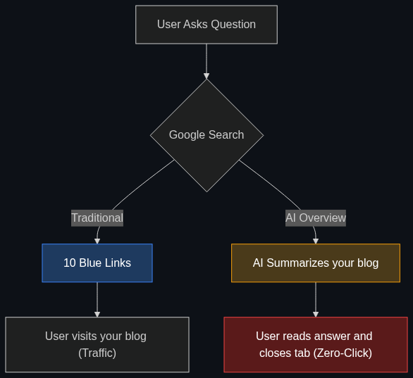

# 🕳️ Zero-Click Result

> **A metric tracking how often an AI provides the full answer to a user, resulting in no traffic to the original website.**

---

## Phase 1: Core Foundations & Pre-requisites

### Prerequisites
- **GEO & AEO** — Optimizing for AI engines (see [01_GEO.md](01_GEO.md)).

### Definition
A **Zero-Click Result** occurs when a user asks a question on a search engine (like Google) or an AI tool (like Perplexity), and the engine provides the complete, satisfactory answer directly on the results page. The user gets what they need and leaves, resulting in *zero clicks* to the websites that actually generated the information.

With the rise of AI Overviews and conversational agents, Zero-Click searches are skyrocketing, terrifying the digital publishing industry.

### The Problem It Solves (For the User) vs The Problem It Creates (For the Business)

| The User Experience | The Business Reality |
|---------------------|----------------------|
| **Fast:** Gets the answer in 1 second. | **Traffic Drop:** The website loses the visitor. |
| **Clean:** No ads, no popups, no cookie banners. | **Revenue Drop:** No visitor = no ad impressions = no money. |
| **Concise:** AI summarizes 5 pages into 3 bullets. | **Brand Erasure:** The user doesn't even know which website the info came from. |

### 🧩 Mini-Quiz

> **Q1:** If your website traffic drops by 30% due to Zero-Click AI results, does that mean your business is failing?
> <details><summary>Answer</summary>Not necessarily. Zero-Click mostly cannibalizes "informational" queries (e.g., "What time is the Superbowl?"). If your business makes money on "transactional" queries (e.g., "Buy Superbowl tickets"), AI will still funnel users to your checkout page. The challenge is that businesses can no longer rely on top-of-funnel informational blog posts to drive passive ad revenue.</details>

---

## Phase 2: Anatomy & Internal Mechanisms

### The Funnel Shift



**The Old Marketing Funnel:**
1. User searches "Best CRM".
2. Clicks your blog post ("Top 10 CRMs").
3. Reads your post, clicks an affiliate link, buys your product.

**The New Zero-Click Funnel:**
1. User asks AI "Best CRM".
2. AI reads your blog post in the background.
3. AI outputs "HubSpot is the best CRM."
4. User closes the app and goes to HubSpot. Your blog gets zero traffic.

### 🃏 Flashcard

> **Front:** How are digital publishers attempting to fight back against Zero-Click AI scraping?
> <details><summary>Flip</summary>They are implementing <code>robots.txt</code> blocks to ban AI web scrapers (like OpenAI's GPTBot) from reading their sites. Alternatively, they are signing massive data-licensing deals (e.g., Reddit and The New York Times) where AI companies pay millions of dollars upfront for the right to use their data, replacing the lost ad revenue from Zero-Click searches.</details>

---

## Phase 3: Advanced / Enterprise Patterns & Pitfalls

### Enterprise Adaptation Strategies

| Strategy | How it works |
|----------|--------------|
| **Gating Content** | Moving high-value information behind an email capture or paywall. AI scrapers cannot read gated content, forcing the user to visit the site. |
| **Optimizing for the "Next Action"** | Assuming the user will read the AI summary, ensuring your brand is positioned as the logical *next step* (e.g., "AI says the weather will be rainy. Click here to buy an umbrella"). |
| **Community Building** | Shifting marketing from SEO blogs to private Discord/Slack communities where humans want to interact with humans, not AI summaries. |

### Anti-Patterns

- ❌ **Writing clickbait titles** → "You won't believe what happens next!" AI doesn't care about clickbait. It will read the article, extract the answer, and give it to the user. Clickbait is dead in the Zero-Click economy.
- ❌ **Relying solely on Ad Revenue** → If your business model requires users to scroll past 10 banner ads on a recipe blog to make money, you will likely go out of business. AI will just extract the recipe and bypass the ads.

---

## Phase 4: Practical Implementation

### Blocking AI Scrapers (robots.txt)

*If you want to stop AI from causing Zero-Click results on your proprietary data, you must block their crawlers.*

```text
# Example of a robots.txt file blocking major AI scrapers
# Place this at the root of your website (e.g., yoursite.com/robots.txt)

User-agent: GPTBot
Disallow: /

User-agent: ChatGPT-User
Disallow: /

User-agent: Google-Extended
Disallow: /

User-agent: anthropic-ai
Disallow: /

User-agent: PerplexityBot
Disallow: /

# Note: Blocking these bots prevents Zero-Click scraping, 
# BUT it also means your brand will be completely erased from their AI answers.
# It is a strategic trade-off.
```

---

## Phase 5: Interview Preparation

### Q1: "Our informational blog traffic is down 40% year-over-year, but our sales haven't dropped. What's happening, and what should we do?"
<details><summary><b>STAR Answer</b></summary>

**Situation:** The marketing team is panicking because top-of-funnel web traffic is plummeting, though core business metrics remain stable.

**Task:** Diagnose the traffic drop and adjust the KPI strategy.

**Action:** I analyzed the search console data and identified that the traffic drop was exclusively on top-of-funnel informational queries (e.g., "What is [Industry Term]?"). I explained that this is the **Zero-Click Result** effect—AI Overviews are answering these questions directly on Google. 
Since our transactional traffic ("Request a Demo") was unchanged, I advised the team to stop measuring "Page Views" as a primary KPI. Instead, we shifted our focus to "Brand Mentions in AI" (GEO) and focused our content budget on deep, proprietary case studies that AI cannot easily summarize.

**Result:** The team stopped panicking over vanity metrics (page views) and successfully realigned the marketing budget toward high-conversion, bottom-of-funnel content that survives the Zero-Click economy.
</details>

---

## Phase 6: Summary Cheatsheet & Action Plan

### 📋 TL;DR

| Concept | Key Point |
|---------|-----------|
| **Zero-Click Result** | The AI answers the question fully; the user never visits a website. |
| **The Impact** | Destroys ad-revenue and top-of-funnel traffic for publishers. |
| **The Defense** | Paywalls, `robots.txt` blocking, or pivoting to transactional value. |
| **The Reality** | Informational queries are now owned by AI. |

### 🚀 Do These Now
1. **Experience Zero-Click:** Go to Google and search "How to boil an egg." Notice the massive AI overview at the top. You just got your answer. Notice how you didn't click on any of the cooking blogs below it. You just participated in the Zero-Click economy.
