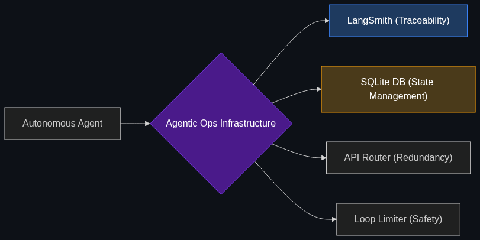

# 🛠️ Agentic Ops (Agentic Operations)

> **This is DevOps for AI. It involves the infrastructure needed to monitor, scale, and recover autonomous agents when they fail or get stuck in a loop.**

---

## Phase 1: Core Foundations & Pre-requisites

### Prerequisites
- **Multi-Agent Orchestration** — How agents talk to each other (see [Module 3](../../02_Enterprise_AI/03_Advanced_Orchestration/01_Multi_Agent_Orchestration.md)).
- **DevOps** — The traditional practice of keeping software running reliably.

### Definition
When you write a normal Python script, if it hits a bug, it throws an error and stops. When you run an *autonomous AI agent*, if it hits a bug, it might try to fix the bug itself, hallucinate, get stuck in an infinite loop, and spend $5,000 in API credits before you notice.

**Agentic Ops (Agentic Operations)** is the emerging discipline and infrastructure required to safely deploy agents into production. It encompasses the logging, monitoring, load balancing, and automated recovery systems necessary to treat AI not as a static script, but as unpredictable, continuous processes.

### The Problem It Solves

| DevOps (For Software) | Agentic Ops (For AI) |
|-----------------------|----------------------|
| Software fails predictably (Exceptions). | Agents fail unpredictably (Hallucinations). |
| Monitor CPU and Memory usage. | Monitor Token Usage and LLM API Latency. |
| Auto-scaling servers based on traffic. | Auto-scaling the "Context Window" or routing to cheaper models dynamically. |

### 🧩 Mini-Quiz

> **Q1:** If an agent gets stuck in a loop trying to scrape a broken website, what Agentic Ops feature stops it?
> <details><summary>Answer</summary>A <b>Max Iteration Cap</b> or a <b>Compute Budget</b>. Agentic Ops frameworks explicitly track how many "thoughts" or API calls an agent has made. If it hits the cap (e.g., 10 loops), the Ops infrastructure forcefully terminates the agent and alerts a human.</details>

---

## Phase 2: Anatomy & Internal Mechanisms

### The Pillars of Agentic Ops



1. **Observability (Tracing):** Recording every prompt, every tool call, and every response. If an agent deletes a file, you must be able to trace exactly *why* it decided to do that. (e.g., using LangSmith or Phoenix).
2. **State Management:** Agents need "memory." If a server crashes while an agent is thinking, Agentic Ops infrastructure (like LangGraph's checkpointer) saves the agent's exact "thought state" to a database so it can resume when the server reboots.
3. **Dynamic Routing:** If OpenAI's API goes down, the Agentic Ops layer instantly routes the agent's internal thoughts to Anthropic's API so the agent doesn't crash.
4. **Guardrails & Evaluation:** Real-time AI judges monitoring the agent's output. If the agent tries to output PII, the Ops layer blocks it.

### 🃏 Flashcard

> **Front:** What is "Agent Degradation"?
> <details><summary>Flip</summary>A phenomenon where an agent performs perfectly for the first 5 steps of a task, but as its context window fills up with too much information, it becomes "confused" and its reasoning degrades. Agentic Ops tackles this by dynamically summarising or flushing the agent's short-term memory during long executions.</details>

---

## Phase 3: Advanced / Enterprise Patterns & Pitfalls

### Enterprise Use Cases

| Industry | Agentic Ops Application |
|----------|-------------------------|
| **Fintech** | Running a swarm of 500 agents analyzing stock charts. The Ops layer monitors API costs in real-time, instantly shutting down any agent that starts hallucinating expensive API calls. |
| **Customer Support** | A live support agent crashes mid-conversation. The State Management system instantly spins up a new agent, loads the exact memory state of the old agent, and continues the chat without the user noticing. |

### Anti-Patterns

- ❌ **"Fire and Forget" Deployment** → Writing a LangChain script, putting it on a server, and walking away. Without Agentic Ops, you have zero visibility into what the AI is thinking, and you will eventually face a catastrophic failure or massive API bill.
- ❌ **Alerting on every step** → If you configure your monitoring to alert you every time an agent makes a decision, you will receive 10,000 emails a day. Agentic Ops must only alert on *anomalies* or hard failures.

---

## Phase 4: Practical Implementation

### Implementing State Management (Python / LangGraph)

*Without state management, if an agent crashes, it forgets everything. With it, it resumes perfectly.*

```python
from langgraph.checkpoint.sqlite import SqliteSaver
from langgraph.graph import StateGraph

# 1. Setup the database for Agentic Ops State Management
memory_saver = SqliteSaver.from_conn_string("agent_state.db")

# 2. Compile the agent graph WITH the memory checkpointer
# This is a core tenet of Agentic Ops: Persistence.
agent_app = my_graph.compile(checkpointer=memory_saver)

# 3. Define a Thread ID (Unique identifier for this specific agent's task)
config = {"configurable": {"thread_id": "user_123_task"}}

# 4. Run the agent
response = agent_app.invoke({"messages": [("user", "Start my taxes.")]}, config)

# IF THE SERVER CRASHES HERE...

# 5. When the server reboots, you run the exact same Thread ID.
# The agent will NOT restart the taxes; it will look at the SQLite DB, 
# load its exact previous thoughts, and continue from step 2.
resume_response = agent_app.invoke(None, config)
```

---

## Phase 5: Interview Preparation

### Q1: "We want to deploy an autonomous research agent to run 24/7. What infrastructure do we need to build around it?"
<details><summary><b>STAR Answer</b></summary>

**Situation:** Deploying a continuous, autonomous agent carries risks of infinite loops, API bankruptcy, and state-loss during server reboots.

**Task:** Design a robust Agentic Ops architecture for a 24/7 deployment.

**Action:** I would implement a full Agentic Ops stack. 
First, for **Observability**, I would wrap the agent in LangSmith to trace every single tool call and token expenditure. 
Second, for **State Persistence**, I would use a graph-based framework with a Postgres checkpointer, ensuring that if the container restarts, the agent resumes its exact "train of thought." 
Third, for **Governance**, I would implement hard resource caps—if the agent executes more than 50 API calls without resolving the user's intent, the loop is forcefully terminated and dumped to a human review queue.

**Result:** The agent can run 24/7 autonomously. If it encounters a fatal error, it fails gracefully without destroying the API budget, and the engineering team has full visual traces to debug the failure.
</details>

---

## Phase 6: Summary Cheatsheet & Action Plan

### 📋 TL;DR

| Concept | Key Point |
|---------|-----------|
| **Agentic Ops** | The infrastructure to monitor, scale, and rescue AI agents. |
| **Observability** | Tracking the hidden "thoughts" and tool calls of the agent. |
| **State Management** | Saving the agent's memory to a DB so it can survive crashes. |
| **The Shift** | Treating AI not as a function call, but as a long-running employee. |

### 🚀 Do These Now
1. **Explore LangSmith:** Go to the LangSmith documentation and read about "Tracing." Look at the screenshots of how developers visually debug an agent's thought process. This is the heart of Agentic Ops.
