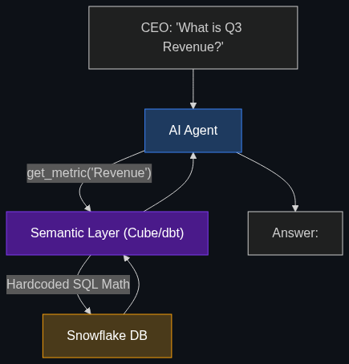

# 🧠 Semantic Layer

> **A shared "dictionary" or map of data that all AI agents in a company use so they all have the same understanding of what terms like "Revenue" or "Customer" mean across different apps.**

---

## Phase 1: Core Foundations & Pre-requisites

### Prerequisites
- **RAG** — Retrieval-Augmented Generation.
- **Knowledge Graphs** — Linking data by relationships.

### Definition
A **Semantic Layer** is a data architecture concept. It sits between an enterprise's raw databases (SQL, Snowflake, APIs) and the AI agents. 

Raw databases are messy. "Revenue" might be called `rev_Q3_final` in one database and `total_sales_net` in another. If you let an AI query the database directly, it will hallucinate or pick the wrong column. 

The **Semantic Layer** is a unified, business-friendly map. It explicitly defines that "Revenue" = `sum(total_sales_net) - refunds`. When an AI agent needs data, it queries the Semantic Layer, which perfectly translates the AI's natural language request into the exact, mathematically correct SQL query required across all the messy underlying databases.

### The Problem It Solves

| Without a Semantic Layer | With a Semantic Layer |
|--------------------------|-----------------------|
| AI tries to write SQL directly against 50 raw tables. | AI asks the Semantic Layer for the "Metric: Revenue". |
| AI calculates "Profit" incorrectly because it forgot to subtract taxes. | AI gets the exact "Profit" number because the math is hardcoded in the layer. |
| 5 different agents give 5 different answers for the same question. | All agents give the exact same answer (A Single Source of Truth). |

### 🧩 Mini-Quiz

> **Q1:** Is the Semantic Layer an AI model?
> <details><summary>Answer</summary>No. The Semantic Layer is traditional software architecture (often written in YAML or a BI tool like Cube or dbt). It is a rigid, deterministic set of rules and definitions. The AI model is the "brain" that reads those rules to figure out how to access the data.</details>

---

## Phase 2: Anatomy & Internal Mechanisms

### How the Layer Translates



1. **User Prompt:** *"What was our Q3 churn rate?"*
2. **The LLM (Agent):** Looks at the tools available to it. It sees a tool called `get_metric(metric_name)`.
3. **The Semantic Layer:** The agent sends `get_metric("churn_rate")`. The layer contains a YAML file defining exactly what "churn_rate" means, which tables to join, and what math to perform.
4. **Execution:** The layer safely executes the massive SQL join on Snowflake, gets the exact number (`4.2%`), and hands it back to the agent.
5. **The Output:** The agent tells the user, *"Our Q3 churn rate was 4.2%."*

### 🃏 Flashcard

> **Front:** Why do data engineers refuse to let LLMs write raw SQL (Text-to-SQL) in production environments?
> <details><summary>Flip</summary>Because LLMs hallucinate table names, misunderstand complex business logic (like how a specific company handles refunds), and can accidentally write incredibly expensive queries that lock up the entire database. A Semantic Layer restricts the LLM to only querying pre-approved, pre-defined metrics.</details>

---

## Phase 3: Advanced / Enterprise Patterns & Pitfalls

### Enterprise Use Cases

| Industry | Semantic Layer Application |
|----------|----------------------------|
| **E-Commerce** | Defining "Active User" in the layer. Marketing AI, Sales AI, and Support AI all query the layer, guaranteeing they all use the exact same definition of an Active User when building reports. |
| **Healthcare** | Masking PII. The Semantic Layer can be programmed to automatically anonymize patient IDs before handing the data back to the AI agent, ensuring HIPAA compliance. |

### Anti-Patterns

- ❌ **Connecting LLMs directly to Data Warehouses** → This is the biggest anti-pattern in AI data engineering. Handing an LLM the schema for a 1,000-table Snowflake instance and asking it to figure out the math will result in disaster.
- ❌ **Duplicating Logic** → Having the Sales Agent calculate profit in its system prompt, and the Finance Agent calculate profit in its Python code. The logic must be centralized in the Semantic Layer.

---

## Phase 4: Practical Implementation

### Defining a Metric in a Semantic Layer (YAML Concept)

*This is how data engineers define the truth for AI agents using tools like Cube or dbt.*

```yaml
# A conceptual Semantic Layer definition for "Net Revenue"
metrics:
  - name: net_revenue
    description: "Total sales minus refunds and taxes. Use this whenever asked about revenue."
    type: sum
    sql: "transactions.amount - transactions.refund - transactions.tax"
    
    # The AI doesn't need to know these table joins; the layer handles it.
    joins:
      - table: refunds
        on: "transactions.id = refunds.transaction_id"

dimensions:
  - name: time_month
    type: time
    sql: "transactions.created_at"
```

*The AI Agent simply executes: `query_semantic_layer(metric="net_revenue", dimension="time_month")`*

---

## Phase 5: Interview Preparation

### Q1: "We built an AI data analyst to answer CEO questions. On Monday it said revenue was $10M. On Tuesday it said revenue was $12M. The database didn't change. What's wrong?"
<details><summary><b>STAR Answer</b></summary>

**Situation:** An LLM utilizing Text-to-SQL was returning inconsistent, non-deterministic answers for rigid financial metrics.

**Task:** Stabilize the AI's data retrieval to ensure a Single Source of Truth.

**Action:** I identified that the LLM was hallucinating different SQL joins depending on how the CEO phrased the question (e.g., sometimes it included tax, sometimes it didn't). To fix this, I implemented a **Semantic Layer** between the AI and the database. 
I hardcoded the exact mathematical definition of "Revenue" into the layer. I then removed the AI's ability to write raw SQL, and instead gave it an API tool to query the Semantic Layer by metric name.

**Result:** The AI became perfectly deterministic regarding financial math. No matter how the CEO phrased the question, the AI called the Semantic Layer, which executed the exact same pre-approved SQL every time, eliminating hallucinations.
</details>

---

## Phase 6: Summary Cheatsheet & Action Plan

### 📋 TL;DR

| Concept | Key Point |
|---------|-----------|
| **Semantic Layer** | A business-logic map sitting between AI and raw databases. |
| **The Goal** | Stop AIs from writing bad SQL; provide a Single Source of Truth. |
| **How it works** | Defines metrics (Revenue, Churn) centrally via code (YAML). |
| **The Benefit** | Consistency. All agents give the exact same answer. |

### 🚀 Do These Now
1. **Research Semantic Tools:** Look up "Cube.dev" or "dbt Semantic Layer". Read their marketing pages to understand how they pitch this architecture to enterprises struggling with AI data hallucinations.
