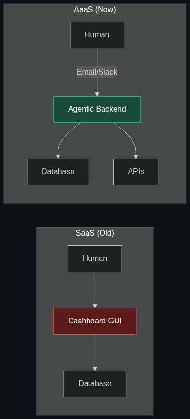

# 👔 AaaS (Agent-as-a-Service)

> **A cloud model where you don't buy software; you "hire" an AI agent to handle a full business process (like payroll or supply chain) autonomously.**

---

## Phase 1: Core Foundations & Pre-requisites

### Prerequisites
- **SaaS** — Software-as-a-Service (the traditional subscription model).
- **Agentic Workflows** — AI taking autonomous actions.

### Definition
For 20 years, B2B companies bought **SaaS (Software-as-a-Service)**. If you bought Salesforce, you still had to hire a human salesperson to log in, click the buttons, and use the software. 

**AaaS (Agent-as-a-Service)** is the next evolution. Instead of buying software for your humans to use, you "hire" a fully autonomous agent from a vendor. You don't get a login screen or a dashboard; you get an email address for "Alex the Sales Agent." You CC Alex on an email, and Alex negotiates the contract, updates your CRM, and closes the deal entirely in the background.

### The Problem It Solves

| SaaS (Software as a Service) | AaaS (Agent as a Service) |
|------------------------------|---------------------------|
| Provides a tool. | Provides the labor. |
| Billed per user seat (e.g., $50/user/month). | Billed per successful outcome (e.g., $10 per closed ticket). |
| Requires human training and onboarding. | Works perfectly on day one. |

### 🧩 Mini-Quiz

> **Q1:** If I use ChatGPT Plus (paying $20/month) to help me write emails, is that AaaS?
> <details><summary>Answer</summary>No. That is still AI-assisted SaaS. You are doing the work, and the AI is your tool. AaaS would be paying a vendor $500 a month to deploy an autonomous agent that reads your inbox, drafts the replies, and hits "Send" while you sleep.</details>

---

## Phase 2: Anatomy & Internal Mechanisms

### The Shift in UI/UX



AaaS fundamentally changes how humans interact with computers.
- **Traditional UX:** Dropdowns, buttons, forms, dashboards.
- **AaaS UX:** Natural language, email, Slack messages.

In an AaaS model, the "software" is entirely invisible. The vendor builds a massive backend orchestration engine of LLMs, RAG, and APIs. The customer just interacts with the agent as if it were a remote contractor on Slack.

### 🃏 Flashcard

> **Front:** How does AaaS completely disrupt the traditional SaaS pricing model?
> <details><summary>Flip</summary>SaaS companies make money by selling "Seats" (licenses for human employees). If AaaS replaces 50 human customer support reps with 1 AI Agent, the SaaS company (like Zendesk) loses 50 seats of revenue. Therefore, vendors are shifting to <b>Outcome-Based Pricing</b>, charging for the <i>work done</i> rather than the software access.</details>

---

## Phase 3: Advanced / Enterprise Patterns & Pitfalls

### Enterprise Use Cases

| Industry | AaaS Application |
|----------|------------------|
| **Accounting** | Hiring an "Agentic Bookkeeper." You forward all receipts to an email. The agent extracts the data, categorizes the spend, updates QuickBooks via API, and emails the CEO a weekly P&L report. |
| **Cybersecurity** | Agentic SOC (Security Operations Center). The agent monitors network logs 24/7, isolates infected laptops autonomously, and writes the incident report. |
| **HR / Recruiting** | An agent that receives a job description, sources 100 candidates on LinkedIn, emails them, conducts the initial text-based screening interview, and puts the top 3 on the human manager's calendar. |

### Anti-Patterns

- ❌ **Zero Oversight** → Giving an AaaS agent full write-access to your production database without an approval node. AaaS still requires Agentic Oversight (see [Module 4](../04_Safety_and_Chain_of_Command/01_Chain_of_Accountability.md)).
- ❌ **Building Custom UI** → Building complex graphical dashboards for AaaS. The point of an agent is that it operates asynchronously. The best UI for an agent is often just an email thread or a Slack channel.

---

## Phase 4: Practical Implementation

### The AaaS Interaction Model (Conceptual)

*You don't write code to use AaaS; you write organizational instructions, just like onboarding an employee.*

```text
# To: support-agent@aaas-vendor.com
# From: VP of Customer Success
# Subject: Your New Instructions

Hi Agent,

Starting today, you are handling all Tier 1 support tickets for our new product launch.

Here are your instructions:
1. Read incoming tickets in Zendesk.
2. Search our internal Confluence Wiki for the answer.
3. If the user asks for a refund, check Stripe. If the purchase was under 30 days ago, issue the refund automatically.
4. If you cannot solve the problem, tag @human_escalation in Slack.

Do not be overly conversational. Be polite and concise.
```

---

## Phase 5: Interview Preparation

### Q1: "We are building an AI tool to help accountants. Should we build a dashboard where they can run AI reports, or an autonomous agent?"
<details><summary><b>STAR Answer</b></summary>

**Situation:** The product team is debating between a traditional SaaS architecture (AI features inside a dashboard) and an AaaS architecture (Agent as a Service).

**Task:** Determine the most defensible and valuable product strategy.

**Action:** I would strongly advocate for the AaaS model. Dashboards and Copilots are becoming commodities; every SaaS company is adding "AI summarize" buttons. The true enterprise value lies in *labor replacement*, not just workflow enhancement.
Instead of forcing the accountant to log in and click "Run AI Report," we build an autonomous agent that connects to their data, generates the report at 3 AM, and emails it to them before they wake up. 

**Result:** By selling the *outcome* (the finished report) rather than the *tool* (the dashboard), we can charge significantly higher margins, transitioning our business model from selling software seats to selling digital labor.
</details>

---

## Phase 6: Summary Cheatsheet & Action Plan

### 📋 TL;DR

| Concept | Key Point |
|---------|-----------|
| **AaaS** | Agent-as-a-Service. |
| **The Shift** | Buying *Labor* (autonomous work) instead of *Tools* (software). |
| **The UI** | Slack, Email, and natural language instead of graphical dashboards. |
| **The Pricing** | Outcome-based pricing (pay per resolved ticket) instead of per-seat pricing. |

### 🚀 Do These Now
1. **Look at Devin:** Search for "Devin AI Software Engineer." Notice how they don't sell an IDE or a coding tool. They sell an "AI Employee" that you give a JIRA ticket to, and it does the work autonomously. This is the ultimate example of AaaS.
