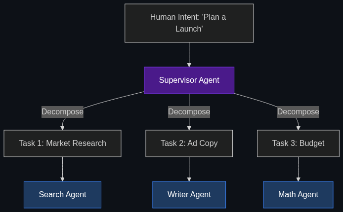

# 🔪 Intent Decomposition

> **The process where an orchestrator takes a complex human request (e.g., "Plan a marketing launch") and breaks it into 50 tiny, executable tasks for different sub-agents.**

---

## Phase 1: Core Foundations & Pre-requisites

### Prerequisites
- **Multi-Agent Orchestration** — Supervisors routing work to workers (see [Module 3](../../02_Enterprise_AI/03_Advanced_Orchestration/01_Multi_Agent_Orchestration.md)).
- **Chain of Thought** — Step-by-step reasoning.

### Definition
When a user asks ChatGPT to "Write a poem," it just writes it. 
When a CEO asks an enterprise AI to "Analyze our Q3 losses, find the worst-performing region, and draft a firing plan for the regional manager," a single LLM prompt will catastrophically fail.

**Intent Decomposition** is the architectural step where a "Supervisor AI" analyzes a massive, ambiguous human goal, breaks it down into a directed acyclic graph (DAG) of tiny, highly-specific sub-tasks, and assigns those sub-tasks to specialized micro-agents. 

### The Problem It Solves

| Single Prompt Execution | Intent Decomposition |
|-------------------------|----------------------|
| AI tries to do 5 things at once in one text block. | AI creates a 5-step checklist and executes them sequentially. |
| Fails at complex, multi-system workflows. | Succeeds by isolating complexity into small, manageable chunks. |
| Context window fills up with confusing noise. | Each sub-agent only gets the exact context it needs for its tiny task. |

### 🧩 Mini-Quiz

> **Q1:** Who performs the Intent Decomposition? The human or the AI?
> <details><summary>Answer</summary>In a true Agentic Enterprise, the <b>AI (The Orchestrator/Supervisor)</b> performs the decomposition. The human simply provides the high-level intent ("Plan a trip to Tokyo"), and the Supervisor AI autonomously writes the checklist (Book flight, find hotels, draft itinerary) and delegates the work.</details>

---

## Phase 2: Anatomy & Internal Mechanisms

### The Decomposition Tree



1. **The Human Intent:** "Launch a new product campaign."
2. **The Orchestrator (System 2 Planning):** The Supervisor Agent uses high Test-Time Compute to deliberate. It breaks the intent into:
   - Task A: Market Research
   - Task B: Ad Copywriting
   - Task C: Budget Allocation
3. **Dependency Mapping:** The Orchestrator realizes Task B cannot start until Task A finishes. It creates a strict execution graph.
4. **Delegation:** 
   - Spins up a Search Agent for Task A.
   - Spins up a Writing Agent for Task B.
   - Spins up a Math/Python Agent for Task C.

### 🃏 Flashcard

> **Front:** Why is Intent Decomposition critical for preventing hallucinations?
> <details><summary>Flip</summary>Because LLMs are easily distracted. If you give an LLM a complex prompt requiring math, writing, and coding, its attention mechanism gets split, causing it to hallucinate. By decomposing the intent into tiny tasks (e.g., "Just do the math"), the agent has intense, narrow focus, drastically increasing accuracy.</details>

---

## Phase 3: Advanced / Enterprise Patterns & Pitfalls

### Enterprise Use Cases

| Scenario | Decomposition Application |
|----------|---------------------------|
| **Legal Discovery** | Human: "Find evidence of fraud in these 10,000 emails."<br>Orchestrator breaks it down: Creates 100 sub-agents, assigns 100 emails to each, asks them to extract specific keywords, then aggregates the findings into a final report. |
| **Software Engineering** | Human: "Build a login page."<br>Orchestrator breaks it down: 1) Write HTML. 2) Write CSS. 3) Write Auth backend. 4) Write Unit Tests. |

### Anti-Patterns

- ❌ **Over-Decomposition** → Breaking a simple task ("Say Hello") into 5 sub-tasks. Every sub-task requires an API call, adding latency and cost. Only decompose complex intents.
- ❌ **Ignoring Error Handling in the Tree** → If Task B fails, the Orchestrator must be programmed to recognize the failure, rewrite the instructions for Task B, and try again, rather than letting the whole tree collapse.

---

## Phase 4: Practical Implementation

### Prompting for Decomposition (Conceptual)

*How to instruct a Supervisor Agent to break down a task.*

```python
from openai import OpenAI
import json

client = OpenAI()

def decompose_intent(human_goal: str):
    """Forces the LLM to output a structured execution plan."""
    
    system_prompt = """
    You are the Chief Orchestrator. 
    Take the user's high-level goal and decompose it into a strict, sequential 
    JSON array of sub-tasks.
    Each sub-task must include:
    - task_id (int)
    - description (string)
    - required_agent_type (Search, Writer, Math, Coder)
    - dependencies (list of task_ids that must finish first)
    """
    
    response = client.chat.completions.create(
        model="gpt-4o",
        messages=[
            {"role": "system", "content": system_prompt},
            {"role": "user", "content": human_goal}
        ],
        response_format={ "type": "json_object" }
    )
    
    return json.loads(response.choices[0].message.content)

# The Human Intent
plan = decompose_intent("Analyze Apple's Q3 earnings and write a summary comparing it to Microsoft.")
print(json.dumps(plan, indent=2))
# Output: A JSON tree containing: 1) Search Apple Q3, 2) Search Microsoft Q3, 3) Extract numbers, 4) Write summary.
```

---

## Phase 5: Interview Preparation

### Q1: "When we ask our AI to draft complex legal contracts, it forgets whole sections and hallucinates clauses. How do we fix this?"
<details><summary><b>STAR Answer</b></summary>

**Situation:** The AI is failing to execute complex, multi-step generative tasks accurately due to context overload and attention fragmentation.

**Task:** Re-architect the prompt flow to guarantee high-fidelity outputs.

**Action:** I would implement an **Intent Decomposition** architecture. 
Instead of sending a single zero-shot prompt ("Write the contract"), I would build a Supervisor Agent. When the user requests a contract, the Supervisor breaks the request into 10 distinct sub-tasks (e.g., Task 1: Draft Indemnification Clause, Task 2: Draft Termination Clause). 
The Supervisor then spins up 10 independent micro-agents, feeding each one *only* the specific instructions for their single clause. Finally, a compiler agent stitches the 10 perfect clauses together into the final document.

**Result:** By decomposing the intent, we eliminate attention fragmentation. Each agent operates with extreme focus, resulting in a 100% complete, hallucination-free contract, solving the complexity bottleneck.
</details>

---

## Phase 6: Summary Cheatsheet & Action Plan

### 📋 TL;DR

| Concept | Key Point |
|---------|-----------|
| **Intent Decomposition** | Breaking a big human goal into tiny AI tasks. |
| **The Actor** | The Orchestrator / Supervisor Agent does the breaking down. |
| **The Benefit** | Fixes hallucinations, allows parallel processing, handles massive complexity. |
| **The Output** | A Directed Acyclic Graph (DAG) or a sequential checklist. |

### 🚀 Do These Now
1. **Try it in ChatGPT:** Give ChatGPT a massive task (like planning a business) but add this prompt at the end: *"Before you do any work, break this task down into a 10-step sequential checklist, and ask me to approve the checklist."* You are forcing it to use Intent Decomposition.
