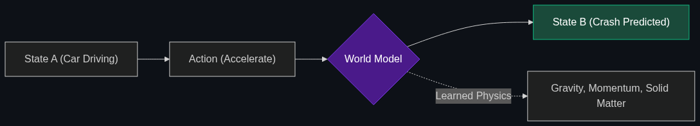

# 🌍 World Models

> **Think of this as the AI having a "physics engine" in its head. It doesn't just predict the next word; it predicts how the physical world will react to an action (e.g., "If I push this glass, it will shatter").**

---

## Phase 1: Core Foundations & Pre-requisites

### Prerequisites
- **Multimodal AI** — Vision and video processing.
- **Auto-regressive Prediction** — How AI predicts the "next step" in a sequence.

### Definition
A **World Model** represents a fundamental shift in AI architecture. Instead of learning the statistical correlation of words (like an LLM), a World Model learns the physical, spatial, and temporal rules of reality.

It acts as an internal "physics engine." If you show a World Model a video of a car driving toward a brick wall, it doesn't need a human to tell it the car will crash. Its internal World Model inherently understands velocity, solid matter, and collision, allowing it to accurately predict and generate the next frame of the video (the crash) entirely on its own.

### The Problem It Solves

| Standard Generative AI | AI with a World Model |
|------------------------|-----------------------|
| Generates a video of a cat walking *through* a table. | Generates a video of a cat walking *around* the table. |
| Needs 100,000 labeled examples of "dropping an apple". | Learns gravity once, and applies it to all objects automatically. |
| Cannot reason about physical consequences. | Can plan physical tasks (e.g., packing a trunk efficiently). |

### 🧩 Mini-Quiz

> **Q1:** Is OpenAI's Sora a video generator or a World Model?
> <details><summary>Answer</summary>OpenAI explicitly refers to Sora as a "World Simulator." While the output is video, the underlying architecture is a World Model. To successfully generate consistent, photorealistic video, the model was forced to deduce the laws of 3D geometry and object permanence.</details>

---

## Phase 2: Anatomy & Internal Mechanisms

### Observation vs Rules



A traditional physics engine (like Unreal Engine in video games) is **Rule-Based**. A programmer hardcodes the equation for gravity ($9.8 m/s^2$).

A World Model is **Observation-Based**. No programmer tells it about gravity. It simply watches millions of hours of raw video. To minimize its error rate when predicting what happens in the next frame, the neural network *derives* the concept of gravity on its own. It learns that objects move downward.

### Object Permanence
A key benchmark for World Models. If a person in a video walks behind a pillar, a standard AI forgets the person exists (because the pixels are gone). A World Model maintains the "concept" (the latent vector) of the person in its memory, understanding they still exist and will emerge on the other side of the pillar.

### 🃏 Flashcard

> **Front:** Why are World Models considered the prerequisite for AGI (Artificial General Intelligence)?
> <details><summary>Flip</summary>Human intelligence is deeply rooted in spatial and physical reasoning (navigating the real world). A text-only LLM can pass the Bar Exam, but it cannot figure out how to fold a shirt. To achieve true General Intelligence, the AI must understand the physical constraints and logic of the universe it exists in.</details>

---

## Phase 3: Advanced / Enterprise Patterns & Pitfalls

### Enterprise Use Cases

| Industry | World Model Application |
|----------|-------------------------|
| **Autonomous Driving** | Tesla's v12 FSD replaces hardcoded C++ driving rules with an end-to-end World Model. The car drives by watching video and predicting the safest future state of the physical world. |
| **Manufacturing Simulation** | Creating a highly accurate "Digital Twin" of a factory floor where the World Model predicts how a new robotic arm will physically disrupt the assembly line before it is ever built. |

### Anti-Patterns

- ❌ **Using LLMs for Spatial Puzzles** → Asking ChatGPT to solve a complex physical geometry problem (like arranging furniture in a room). Without a World Model, the LLM just guesses based on text patterns and fails miserably.
- ❌ **Assuming Perfect Physics** → Current World Models (like Sora) still suffer from "Physical Hallucinations." They understand general physics, but often fail at complex interactions (e.g., a person taking a bite of a cookie, but the cookie remains whole).

---

## Phase 4: Practical Implementation

### Conceptualizing Future State Prediction (Python)

*How a World Model thinks: Given State A and Action B, predict State C.*

```python
class ConceptualWorldModel:
    def __init__(self):
        # A massive neural network holding the rules of physics
        self.latent_physics_engine = load_model()
        
    def predict_consequence(self, current_video_frame, proposed_action):
        """
        The AI hallucinates the future to see if an action is safe.
        """
        # Compress the image into concepts (Car, Pedestrian, Wall)
        current_state = encode(current_video_frame)
        
        # Simulate the physics of the action (e.g., "Accelerate")
        simulated_future_state = self.latent_physics_engine.simulate(
            state=current_state, 
            action=proposed_action
        )
        
        return simulated_future_state

# Usage in a self-driving car
world_model = ConceptualWorldModel()

# The car imagines what will happen if it turns left
future = world_model.predict_consequence(camera_feed, action="turn_left")

if "collision" in decode_risks(future):
    print("Action Rejected. Recalculating path.")
```

---

## Phase 5: Interview Preparation

### Q1: "Why is the AI industry shifting focus from scraping text data (Wikipedia) to scraping video data (YouTube)?"
<details><summary><b>STAR Answer</b></summary>

**Situation:** The AI industry has hit the "Data Wall" for text—we have largely scraped all high-quality human text available on the internet.

**Task:** Explain the strategic pivot to video data for future model training.

**Action:** Text is an incredibly low-bandwidth representation of reality. You cannot teach an AI how to physically navigate a room or understand the concept of friction just by having it read text. I would explain that the industry is pivoting to video because it is the foundational data required to train **World Models**. 

**Result:** By training on massive amounts of video, models are shifting from statistical text-predictors to physical-reality predictors. This enables the model to develop an inherent "physics engine," which unlocks the next trillion-dollar market: Embodied AI and robotics.
</details>

---

## Phase 6: Summary Cheatsheet & Action Plan

### 📋 TL;DR

| Concept | Key Point |
|---------|-----------|
| **World Model** | An AI that understands physics, gravity, and object permanence. |
| **How it Learns** | Bottom-up observation of massive amounts of video data. |
| **Sora** | OpenAI's video generator, which is actually a World Simulator. |
| **The End Goal** | Safe, autonomous interaction with the physical world (Robotics). |

### 🚀 Do These Now
1. **Watch Yann LeCun:** Search YouTube for "Yann LeCun World Models." As the Chief AI Scientist at Meta, he is the primary evangelist explaining why LLMs are a dead end and World Models are the true path to AGI.
