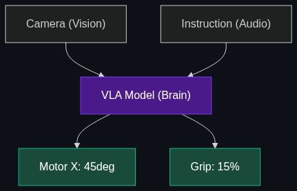

# 🦾 Embodied AI

> **The bridge between AI and Robotics. It’s the study of how an AI "brain" interacts with a physical "body" to perform tasks in the real world, like folding laundry or navigating a warehouse.**

---

## Phase 1: Core Foundations & Pre-requisites

### Prerequisites
- **World Models** — Understanding physics (see [01_World_Models.md](01_World_Models.md)).
- **VLMs** — Vision-Language Models processing camera feeds.

### Definition
**Embodied AI** is the discipline of taking highly capable AI models (like GPT-4o or Gemini) out of the web browser and putting them into physical machines (robotic arms, humanoid robots, drones). 

Traditional robotics relies on rigid programming—if a box is 2 inches to the left of where the code expects it to be, the robot fails. Embodied AI utilizes Vision-Language-Action (VLA) models. The robot uses cameras to *see* the box, uses its LLM brain to *reason* about how to pick it up, and dynamically adjusts its physical *body* to execute the task in real-time, even in messy, unpredictable human environments.

### The Problem It Solves

| Traditional Factory Robot | Embodied AI Robot |
|---------------------------|-------------------|
| Blindly repeats the exact same motion 10,000 times. | Looks at the environment and decides the best motion. |
| Requires a team of C++ engineers to reprogram for a new task. | Can be reprogrammed by a human saying: "Hey, sort the red boxes today." |
| Fails catastrophically in a messy human home. | Can navigate clutter, open doors, and fold laundry. |

### 🧩 Mini-Quiz

> **Q1:** Why did it take so long to get smart humanoid robots? Have the motors just recently gotten better?
> <details><summary>Answer</summary>No, the hardware (actuators, motors, batteries) has been capable for years (e.g., Boston Dynamics doing backflips in 2018). The missing piece was the <b>Brain</b>. We didn't have AI models capable of looking at a chaotic room and semantically understanding what a "chair" or a "fragile cup" was until the recent explosion of Multimodal LLMs.</details>

---

## Phase 2: Anatomy & Internal Mechanisms

### The VLA Pipeline (Vision-Language-Action)



Embodied AI models do not output text; they output *continuous motor control numbers*.

1. **Vision (Input):** The robot's stereo cameras stream 60fps video into the model.
2. **Language (Instruction):** The user provides an audio command: *"Hand me the apple."*
3. **Reasoning:** The LLM identifies the apple on the table, calculates the distance, and recognizes obstacles.
4. **Action (Output):** The model directly outputs the coordinates: `Move_Arm(X: 12, Y: 4, Z: -2, Grip: 15%)`.

### Teleoperation & Imitation Learning
Because we don't have an "internet of robot data" to train these models on, companies use **Teleoperation**. A human wears a VR headset and haptic gloves, looking through the robot's cameras and physically moving the robot's arms to fold laundry. The AI records this (Video + Motor Data) and learns to imitate the human's physical logic.

### 🃏 Flashcard

> **Front:** What is the "Sim-to-Real" gap in Embodied AI?
> <details><summary>Flip</summary>Because collecting physical robot data is slow, researchers train AI brains inside fast, massive video game simulations (like Nvidia Omniverse). However, when they download that brain into a physical robot, it often fails because the real world has unpredictable friction, wind, and lighting. Bridging this gap (Sim-to-Real) is the hardest engineering challenge in Embodied AI today.</details>

---

## Phase 3: Advanced / Enterprise Patterns & Pitfalls

### Enterprise Use Cases

| Industry | Embodied AI Application |
|----------|-------------------------|
| **Logistics / Warehousing** | Amazon utilizing robots that can look at a bin of 50 randomly mixed items, identify a specific toy, figure out how to grasp its awkward shape, and place it in a shipping box. |
| **Hazardous Environments** | Sending a robot into a chemical spill. Instead of remote-controlling it, the operator just says: "Find the valve and turn it clockwise until it stops leaking." |

### Anti-Patterns

- ❌ **Cloud Dependency** → Running a robot's brain via an OpenAI API call over Wi-Fi. If the Wi-Fi drops, the robot drops the heavy box. Embodied AI *must* run locally on Edge NPUs for low-latency, deterministic safety.
- ❌ **Ignoring Moravec's Paradox** → The realization that high-level reasoning (playing chess, passing the Bar Exam) is easy for AI, but low-level sensorimotor skills (walking up stairs, tying a shoelace) are incredibly difficult. Do not assume a smart chatbot makes a smart physical robot.

---

## Phase 4: Practical Implementation

### Connecting LLMs to Physical Hardware (Conceptual)

*How a software engineer talks to a robot's API.*

```python
# A conceptual example of a VLA (Vision-Language-Action) loop

import robot_hardware_api as robot
import vla_model

def execute_embodied_task(user_command):
    print(f"Goal: {user_command}")
    
    while True:
        # 1. Get sensory input from the physical body
        camera_feed = robot.get_stereo_cameras()
        arm_position = robot.get_joint_states()
        
        # 2. Feed reality into the AI Brain
        action_payload = vla_model.predict_next_action(
            vision=camera_feed,
            proprioception=arm_position, # Where the robot's body currently is
            goal=user_command
        )
        
        # 3. Execute the physical movement
        robot.move_joints(action_payload.motor_commands)
        
        # 4. Check if task is complete
        if action_payload.status == "DONE":
            print("Task achieved.")
            break

# The robot acts autonomously
execute_embodied_task("Find the blue mug and put it in the sink.")
```

---

## Phase 5: Interview Preparation

### Q1: "We want to automate our factory sorting line. Should we buy traditional programmed robotic arms, or the new Embodied AI humanoid robots?"
<details><summary><b>STAR Answer</b></summary>

**Situation:** The business is deciding between legacy hardcoded robotics and bleeding-edge Embodied AI for a physical workflow.

**Task:** Evaluate the environment to recommend the correct hardware architecture.

**Action:** I would assess the *predictability* of the factory line. If the items coming down the belt are exactly the same size, shape, and orientation every single time, I would recommend traditional, hardcoded robotic arms. They are faster, cheaper, and highly precise for rigid tasks.
However, if the factory deals with unstructured data—like a recycling plant where items are varied, broken, and unpredictable—I would recommend Embodied AI (VLA models). 

**Result:** Embodied AI provides the semantic vision and real-time physical reasoning required to handle chaos and unstructured environments, replacing the need for perfect alignment on the factory floor.
</details>

---

## Phase 6: Summary Cheatsheet & Action Plan

### 📋 TL;DR

| Concept | Key Point |
|---------|-----------|
| **Embodied AI** | AI models given physical bodies to interact with the real world. |
| **VLA Models** | Vision-Language-Action. Outputting motor controls, not text. |
| **Moravec's Paradox** | Math is easy for AI; tying a shoelace is incredibly hard. |
| **Sim-to-Real** | Training in a video game and deploying to a real robot. |

### 🚀 Do These Now
1. **Watch Figure 01 or Tesla Optimus:** Search YouTube for the latest demos of humanoid robots. Notice how the engineers are talking to them normally, and the robots are dynamically reacting to mistakes (like dropping an item and picking it back up without being explicitly told to).
