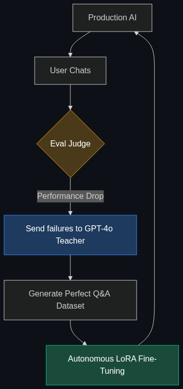

# 🧬 Self-Evolving AI

> **Systems designed to monitor their own performance and automatically trigger their own "fine-tuning" or "distillation" when they notice their accuracy is dropping—without a human developer intervening.**

---

## Phase 1: Core Foundations & Pre-requisites

### Prerequisites
- **Evals** — Automated grading of AI outputs.
- **Fine-Tuning / Distillation** — Training models on new data (see [Module 2](../02_The_Agentic_Enterprise/01_Agentic_Ops.md) and earlier distillation docs).

### Definition
Historically, AI models are frozen in time. If a company deploys an LLM to customer support, its knowledge base degrades as the company releases new products. A human engineer must manually collect chat logs, format them, and run a new Fine-Tuning job to update the model.

**Self-Evolving AI** automates this entire lifecycle. It is an architecture where an AI system constantly evaluates its own conversations. When it realizes it is frequently failing to answer questions about a new product, the system *autonomously* compiles a dataset of those failures, queries a massive model (like GPT-4) for the correct answers, and kicks off a fine-tuning job to upgrade its own weights over the weekend. 

### The Problem It Solves

| Static AI Deployment | Self-Evolving AI |
|----------------------|------------------|
| Knowledge is frozen at the training cutoff. | Knowledge continuously adapts to new data streams. |
| Requires a dedicated ML Ops team to maintain. | Operates completely autonomously (Zero-Touch ML). |
| Fails repeatedly on the same edge-case bug. | Fails once, learns the fix, and never fails on that edge-case again. |

### 🧩 Mini-Quiz

> **Q1:** If an AI uses RAG (web searching) to find new information, is it Self-Evolving?
> <details><summary>Answer</summary>No. RAG just changes the prompt context; the underlying "brain" (the weights) of the model remains identical. Self-Evolving AI actually alters its own neural network weights through automated fine-tuning, permanently learning the new information without needing to search for it next time.</details>

---

## Phase 2: Anatomy & Internal Mechanisms

### The Self-Evolution Loop



1. **Inference & Evals:** The deployed model handles 10,000 customer chats. A background "Judge AI" evaluates them and flags 500 chats where the user was frustrated or the answer was wrong.
2. **Synthetic Correction:** The system sends those 500 failed questions to a massive, expensive "Teacher" model (e.g., GPT-4o) alongside the company documentation to generate the *perfect* answers.
3. **Dataset Compilation:** The system automatically converts these 500 perfect Q&A pairs into a JSONL training file.
4. **Autonomous Fine-Tuning:** The system triggers a LoRA fine-tuning job on the cloud.
5. **Hot Swap:** Once training is done, the system runs a test suite. If the new model scores higher, it swaps the API endpoint. On Monday morning, the AI is noticeably smarter.

### 🃏 Flashcard

> **Front:** What is the primary danger of a Self-Evolving AI loop?
> <details><summary>Flip</summary><b>Data Contamination / Model Collapse.</b> If malicious users realize the AI learns from its conversations, they can purposefully feed it toxic or incorrect data (Data Poisoning). If the autonomous system doesn't have strict filtering guardrails, it will automatically fine-tune itself to become toxic or factually incorrect.</details>

---

## Phase 3: Advanced / Enterprise Patterns & Pitfalls

### Enterprise Use Cases

| Industry | Self-Evolving Application |
|----------|---------------------------|
| **Coding Assistants (Copilots)** | A corporate coding assistant notices that developers keep rejecting its suggestions for a specific internal API. It autonomously pulls the latest API docs from GitHub, fine-tunes itself overnight, and provides perfect suggestions the next day. |
| **Cybersecurity** | A threat-detection AI identifies a novel hacking pattern it has never seen before. It autonomously trains a new adapter (LoRA) to recognize that specific threat signature and deploys it globally across the enterprise in minutes. |

### Anti-Patterns

- ❌ **Evolving without Human-in-the-Loop Validation** → Allowing a system to push a newly trained model to production without a human clicking "Approve." Always require a human to review the final Eval metrics before the hot-swap occurs.
- ❌ **Over-Fitting to Noise** → Triggering a fine-tuning job based on only 10 failed interactions. The model will over-fit to those 10 specific users and degrade its general performance. Evolving should occur in large, statistically significant batches.

---

## Phase 4: Practical Implementation

### The Trigger Mechanism (Python Pseudo-code)

*How an Agentic Ops system decides it is time to evolve.*

```python
# A background cron job that runs nightly

def evaluate_and_evolve(daily_chat_logs, quality_threshold=0.85):
    # 1. Grade today's performance
    average_score = run_llm_judge(daily_chat_logs)
    print(f"Daily Quality Score: {average_score}")
    
    # 2. Trigger evolution if performance drops
    if average_score < quality_threshold:
        print("⚠️ Performance degradation detected. Initiating Self-Evolution.")
        
        # Extract the specific failures
        failures = extract_failed_interactions(daily_chat_logs)
        
        # Use GPT-4 to generate the CORRECT answers for those failures
        synthetic_training_data = generate_correct_answers(failures)
        
        # Kick off an autonomous Fine-Tuning job via API (e.g., OpenAI or Anyscale)
        job_id = start_cloud_finetuning(synthetic_training_data)
        
        print(f"Fine-tuning job {job_id} started. Will notify admin for deployment approval upon completion.")
    else:
        print("✅ Performance optimal. No evolution required.")

evaluate_and_evolve(logs)
```

---

## Phase 5: Interview Preparation

### Q1: "Our customer support AI requires constant, expensive manual updates every time our product team releases a new feature. How can we modernize this pipeline?"
<details><summary><b>STAR Answer</b></summary>

**Situation:** The ML Ops team is bottlenecked manually curating datasets and running fine-tuning jobs to keep the production AI up to date with product releases.

**Task:** Automate the model lifecycle management to reduce engineering overhead.

**Action:** I would design a **Self-Evolving AI** pipeline. 
I would implement an automated Eval layer that monitors daily user interactions. Whenever the AI encounters a high volume of questions about a new, unknown feature (resulting in low confidence scores or negative user feedback), the system flags those queries. 
It autonomously routes those queries to a highly capable Teacher model, armed with the latest Gitbook documentation, to generate the perfect responses. It then compiles this into a LoRA fine-tuning dataset and triggers a nightly training job.

**Result:** The engineering bottleneck is entirely removed. The AI effectively "learns on the job," autonomously adapting its internal weights to new product releases overnight, ensuring high accuracy with zero manual ML engineering required.
</details>

---

## Phase 6: Summary Cheatsheet & Action Plan

### 📋 TL;DR

| Concept | Key Point |
|---------|-----------|
| **Self-Evolving AI** | Systems that autonomously fine-tune themselves over time. |
| **The Trigger** | Automated Evals detecting a drop in accuracy. |
| **The Mechanism** | Using a massive Teacher model to generate corrections for a smaller Student model. |
| **The Risk** | Data poisoning and model collapse without proper filtering. |

### 🚀 Do These Now
1. **Read about DSPy:** Re-visit the concept of DSPy (from Module 2). DSPy is a localized version of self-evolution, where the compiler automatically optimizes its own prompts based on failures. Self-Evolving AI scales this concept up to actual neural network weights.
