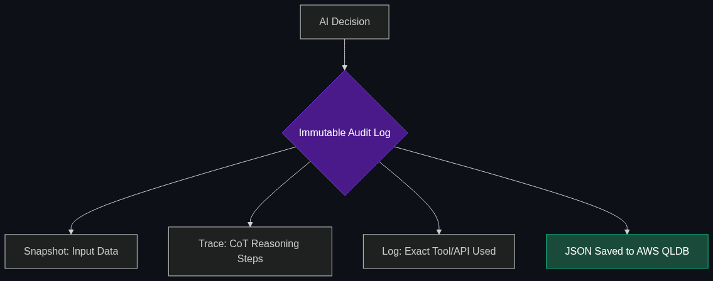

# 🔗 Chain-of-Accountability

> **An architectural framework that tracks every decision an autonomous agent makes so that if a mistake happens (like a bank bot approving a bad loan), a human can see exactly which "thought process" led to the error.**

---

## Phase 1: Core Foundations & Pre-requisites

### Prerequisites
- **Agentic Ops / Traceability** — Logging agent thoughts (see [Module 2](../02_The_Agentic_Enterprise/01_Agentic_Ops.md)).
- **Chain of Thought (CoT)** — Step-by-step AI reasoning.

### Definition
When a human employee makes a catastrophic mistake, an enterprise conducts an audit to find out *why* and *how* it happened. When an AI agent makes a catastrophic mistake, standard LLMs offer no explanation—they act as "Black Boxes."

**Chain-of-Accountability** is a strict compliance framework required for deploying AI in highly regulated industries (Finance, Healthcare, Law). It mandates that every single data retrieval, mathematical calculation, and logical jump an agent makes is cryptographically logged and stored in a human-readable format. If an AI denies a user a mortgage, the bank must be able to legally prove *exactly* which numbers the AI looked at to make that decision.

### The Problem It Solves

| Black Box AI (The Problem) | Chain-of-Accountability (The Solution) |
|----------------------------|----------------------------------------|
| Outputs a final decision: "Loan Denied." | Outputs: "Loan Denied. Reason: Credit score retrieved from Experian API on [Date] was 580. Rule 4B requires 600." |
| Un-auditable. Violates GDPR and Fair Lending laws. | 100% Auditable. Legally defensible in court. |
| Debugging is impossible. | Developers can isolate the exact flawed logic step and fix it. |

### 🧩 Mini-Quiz

> **Q1:** If I use an open-source model like Llama 3 instead of OpenAI, does that automatically give me Chain-of-Accountability?
> <details><summary>Answer</summary>No. Open-source models give you access to the weights, but they are still Black Boxes in how they generate text. Chain-of-Accountability is an <b>infrastructure/architectural layer</b> built around the model (using tools like LangSmith or custom audit logs) to record its exact inputs, tools used, and sequential logic.</details>

---

## Phase 2: Anatomy & Internal Mechanisms

### The Audit Trail



A fully compliant Chain-of-Accountability system requires logging three distinct layers of an agent's workflow:

1. **The Context Snapshot:** A frozen record of exactly what data the agent was fed. (If the agent read a stock chart, you must save the exact chart data from that specific millisecond).
2. **The Reasoning Trace:** The raw Chain of Thought output from the LLM (e.g., "Step 1: I see the user's income is X. Step 2: I must multiply by Y.").
3. **The Tool Execution Log:** A strict API log proving exactly what external software the agent touched (e.g., `POST /approve_loan {user_id: 123}`).

### 🃏 Flashcard

> **Front:** How does "Explainable AI (XAI)" relate to Chain-of-Accountability?
> <details><summary>Flip</summary>Explainable AI (XAI) is the broader academic pursuit of understanding <i>how</i> neural networks make decisions mathematically. Chain-of-Accountability is the practical, enterprise application of XAI—forcing the agent to write out its logic in English and logging its tool usage so lawyers and compliance officers can understand the decision.</details>

---

## Phase 3: Advanced / Enterprise Patterns & Pitfalls

### Enterprise Use Cases

| Industry | Accountability Application |
|----------|----------------------------|
| **Healthcare** | An AI triaging patients in an ER. If a patient is misdiagnosed, the hospital uses the Chain-of-Accountability log to prove whether the AI hallucinated, or if the human nurse input the wrong blood pressure into the system. |
| **HR / Recruiting** | An AI screening resumes. If a candidate sues for discrimination, the company can produce the exact logic trace showing the AI rejected the resume purely due to missing a Python requirement, not due to bias. |

### Anti-Patterns

- ❌ **Logging only the final prompt and response** → This is insufficient for compliance. If the agent used 5 tools and 10 intermediate reasoning steps to arrive at the final response, all of those hidden steps must be logged.
- ❌ **Allowing humans to edit the logs** → In regulated industries, the Chain-of-Accountability must be immutable (write-only). If a developer can delete a log showing the AI hallucinated, the system fails compliance audits.

---

## Phase 4: Practical Implementation

### Structuring an Auditable Output (JSON)

*Do not rely on the LLM to write paragraphs. Force it to output a structured audit trail.*

```json
// An example of a compliant, auditable response payload from a Financial Agent
{
  "transaction_id": "tx_987654321",
  "timestamp": "2026-04-29T14:22:00Z",
  "decision": "DENIED",
  "chain_of_accountability": {
    "step_1_data_retrieval": {
      "source": "Experian_API_v2",
      "data_pulled": {"credit_score": 580, "debt_to_income": "45%"}
    },
    "step_2_policy_check": {
      "policy_applied": "Enterprise_Loan_Policy_v4",
      "rule_evaluated": "Require credit_score > 600"
    },
    "step_3_reasoning": "The user's credit score of 580 is strictly less than the required 600. Therefore, the loan cannot be approved.",
    "step_4_action_taken": "Triggered API /send_rejection_email"
  }
}
```

---

## Phase 5: Interview Preparation

### Q1: "Our compliance team is blocking the deployment of our AI underwriting agent because they fear it violates the Fair Credit Reporting Act. How do we get approval?"
<details><summary><b>STAR Answer</b></summary>

**Situation:** The legal and compliance teams view the LLM as a Black Box and fear regulatory fines if the AI makes biased or inexplicable decisions.

**Task:** Design a transparent architecture that satisfies strict regulatory audit requirements.

**Action:** I would halt the standard deployment and implement a strict **Chain-of-Accountability** architecture. 
First, I would decouple the reasoning from the action. The AI will not be allowed to execute a decision directly. Instead, it must generate a structured JSON payload detailing its exact Chain of Thought, explicitly citing the specific data points (e.g., debt-to-income ratio) and the specific corporate policy rules it evaluated.
Second, I would store these payloads in an immutable, append-only database (like AWS QLDB). 

**Result:** Compliance approved the deployment because we transitioned the AI from a "Black Box" into a fully auditable "Glass Box." If auditors ever question a decision, we can query the database and instantly produce the exact mathematical and logical steps the AI took.
</details>

---

## Phase 6: Summary Cheatsheet & Action Plan

### 📋 TL;DR

| Concept | Key Point |
|---------|-----------|
| **Chain-of-Accountability** | An architecture ensuring every AI decision is fully auditable. |
| **The Goal** | Legal compliance and debugging in high-risk industries. |
| **The Method** | Logging Context, Reasoning (CoT), and Tool Execution immutably. |
| **The Antithesis** | Black Box AI (unexplained final answers). |

### 🚀 Do These Now
1. **Read about GDPR Automated Decision Making:** Look up "GDPR Article 22." It explicitly gives humans the right to an explanation when a decision (like a loan or a job) is made by an automated system. This law is why Chain-of-Accountability is mandatory in Europe.
