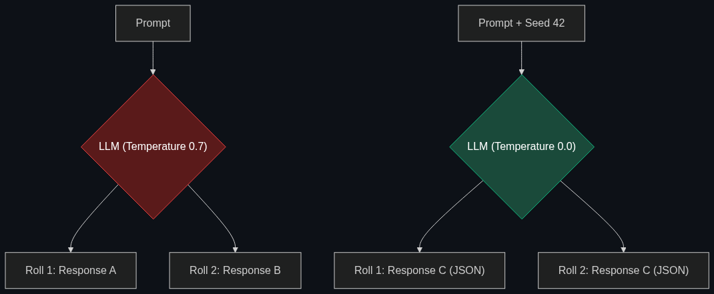

# 🎲 Non-determinism

> **A term used to describe the "randomness" of AI. In the industry, "solving for non-determinism" means trying to make an AI give the exact same answer every single time, which is much harder than it sounds.**

---

## Phase 1: Core Foundations & Pre-requisites

### Prerequisites
- **LLM Tokenization** — Predicting the next word based on probabilities.
- **Temperature** — The setting that controls creativity/randomness.

### Definition
In traditional software engineering, code is **Deterministic**. If you input `2 + 2`, the code will output `4` exactly 100% of the time, even if you run it a billion times.

Large Language Models are inherently **Non-deterministic** (stochastic). Because they generate text based on statistical probabilities (guessing the next most likely word), if you ask an LLM the exact same question twice, it might give you two completely different answers. 
For creative writing, non-determinism is a feature. For an enterprise trying to build a reliable financial auditing tool or an automated healthcare assistant, non-determinism is a catastrophic bug. 

### The Problem It Solves

| Traditional Software | Generative AI |
|----------------------|---------------|
| Highly rigid, breaks if the input is misspelled. | Highly flexible, understands misspellings perfectly. |
| 100% predictable output. | Unpredictable output. |
| **Goal:** Maintain flexibility. | **Goal:** "Solve for Non-determinism" to force predictability. |

### 🧩 Mini-Quiz

> **Q1:** If I set the API `temperature` parameter to `0.0`, does the LLM become 100% deterministic?
> <details><summary>Answer</summary>Almost, but no. Setting temperature to 0 forces the model to pick the most likely next word, drastically reducing randomness. However, due to floating-point math rounding errors on massive GPU clusters (hardware-level non-determinism), even a temperature of 0 can sometimes yield slightly different outputs across multiple runs on models like GPT-4.</details>

---

## Phase 2: Anatomy & Internal Mechanisms

### Why Models are Random



When an LLM generates a token, it doesn't just pick one word; it generates a list of probabilities:
- `Apple (60%)`
- `Banana (30%)`
- `Orange (10%)`

If `temperature > 0`, the model rolls a weighted dice. Most of the time it picks Apple, but 30% of the time it picks Banana. This divergence early in a sentence completely alters the rest of the generation, leading to wildly different final answers.

### Seed Parameters
To help developers test their apps, OpenAI introduced the `seed` parameter. If you send the exact same prompt, with the exact same `seed` number (e.g., `123`), the API will attempt to roll the exact same "dice" internally, giving you a highly consistent output for testing purposes.

### 🃏 Flashcard

> **Front:** Why does forcing an LLM to output JSON help control non-determinism?
> <details><summary>Flip</summary>Free-form text is boundless. By forcing the LLM to adhere to a strict JSON schema (e.g., `{"status": "approved", "reason": "..."}`), you violently restrict the universe of acceptable next tokens. This architectural constraint forces the model into a highly predictable, machine-readable groove, acting as a guardrail against random rambling.</details>

---

## Phase 3: Advanced / Enterprise Patterns & Pitfalls

### Enterprise Use Cases

| Scenario | Solving for Non-Determinism |
|----------|-----------------------------|
| **Data Extraction** | Reading 10,000 PDFs to extract invoice numbers. You use `temperature=0`, `seed`, and `response_format="json_object"` to ensure the AI behaves like a predictable regex parser, not a creative writer. |
| **Unit Testing** | In CI/CD pipelines, engineers use the `seed` parameter to ensure their automated tests don't randomly fail on Tuesday just because the AI decided to phrase the answer differently than it did on Monday. |

### Anti-Patterns

- ❌ **Expecting deterministic math from LLMs** → Never ask an LLM to multiply `12345 * 67890`. It will guess probabilistically and often fail. You must use a "Semantic Layer" or a "Calculator Tool" so the deterministic Python code does the math, not the non-deterministic LLM.
- ❌ **Testing a prompt only once** → Because of non-determinism, a prompt that works perfectly on the first try might fail on the second try. Prompt engineers must run an Eval 100 times to calculate the "pass rate" before declaring a prompt production-ready.

---

## Phase 4: Practical Implementation

### Forcing Determinism via API (Python)

*How to lock down an LLM for enterprise workflows.*

```python
from openai import OpenAI

client = OpenAI()

def deterministic_data_extraction(resume_text):
    """Extracts a candidate's email address with maximum predictability."""
    
    response = client.chat.completions.create(
        model="gpt-4o",
        messages=[
            {"role": "system", "content": "Extract the email. Output ONLY valid JSON."},
            {"role": "user", "content": resume_text}
        ],
        # 1. Temperature 0: Always pick the most likely token
        temperature=0.0,
        
        # 2. Seed: Force the random number generator to be consistent
        seed=42,
        
        # 3. JSON Mode: Force the output format
        response_format={ "type": "json_object" }
    )
    
    return response.choices[0].message.content

# Running this 100 times will yield the exact same JSON 99.9% of the time.
```

---

## Phase 5: Interview Preparation

### Q1: "Our CEO hates our new AI reporting tool. Yesterday it told him sales were 'excellent', and today it said sales were 'acceptable', even though the underlying data hasn't changed. How do we fix this?"
<details><summary><b>STAR Answer</b></summary>

**Situation:** The CEO is experiencing the inherent non-determinism of LLMs, which erodes trust in enterprise applications.

**Task:** Re-architect the reporting pipeline to guarantee consistency while retaining AI summarization.

**Action:** 
1. I would drop the `temperature` parameter on the reporting API call from the default `0.7` down to `0.0` to eliminate creative variance.
2. I would implement an explicit `seed` parameter to force generation consistency.
3. Crucially, I would alter the System Prompt to strictly categorize the data rather than interpret it freely. Instead of "Summarize the sales," the prompt becomes: *"If sales > $1M, output the exact string: 'Excellent'. If sales < $1M, output: 'Acceptable'."*

**Result:** By combining API parameter lockdowns with strict prompt constraints, we "solved for non-determinism." The CEO now receives the exact same, highly predictable executive summary every time the data meets the threshold, restoring trust in the tool.
</details>

---

## Phase 6: Summary Cheatsheet & Action Plan

### 📋 TL;DR

| Concept | Key Point |
|---------|-----------|
| **Non-determinism** | The inherent randomness of generative AI. |
| **The Enterprise Goal** | "Solving" for it to make AI as reliable as traditional software. |
| **The Tools** | `temperature=0`, `seed` parameters, and JSON-mode forcing. |
| **The Rule** | Never trust an LLM to do deterministic math. Use a calculator tool. |

### 🚀 Do These Now
1. **Test Temperature:** If you have access to the OpenAI Playground (platform.openai.com/playground), type a prompt and set the Temperature to `2.0` (Maximum). Watch the AI output absolute gibberish as it chooses highly unlikely words. Then set it to `0.0` and watch it become robotic and predictable.
