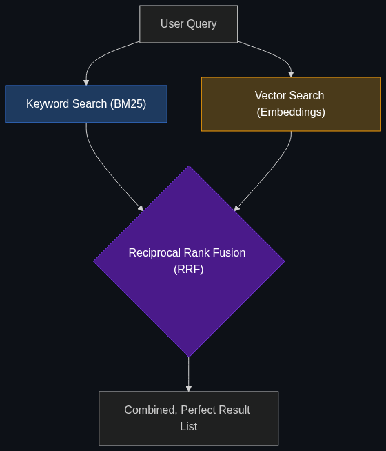

# 🧬 Hybrid Search

> **The "secret sauce" of modern RAG. It combines Vector Search (finding things by meaning) with Keyword Search (finding exact names or IDs) to ensure the AI gets the context right.**

---

## Phase 1: Core Foundations & Pre-requisites

### Prerequisites
- **RAG** — Retrieval-Augmented Generation (see [Module 2](../../02_Enterprise_AI/02_Data_and_Context_The_Knowing_Layer/01_RAG.md)).
- **Vector Databases** — Searching by numerical meaning.

### Definition
When companies first built RAG applications, they used pure **Vector Search**. This searches by *meaning* (e.g., searching for "puppy" will find documents about "dogs").
However, they quickly realized that Vector Search completely fails at finding exact names, IDs, or acronyms. (e.g., searching for "User ID 8832" using Vector Search might return "User ID 8831" because they are mathematically "similar").

**Hybrid Search** is the industry standard solution. It runs a Vector Search (for meaning) AND a traditional Keyword Search (like Google or Elasticsearch) at the exact same time, merging the results to ensure the AI gets both the general concepts and the exact hard facts.

### The Problem It Solves

| Keyword Search (BM25) | Vector Search (Embeddings) | Hybrid Search (The Solution) |
|-----------------------|----------------------------|------------------------------|
| Finds exact matches ("ID 123"). | Finds semantic meaning ("Happy"). | Finds both simultaneously. |
| Fails if there is a typo. | Handles typos perfectly. | Balances exactness and flexibility. |
| Cannot understand synonyms. | Understands "Dog" = "Puppy". | Perfect for Enterprise RAG. |

### 🧩 Mini-Quiz

> **Q1:** If I want my AI to search a database of medical codes where every diagnosis has a specific ID (e.g., ICD-10 J45), which search is more important?
> <details><summary>Answer</summary><b>Keyword Search.</b> In medical coding, an exact ID match is critical. Vector search might think J45 (Asthma) is mathematically similar to J44 (COPD) and return the wrong disease. In a Hybrid Search setup, you would heavily weight the keyword algorithm over the vector algorithm for this specific use case.</details>

---

## Phase 2: Anatomy & Internal Mechanisms

### Alpha Weighting (The Merge)



When a user asks: *"Where is the TPS Report for Acme Corp?"*

1. **Keyword Search (BM25):** Scans the database looking for the exact string `"Acme Corp"`. It returns Document A.
2. **Vector Search:** Converts "TPS Report" into a mathematical embedding and looks for similar vectors (e.g., documents about "status updates" or "quarterly filings"). It returns Document B.
3. **Reciprocal Rank Fusion (RRF):** The system merges the two lists.
4. **Alpha ($\alpha$):** A slider the engineer controls. 
   - $\alpha = 1.0$ (100% Vector Search)
   - $\alpha = 0.0$ (100% Keyword Search)
   - $\alpha = 0.5$ (50/50 Hybrid Search)

### 🃏 Flashcard

> **Front:** What is BM25?
> <details><summary>Flip</summary>BM25 (Best Matching 25) is the industry-standard algorithm used for Keyword Search. It is the math behind traditional search engines like Elasticsearch. It ranks documents based on how often the search terms appear in a document relative to how long the document is.</details>

---

## Phase 3: Advanced / Enterprise Patterns & Pitfalls

### Enterprise Use Cases

| Industry | Hybrid Search Application |
|----------|---------------------------|
| **Legal** | A lawyer asks: "Find me cases about *intellectual property theft* that mention *Defendant Smith*." Vector search handles the broad concept of "theft." Keyword search guarantees it only returns documents containing the exact name "Smith". |
| **E-Commerce** | A user searches "Red running shoes size 10". Vector handles the "vibe" of running shoes. Keyword strictly filters for the exact string "Size 10". |

### Anti-Patterns

- ❌ **Assuming Vector Search replaces everything** → Firing your Elasticsearch engineers because you bought a Vector Database. Vector DBs are terrible at exact matches. You need both.
- ❌ **Static Alpha Weighting** → Hardcoding $\alpha = 0.5$ for all queries. Advanced systems dynamically adjust the weight based on the prompt. If the prompt contains a serial number, the system dynamically shifts to 90% Keyword Search.

---

## Phase 4: Practical Implementation

### Executing a Hybrid Query (Conceptual Python)

*Modern Vector Databases (like Pinecone or Weaviate) have Hybrid Search built-in.*

```python
import weaviate

client = weaviate.Client("http://localhost:8080")

def hybrid_rag_search(user_query: str):
    """Searches the database using both Vector and Keyword simultaneously."""
    
    response = (
        client.query
        .get("CorporateDocuments", ["title", "content"])
        
        # THE HYBRID SEARCH COMMAND
        .with_hybrid(
            query=user_query,
            
            # Alpha = 0.5 means a perfect 50/50 split between 
            # Semantic Vector search and BM25 Keyword search
            alpha=0.5,
            
            # Use specific properties for the keyword exact matching
            properties=["title^2", "content"] # Weight the title 2x heavier
        )
        .with_limit(3)
        .do()
    )
    
    return response['data']['Get']['CorporateDocuments']

# Query containing both a broad concept and an exact name
results = hybrid_rag_search("Contract breaches involving the vendor TechCorp.")
```

---

## Phase 5: Interview Preparation

### Q1: "Our internal RAG bot is fantastic at finding HR policies, but when engineers ask it for a specific Git commit hash, it hallucinates or says it can't find it. Why?"
<details><summary><b>STAR Answer</b></summary>

**Situation:** The RAG system was failing on exact-match queries (like Git commit hashes or serial numbers) while succeeding on semantic queries.

**Task:** Diagnose the retrieval failure and implement a robust search architecture.

**Action:** I diagnosed that the RAG pipeline was relying exclusively on Dense Vector Search. Vector embeddings are designed to map semantic meaning (like translating "dog" to "canine"); they completely destroy arbitrary strings like a 40-character hexadecimal Git commit hash, because the hash has no semantic "meaning" in the English language.
To fix this, I implemented **Hybrid Search** via Reciprocal Rank Fusion (RRF). I layered a BM25 Keyword Search directly over the Vector Search. 

**Result:** When an engineer searches for a specific hash, the BM25 algorithm catches the exact string match instantly, while the Vector algorithm still handles the broad semantic intent of the question. Retrieval accuracy on technical documents increased by 90%.
</details>

---

## Phase 6: Summary Cheatsheet & Action Plan

### 📋 TL;DR

| Concept | Key Point |
|---------|-----------|
| **Hybrid Search** | Combining Vector Search (Meaning) + BM25 (Keywords). |
| **Why?** | Vectors fail at exact names/IDs. Keywords fail at synonyms. |
| **Reciprocal Rank Fusion (RRF)** | The math used to merge the two separate lists of results. |
| **Alpha Parameter** | The slider adjusting the balance between Vectors and Keywords. |

### 🚀 Do These Now
1. **Read Weaviate's Docs:** Go to the official documentation for `Weaviate` or `Pinecone` and search for "Hybrid Search." Look at their diagrams explaining how RRF combines the scores.
