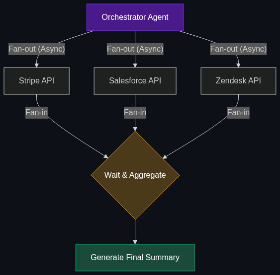

# 🪭 Fan-out Queries

> **When an AI takes one question and "fans it out" into multiple searches across different databases simultaneously to get a comprehensive view before answering.**

---

## Phase 1: Core Foundations & Pre-requisites

### Prerequisites
- **Multi-Agent Orchestration** — Delegating tasks to sub-agents (see [Module 3](../../02_Enterprise_AI/03_Advanced_Orchestration/01_Multi_Agent_Orchestration.md)).
- **RAG** — Retrieving data.

### Definition
A standard RAG pipeline is linear: User asks a question $\rightarrow$ AI searches the Vector DB $\rightarrow$ AI answers.

In the Enterprise, data does not live in one place. A customer's data might be split across Salesforce (CRM), Jira (Tickets), Stripe (Billing), and Snowflake (Logs). 
A **Fan-out Query** is an architectural pattern where an orchestrator agent takes a user's prompt, dynamically spins up multiple concurrent API calls (fanning out), searches all 4 databases simultaneously, waits for the results to return, aggregates them (fanning in), and then writes a comprehensive answer.

### The Problem It Solves

| Linear Query (Standard) | Fan-out Query (Enterprise) |
|-------------------------|----------------------------|
| Searches one database at a time. | Searches 10 databases concurrently. |
| **Latency:** Takes 10 seconds to search sequentially. | **Latency:** Takes 1 second (limited only by the slowest DB). |
| Fails if the answer requires cross-referencing. | Excels at cross-system data synthesis. |

### 🧩 Mini-Quiz

> **Q1:** If a user asks, "What is the status of my order?", does the AI need to fan-out to the HR database?
> <details><summary>Answer</summary>No. A well-designed Orchestrator LLM uses <b>Query Routing</b> before the fan-out. It reads the prompt, recognizes the intent is "E-Commerce", and purposefully only fans out to the Inventory and Shipping databases, ignoring irrelevant systems to save API costs.</details>

---

## Phase 2: Anatomy & Internal Mechanisms

### The Fan-Out / Fan-In Architecture



This pattern is often implemented using async programming (like `asyncio` in Python).

1. **The Intent:** "Give me a summary of Client X."
2. **Fan-Out (Concurrent Execution):**
   - Thread 1 hits the Stripe API (Billing status).
   - Thread 2 hits the Zendesk API (Support status).
   - Thread 3 hits the Salesforce API (Contract status).
3. **The Wait (Gather):** The system waits for all three API calls to resolve.
4. **Fan-In (Aggregation):** The JSON payloads from all three systems are dumped into a single LLM prompt: *"Here is the billing, support, and contract data. Write a 1-paragraph executive summary."*

### 🃏 Flashcard

> **Front:** What happens in a Fan-out Query if one of the 5 APIs goes down?
> <details><summary>Flip</summary>Without proper engineering, the entire query will hang or crash. Enterprise Fan-out patterns must include <b>Timeouts and Graceful Degradation</b>. If the Jira API doesn't respond in 2 seconds, the orchestrator proceeds to the Fan-In step anyway, instructing the LLM: <i>"Write the summary based on Stripe and Salesforce, but explicitly mention to the user that Jira data is currently unavailable."</i></details>

---

## Phase 3: Advanced / Enterprise Patterns & Pitfalls

### Enterprise Use Cases

| Industry | Fan-out Application |
|----------|---------------------|
| **Cybersecurity** | A security analyst asks "Investigate IP Address 192.168.1.1." The AI fans out the IP address to VirusTotal, internal firewall logs, AWS CloudTrail, and CrowdStrike APIs simultaneously to build a comprehensive threat report in 3 seconds. |
| **Wealth Management** | Fanning out a client's portfolio across 5 different global market APIs to generate a real-time risk assessment before a client meeting. |

### Anti-Patterns

- ❌ **Fanning out to Vector DBs for exact metrics** → Doing a Fan-out query to 5 different Vector DBs looking for "Total Q3 Revenue." You will get 5 different, hallucinated numbers. Fan-out queries for hard numbers must hit Semantic Layers or SQL, not Vector DBs.
- ❌ **Ignoring Token Limits during Fan-In** → If you fan out to 20 databases, and they all return 5 pages of JSON, you will blow past the LLM's Context Window during the Fan-In phase. The Fan-In prompt will crash. You must pre-filter the API payloads before feeding them to the LLM.

---

## Phase 4: Practical Implementation

### Asynchronous Fan-Out (Python `asyncio`)

*How to hit multiple systems concurrently to build context for an LLM.*

```python
import asyncio
from openai import AsyncOpenAI

client = AsyncOpenAI()

# Mock API calls
async def fetch_billing_data(user_id):
    await asyncio.sleep(1) # Simulating network latency
    return f"Stripe: User {user_id} owes $500."

async def fetch_support_data(user_id):
    await asyncio.sleep(1)
    return f"Zendesk: User {user_id} has 2 open angry tickets."

async def fan_out_query(user_id):
    # FAN OUT: Execute both API calls concurrently
    # This takes 1 second total, not 2 seconds.
    billing, support = await asyncio.gather(
        fetch_billing_data(user_id),
        fetch_support_data(user_id)
    )
    
    # FAN IN: Aggregate the data for the LLM
    context = f"{billing}\n{support}"
    
    response = await client.chat.completions.create(
        model="gpt-4o",
        messages=[
            {"role": "system", "content": "Write a 1-sentence summary of this client."},
            {"role": "user", "content": context}
        ]
    )
    
    print(response.choices[0].message.content)

# Execute
asyncio.run(fan_out_query("8832"))
# Output: "User 8832 has an outstanding balance of $500 and is currently frustrated with two open support tickets."
```

---

## Phase 5: Interview Preparation

### Q1: "Our customer 360 AI is too slow. The user asks a question, and they have to wait 15 seconds for the bot to check Stripe, then check Salesforce, then write the answer. How do we speed this up?"
<details><summary><b>STAR Answer</b></summary>

**Situation:** A linear orchestration pipeline was causing severe latency (Time-To-First-Token), resulting in a poor user experience.

**Task:** Re-architect the data retrieval pipeline to minimize latency.

**Action:** I would transition the architecture from a sequential tool-calling loop to an asynchronous **Fan-out/Fan-in** pattern. 
Instead of the LLM deciding to check Stripe, waiting, then deciding to check Salesforce, and waiting again, I would implement a Router Agent. The Router reads the prompt and instantly dispatches concurrent, asynchronous HTTP requests to both Stripe and Salesforce APIs simultaneously (Fan-out). 
Once both promises resolve, the JSON payloads are concatenated and fed into the final generation prompt (Fan-in).

**Result:** By executing the API calls concurrently, the retrieval latency is bound only by the single slowest API, not the sum of all APIs. This dropped the total response time from 15 seconds down to 3 seconds.
</details>

---

## Phase 6: Summary Cheatsheet & Action Plan

### 📋 TL;DR

| Concept | Key Point |
|---------|-----------|
| **Fan-out Query** | Searching multiple databases simultaneously. |
| **Fan-in** | Aggregating all those search results into one LLM prompt. |
| **The Goal** | Massive reduction in latency (speed) and cross-system synthesis. |
| **The Tech** | Asynchronous programming (`asyncio`, Promises). |

### 🚀 Do These Now
1. **Review LangChain's RunnableParallel:** If you use LangChain, look up their documentation on `RunnableParallel`. This is the specific class they provide to execute Fan-out queries across multiple retrievers simultaneously.
