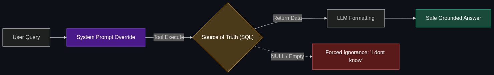

# ⚓ Grounding (in Production)

> **Connecting the AI's "brain" to a "Source of Truth" (like a real-time SQL database) so it can't hallucinate facts about inventory or prices.**

---

## Phase 1: Core Foundations & Pre-requisites

### Prerequisites
- **Hallucinations** — When AI makes things up.
- **Semantic Layer** — The map of business data (see [Module 2](../02_The_Agentic_Enterprise/02_Semantic_Layer.md)).

### Definition
When an LLM is trained, its weights are locked. If you ask an ungrounded LLM, "Is the red shirt in stock?", it will literally guess the answer based on statistical text patterns, often resulting in a confident hallucination: "Yes, it is in stock!"

**Grounding** is the architectural mandate that an AI is not allowed to generate factual claims based on its internal weights. It must explicitly connect to an external "Source of Truth" (a database, a verified document, or a search API) and base its response *entirely* on that external data.

### The Problem It Solves

| Ungrounded AI | Grounded AI |
|---------------|-------------|
| Relies on its pre-trained memory. | Relies on live API data. |
| Answers: "The price of the TV is $500" (Because that was the price in 2023). | Answers: "The price is $450" (Because it checked the Stripe API 1 second ago). |
| Hallucinates facts with extreme confidence. | Says "I don't know" if the external database is empty. |

### 🧩 Mini-Quiz

> **Q1:** Is RAG (Retrieval-Augmented Generation) a form of Grounding?
> <details><summary>Answer</summary>Yes! RAG is the most common form of grounding for text documents. By injecting a PDF into the prompt, you are "grounding" the AI's answer in that specific PDF. However, in enterprise production, Grounding also refers to connecting to structured databases (SQL/APIs) to ground hard numbers and inventory statuses.</details>

---

## Phase 2: Anatomy & Internal Mechanisms

### The Strict Grounding Pipeline



A production-ready grounded pipeline relies on **System Prompts** and **Function Calling**.

1. **The System Prompt Override:** The AI is explicitly told: *"You are a routing agent. You know nothing. If a user asks a factual question, you must use a Tool to find the answer. If the Tool returns nothing, you must say 'I don't know'."*
2. **The Query:** User asks, "What is my account balance?"
3. **The Tool Execution:** The AI is forbidden from guessing. It executes the `get_balance(user_id)` function.
4. **The Source of Truth:** The function hits the PostgreSQL database, which returns `$1,200`.
5. **The Grounded Generation:** The AI takes the `$1,200` from the tool and formats it nicely for the user: *"Your current balance is $1,200."*

### 🃏 Flashcard

> **Front:** What is "Citation-Forced Grounding"?
> <details><summary>Flip</summary>An enterprise technique where the LLM is programmed to fail if it generates a fact without appending a `[Citation]` tag linking directly to the specific database row or document chunk it retrieved the fact from. If it cannot cite the source, the output is blocked by the Agentic Ops layer.</details>

---

## Phase 3: Advanced / Enterprise Patterns & Pitfalls

### Enterprise Use Cases

| Industry | Grounding Application |
|----------|-----------------------|
| **Travel & Airlines** | An AI chatbot booking flights MUST be grounded in the live Amadeus API. If it hallucinates an available seat on a sold-out flight, the airline faces massive liability. |
| **E-Commerce** | A shopping assistant grounded in the Shopify inventory database. It cannot recommend a product unless the `in_stock` boolean from the database is `True`. |

### Anti-Patterns

- ❌ **Assuming "Good Prompts" fix hallucinations** → You cannot prompt away a hallucination if the AI doesn't have the data. Telling an AI "Don't hallucinate" is useless. You must give it a tool to check the database.
- ❌ **Grounding in Stale Data** → Exporting your SQL database to a CSV, embedding it into a Vector DB, and doing RAG. By tomorrow, the CSV is out of date. Hard facts (inventory, prices, account balances) must be grounded via live API calls, not Vector searches.

---

## Phase 4: Practical Implementation

### Enforcing Grounding (Python Pseudo-code)

*The key to grounding is forcing the AI to admit ignorance if the external data is missing.*

```python
def grounded_customer_support(user_query, db_connection):
    
    # 1. Hit the Source of Truth FIRST
    live_inventory_data = db_connection.execute(
        "SELECT status FROM inventory WHERE item = 'Red Shirt'"
    )
    
    # 2. Strict Grounding System Prompt
    system_prompt = f"""
    You are a customer support agent. 
    You MUST base your answer ENTIRELY on the following database record.
    If the database record says 'NULL' or is empty, you must say exactly:
    'I currently do not have access to that information.'
    Do not guess. Do not offer alternatives unless they are in the database.
    
    DATABASE RECORD: {live_inventory_data}
    """
    
    # 3. Generate the response
    response = call_llm(system_prompt, user_query)
    return response

# If live_inventory_data is empty, the AI is structurally forced to admit ignorance 
# rather than hallucinating a restock date.
```

---

## Phase 5: Interview Preparation

### Q1: "Our AI chatbot recommended a competitor's product to a customer, and occasionally makes up a discount code. How do we stop this immediately?"
<details><summary><b>STAR Answer</b></summary>

**Situation:** An ungrounded conversational agent is relying on its pre-trained weights, leading to brand-damaging hallucinations (competitor recommendations) and financial risk (fake discounts).

**Task:** Architect a strict grounding perimeter around the agent.

**Action:** 
1. **Disable Free-Generation:** I would update the System Prompt to strictly forbid the AI from relying on its internal memory for any product or pricing information.
2. **Implement API Grounding:** I would give the AI a `query_product_catalog` tool connected directly to our live inventory database.
3. **Egress Filtering:** I would implement an Agentic Ops guardrail (an output classifier) that scans the AI's final response. If the response contains a discount code string, the guardrail intercepts it, checks it against our live Stripe database, and blocks the message if the code is invalid.

**Result:** The AI is mathematically severed from its internal hallucinations. It can now only speak about products and discounts that physically exist in our verified corporate databases, eliminating the PR and financial risks.
</details>

---

## Phase 6: Summary Cheatsheet & Action Plan

### 📋 TL;DR

| Concept | Key Point |
|---------|-----------|
| **Grounding** | Forcing an AI to use a live external database, not its own memory. |
| **The Goal** | Eliminate factual hallucinations and stale data. |
| **Source of Truth** | The verified SQL database or API the AI connects to. |
| **The Golden Rule** | If the external data is missing, the AI must be programmed to say "I don't know." |

### 🚀 Do These Now
1. **Read about Function Calling:** Grounding is practically executed using OpenAI's "Function Calling" (or Tool Use). Look up the OpenAI documentation on Function Calling to see how developers give the AI the ability to trigger a live database search.
