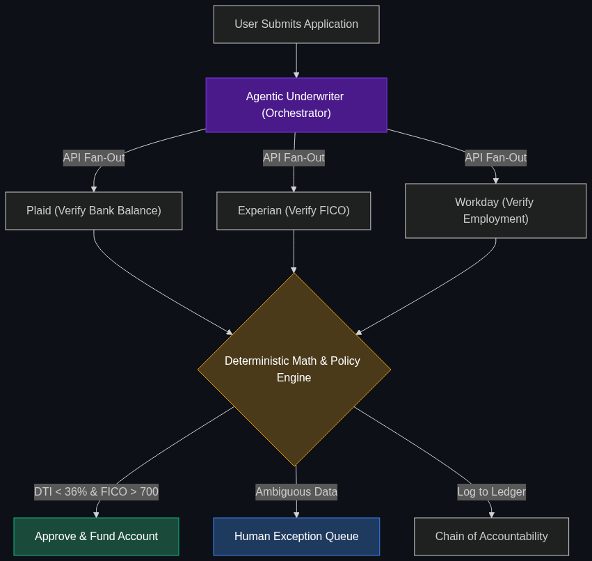

# 📝 Agentic Underwriting

> **Using AI agents to independently pull credit data, verify employment, and make a final lending decision in seconds without human intervention.**

---

## Phase 1: Core Foundations & Pre-requisites

### Prerequisites
- **AaaS (Agent-as-a-Service)** — AI performing labor (see [Module 4](../../04_Industry_terminology_AI/02_The_Agentic_Enterprise/03_AaaS.md)).
- **Chain of Accountability** — Auditing AI decisions (see [Module 4](../../04_Industry_terminology_AI/04_Safety_and_Chain_of_Command/01_Chain_of_Accountability.md)).

### Definition
Underwriting is the process of deciding whether to give someone a loan or an insurance policy based on their risk profile. Historically, this required a human loan officer to read W-2s, check FICO scores, and calculate debt-to-income ratios—a process taking days or weeks.

**Agentic Underwriting** utilizes an autonomous AI agent to execute this entire workflow in seconds. The agent actively calls APIs (like Experian or Plaid) to gather real-time financial data, mathematically calculates the risk against the bank's policies, and issues a binding financial decision (Approval/Denial) with zero human involvement.

### The Problem It Solves

| Traditional Underwriting | Agentic Underwriting |
|--------------------------|----------------------|
| Takes 5-14 days for a mortgage decision. | Takes 10 seconds. |
| Human error in reading PDF bank statements. | API-direct data extraction (100% accuracy). |
| Expensive labor cost per application. | Near-zero marginal cost per application. |

### 🧩 Mini-Quiz

> **Q1:** If an AI model denies a loan because it noticed a statistical correlation between a user's zip code and high default rates, is that good Agentic Underwriting?
> <details><summary>Answer</summary>Absolutely not! That is <b>Redlining</b> and is highly illegal. Agentic Underwriting must be strictly grounded in predefined, legally compliant rules (like Debt-to-Income ratio), not black-box statistical correlations, to avoid violating the Equal Credit Opportunity Act (ECOA).</details>

---

## Phase 2: Anatomy & Internal Mechanisms

### The Agentic Workflow



1. **Intake:** The user submits a natural language request or a PDF application.
2. **Data Orchestration (Fan-out):** The Underwriting Agent fans out API requests to:
   - **Plaid:** To verify bank balances and cash flow.
   - **Equifax/Experian:** To pull the FICO score and credit history.
   - **Workday/Payroll APIs:** To verify active employment.
3. **Policy Evaluation:** The agent compares the gathered data against the bank's strict YAML policy file (e.g., `require FICO > 650 AND DTI < 36%`).
4. **Execution:** The agent triggers the `/approve_loan` webhook, funding the account instantly.
5. **Audit Logging:** The exact logic and data points are dumped into a Chain-of-Accountability database.

### 🃏 Flashcard

> **Front:** What is the "Human Exception Queue" in Agentic Underwriting?
> <details><summary>Flip</summary>A safety mechanism where the AI is not allowed to deny a loan for edge cases (e.g., a user with massive income but no credit history). If the data is ambiguous, the agent flags the application and pushes it to the Human Exception Queue for a human loan officer to manually review.</details>

---

## Phase 3: Advanced / Enterprise Patterns & Pitfalls

### Enterprise Use Cases

| Lending Type | Agentic Application |
|--------------|---------------------|
| **Auto Loans** | Dealerships submitting applications and receiving instant, binding financing offers while the customer is still sitting at the desk, based on real-time API pulls. |
| **Micro-Lending (BNPL)** | Buy-Now-Pay-Later services (like Affirm) using micro-agents to run soft credit checks and approve $500 point-of-sale loans in 1.5 seconds. |

### Anti-Patterns

- ❌ **Using the LLM for Math** → Asking the LLM to read a W-2 and calculate the Debt-to-Income ratio. LLMs hallucinate math. The agent must use a deterministic Python `calculator` tool to execute the final math based on the extracted numbers.
- ❌ **Black Box Approvals** → Allowing the agent to approve a loan based on "gut feeling" or sentiment analysis of the applicant's email. Every approval must be tied directly to a hardcoded policy threshold.

---

## Phase 4: Practical Implementation

### The Underwriting Tool (Python Pseudo-code)

*The agent is given a strict set of tools to prevent hallucinated decisions.*

```python
def underwriting_decision_tool(applicant_id):
    """
    The strict tool the Agent uses to finalize the underwriting process.
    """
    # 1. Pull verified data
    credit_score = get_experian_score(applicant_id)
    monthly_debt = get_plaid_liabilities(applicant_id)
    monthly_income = get_payroll_data(applicant_id)
    
    # 2. Deterministic Math (NOT done by the LLM)
    dti_ratio = monthly_debt / monthly_income
    
    # 3. Policy Engine
    if credit_score >= 700 and dti_ratio <= 0.35:
        decision = "APPROVED"
        interest_rate = 5.5
    elif credit_score >= 650 and dti_ratio <= 0.45:
        decision = "HUMAN_REVIEW"
        interest_rate = None
    else:
        decision = "DENIED"
        interest_rate = None
        
    return {
        "status": decision, 
        "rate": interest_rate, 
        "audit_dti": dti_ratio
    }

# The LLM reads the output of this tool and drafts the email to the customer.
```

---

## Phase 5: Interview Preparation

### Q1: "We want to use an LLM to read 50-page commercial real estate loan applications and make underwriting decisions. How do we ensure it doesn't make a million-dollar mistake?"
<details><summary><b>STAR Answer</b></summary>

**Situation:** The bank wants to automate complex, high-value commercial underwriting using AI, which carries massive financial and regulatory risk.

**Task:** Design an Agentic Underwriting architecture that guarantees deterministic, risk-free execution.

**Action:** I would implement a strict separation of concerns. The LLM is used *only* for unstructured data extraction (e.g., pulling the property value and net operating income out of the 50-page PDF). 
Once the data is extracted, the LLM passes those numbers into a rigid, deterministic Python rules-engine. The Python engine calculates the Debt Service Coverage Ratio (DSCR) and makes the final Approval/Denial decision based on hardcoded banking policy. 
Finally, the decision and the extracted numbers are written to an immutable audit log.

**Result:** By using the LLM strictly as a "reader" and a deterministic engine as the "decider," we achieve the speed of Agentic AI while completely eliminating the risk of a hallucinated million-dollar loan approval.
</details>

---

## Phase 6: Summary Cheatsheet & Action Plan

### 📋 TL;DR

| Concept | Key Point |
|---------|-----------|
| **Agentic Underwriting** | AI agents making binding lending/insurance decisions. |
| **The Speed** | Reduces decision times from weeks to seconds. |
| **The Safety Mechanism** | Separation of concerns: LLM extracts data, Python does the math. |
| **The Human Exception** | Ambiguous applications are routed to a human queue. |

### 🚀 Do These Now
1. **Look at Upstart:** Upstart is a massive AI lending platform. Look at their engineering blog to see how they utilize machine learning to underwrite loans faster and with lower default rates than traditional FICO-only banks.
