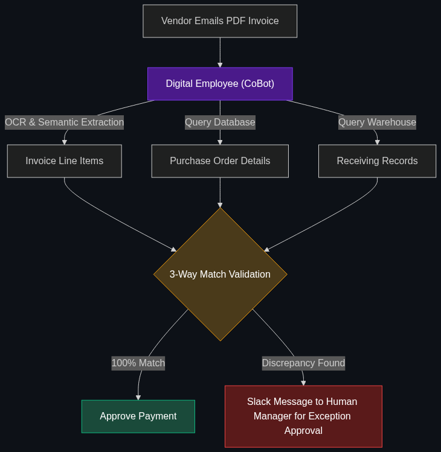

# 🧑‍💼 Digital Employee / CoBot

> **A specialized AI agent that functions as a "team member" for tasks like accounts payable (AP) or payroll. It handles the boring stuff (matching invoices) and only asks a human for help if something looks "weird."**

---

## Phase 1: Core Foundations & Pre-requisites

### Prerequisites
- **AaaS** — Agent as a Service (see [Module 4](../../04_Industry_terminology_AI/02_The_Agentic_Enterprise/03_AaaS.md)).
- **Human-in-the-Loop (HITL)** — Systems that pause for human approval.

### Definition
A **Digital Employee** (or CoBot - Collaborative Robot) is an enterprise-grade AI agent that is given a corporate email address, a Slack account, and access to internal software (like SAP or Oracle). 

Unlike a "Copilot" (which is just a tool a human uses), a Digital Employee operates autonomously. For example, in Accounts Payable, vendors email invoices directly to `ap-bot@company.com`. The Digital Employee reads the PDF, matches it against the purchase order in the database, schedules the payment, and replies to the vendor—all without a human clicking a single button.

### The Problem It Solves

| Human AP Clerk | Digital Employee (CoBot) |
|----------------|--------------------------|
| Spends 4 hours a day doing "stare and compare" (matching PDF invoices to POs). | Matches 10,000 invoices in 5 minutes with 100% OCR accuracy. |
| Takes vacations and sleeps. | Processes global vendor invoices 24/7/365. |
| Hates repetitive data entry. | Exists purely to execute repetitive data entry. |

### 🧩 Mini-Quiz

> **Q1:** If the Digital Employee receives an invoice for $50,000 but the original Purchase Order was only for $40,000, does it just pay the bill?
> <details><summary>Answer</summary>No. A core feature of a Digital Employee is the <b>Exception Hand-off</b>. The bot recognizes the $10,000 variance, pauses the workflow, and sends a Slack message to the human AP Manager saying: "I found a $10k discrepancy on Invoice 443. Do you want me to approve this, or draft an email to the vendor asking for clarification?"</details>

---

## Phase 2: Anatomy & Internal Mechanisms

### The 3-Way Match Workflow



In finance, the most tedious task is the "3-Way Match." A Digital Employee automates this completely.

1. **The Invoice:** The bot receives an email with a PDF invoice from a vendor.
2. **The Purchase Order (PO):** The bot queries the ERP system (like NetSuite) to find the original PO the company issued.
3. **The Receipt:** The bot queries the warehouse system to confirm the goods actually arrived.
4. **The Match:** The bot uses its LLM brain to read the unstructured PDF, extract the line items, and compare them against the structured PO and Receipt data.
5. **The Execution:** If all three match perfectly, the bot triggers the API to release funds via the corporate bank account.

### 🃏 Flashcard

> **Front:** Why is a Digital Employee given its own name and Slack profile picture in the enterprise?
> <details><summary>Flip</summary>Change Management. Calling it an "Automated Python Script" isolates human workers. Giving it a persona (e.g., "Artemis the AP Bot") helps humans treat it as a colleague. Humans are more willing to interact with, correct, and trust a system that feels like a collaborative teammate (CoBot) rather than a faceless server.</details>

---

## Phase 3: Advanced / Enterprise Patterns & Pitfalls

### Enterprise Use Cases

| Department | Digital Employee Application |
|------------|------------------------------|
| **Payroll** | A CoBot that monitors the "Time & Attendance" system. If an employee forgets to clock out, the bot Slack messages the employee directly: "Hey, it looks like you missed a punch yesterday at 5 PM. Should I adjust it to 5:00?" |
| **Expense Auditing** | A CoBot that reads every single employee expense receipt. If a salesperson expensed a $500 dinner but the corporate policy max is $150, the bot autonomously rejects the expense and emails the employee the exact policy clause they violated. |

### Anti-Patterns

- ❌ **Zero Escalation Paths** → Building a bot that just guesses when it's confused. In finance, guessing leads to jail time or massive losses. CoBots must have a low confidence threshold where they *immediately* stop and tag a human for help.
- ❌ **Replacing the Human entirely** → The goal is not to fire the AP team. The goal is to let the CoBot handle the 80% of invoices that match perfectly, freeing the human AP team to investigate the 20% of complex, fraudulent, or disputed invoices that require high-level negotiation.

---

## Phase 4: Practical Implementation

### Exception Handling via Slack (Conceptual)

*How a CoBot interacts with its human manager.*

```python
def process_invoice(pdf_text, po_database):
    invoice_total = extract_total_from_pdf(pdf_text)
    po_total = po_database.get_total()
    
    # 3-Way Match Logic
    if invoice_total == po_total:
        execute_payment(invoice_total)
        return "Payment processed autonomously."
        
    else:
        # EXCEPTION HAND-OFF (The CoBot asks for help)
        variance = invoice_total - po_total
        message = f"""
        🚨 *Invoice Variance Detected* 🚨
        Vendor: Acme Corp
        PO Total: ${po_total}
        Invoice Total: ${invoice_total}
        Variance: ${variance}
        
        Please reply with `APPROVE` to override, or `DISPUTE` to have me 
        draft an email to the vendor.
        """
        send_slack_message(channel="#ap-exceptions", text=message)
        return "Paused: Awaiting Human Exception Handling."
```

---

## Phase 5: Interview Preparation

### Q1: "Our Accounts Payable team is burning out. They spend all day reading PDF invoices and typing the numbers into SAP. How can AI fix this?"
<details><summary><b>STAR Answer</b></summary>

**Situation:** Highly paid financial professionals are wasting time on tedious, error-prone manual data entry ("stare and compare" workflows).

**Task:** Automate the AP ingestion pipeline to increase efficiency and employee satisfaction.

**Action:** I would deploy a **Digital Employee (CoBot)** for AP Automation. 
We set up an email inbox (`invoices@company.com`). The CoBot monitors this inbox, using Multimodal LLMs to read the attached PDFs, regardless of the vendor's unique formatting. 
It extracts the line items and automatically runs a 3-Way Match against our ERP system. If the match is 100% accurate, the bot schedules the payment. If there is a discrepancy (e.g., a missing PO number), the bot sends a Slack message to the AP team with a pre-drafted email to the vendor, asking the human to click "Approve and Send."

**Result:** The CoBot handles 85% of standard invoices entirely in the background. The human AP team is elevated from "Data Entry Clerks" to "Exception Managers," curing burnout and drastically speeding up the payment cycle.
</details>

---

## Phase 6: Summary Cheatsheet & Action Plan

### 📋 TL;DR

| Concept | Key Point |
|---------|-----------|
| **Digital Employee** | An autonomous AI agent with an email/Slack account. |
| **The AP Use Case** | Automating the 3-Way Match (Invoice -> PO -> Receipt). |
| **CoBot** | Collaborative Robot. It works *with* humans, not instead of them. |
| **Exception Hand-off** | The crucial safety feature where the bot pauses and asks a human for help. |

### 🚀 Do These Now
1. **Research "RPA vs Agentic AI":** Look up the difference between old Robotic Process Automation (UiPath) and new Agentic AI. RPA breaks if a vendor moves a column on an invoice 1 inch to the left. A Digital Employee (LLM) reads the invoice semantically and never breaks due to formatting changes.
