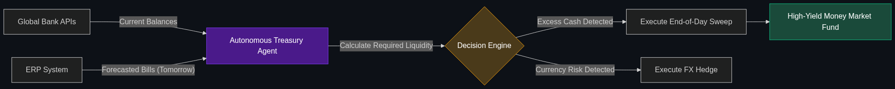

# 🏦 Autonomous Treasury

> **AI systems that monitor global cash positions 24/7 and automatically move money between accounts or currencies to maximize interest and minimize risk.**

---

## Phase 1: Core Foundations & Pre-requisites

### Prerequisites
- **Agentic Ops** — Deploying agents with high reliability (see [Module 4](../../04_Industry_terminology_AI/02_The_Agentic_Enterprise/01_Agentic_Ops.md)).
- **APIs** — How systems talk to bank accounts (e.g., J.P. Morgan Coin Systems).

### Definition
Corporate Treasury is the department responsible for managing a massive company's cash. If a multinational corporation has \$500 million sitting in 100 different bank accounts across 30 countries, they must ensure they have enough cash to make payroll in Japan, while investing the excess cash in the US overnight to earn interest.

**Autonomous Treasury** utilizes AI agents to monitor these global cash positions in real-time. Instead of a human treasury analyst logging in at 8 AM to manually wire money, the AI continuously forecasts cash needs, executes currency hedges, and autonomously sweeps excess cash into high-yield money market funds 24/7/365.

### The Problem It Solves

| Human Treasury Team | Autonomous Treasury Agent |
|---------------------|---------------------------|
| Gathers data via massive, slow Excel spreadsheets. | Consumes real-time API feeds from global banks. |
| Cash sits idle overnight, earning 0% interest. | Excess cash is instantly swept into interest-bearing accounts. |
| Reacts to a currency crash (e.g., Euro drops) the next morning. | Executes a protective currency hedge instantly at 3 AM. |

### 🧩 Mini-Quiz

> **Q1:** If an Autonomous Treasury agent moves \$10 million from a US account to a European account, doesn't it take days for the wire transfer to settle?
> <details><summary>Answer</summary>Traditionally, yes (via SWIFT). However, Autonomous Treasury relies heavily on new <b>Real-Time Payment Rails</b> and blockchain-based bank systems (like JPM Coin) where money settles in milliseconds, allowing the AI to optimize cash positioning on a minute-by-minute basis.</details>

---

## Phase 2: Anatomy & Internal Mechanisms

### The Cash Optimization Loop



1. **Data Ingestion (Fan-out):** The Treasury Agent queries 50 global bank APIs to determine the exact cash balance of the enterprise.
2. **Predictive Modeling:** The AI analyzes upcoming liabilities (e.g., "We have a \$5M vendor payment due in London tomorrow").
3. **Optimization Engine:** The agent calculates the most profitable move. (e.g., "The interest rate in the UK is higher right now. Move \$10M to London, pay the \$5M bill, and invest the remaining \$5M in overnight UK bonds").
4. **Execution:** The agent triggers the API wire transfers.
5. **Reporting:** The human CFO wakes up to a dashboard showing the overnight yield generated by the agent.

### 🃏 Flashcard

> **Front:** What is "Cash Sweeping" in Autonomous Treasury?
> <details><summary>Flip</summary>Cash Sweeping is the automated process of transferring idle funds from various operating accounts (which pay no interest) into a central investment account at the end of every business day. By automating this with AI, large enterprises can generate millions of dollars in extra interest revenue per year.</details>

---

## Phase 3: Advanced / Enterprise Patterns & Pitfalls

### Enterprise Use Cases

| Strategy | Autonomous Treasury Application |
|----------|---------------------------------|
| **FX Hedging** | An AI agent monitoring global news and currency markets. If it detects political instability in a country where the company holds cash, it autonomously buys an FX forward contract to protect against a sudden currency devaluation. |
| **Liquidity Buffers** | The AI dynamically adjusting the company's "safety net" of cash based on macro-economic data. If a recession is predicted, the AI autonomously hoards more cash and reduces investments. |

### Anti-Patterns

- ❌ **Fully Unsupervised Trading** → Allowing an AI to invest corporate cash into high-risk equities (stocks) autonomously. Treasury is about *capital preservation*, not high-risk trading. Autonomous Treasury agents are strictly limited to zero-risk instruments like Money Market Funds or US Treasuries.
- ❌ **Siloed ERP Systems** → Trying to build an Autonomous Treasury when the company's accounts payable system isn't connected to the cloud. The AI cannot predict how much cash it needs tomorrow if it cannot see the invoices due tomorrow.

---

## Phase 4: Practical Implementation

### Forecasting Cash Needs (Conceptual Python)

*The core of treasury is predicting exactly how much cash you will need tomorrow.*

```python
def autonomous_treasury_sweep(current_cash_balance, ai_forecasted_spend):
    """
    Calculates excess cash and sweeps it into an interest-bearing account.
    """
    # 1. The AI predicts we need $2M tomorrow to cover payroll and AP
    required_liquidity_buffer = ai_forecasted_spend * 1.10 # Add 10% safety margin
    
    # 2. Calculate idle cash
    if current_cash_balance > required_liquidity_buffer:
        excess_cash = current_cash_balance - required_liquidity_buffer
        
        # 3. Autonomous Execution
        print(f"Executing overnight sweep of ${excess_cash} to US Treasury Fund.")
        bank_api.execute_wire(
            amount=excess_cash, 
            destination="YIELD_ACCOUNT"
        )
        return f"Swept ${excess_cash}."
    else:
        return "No excess cash. Maintaining liquidity."

# The AI determines we only need $2M tomorrow, but we have $10M in the bank.
autonomous_treasury_sweep(current_cash_balance=10000000, ai_forecasted_spend=2000000)
```

---

## Phase 5: Interview Preparation

### Q1: "We are a global retail company. Every Friday, we leave $50M sitting in various local bank accounts doing nothing over the weekend. How can AI help our Treasury team?"
<details><summary><b>STAR Answer</b></summary>

**Situation:** The enterprise is suffering from "cash drag"—massive amounts of liquidity sitting idle and earning zero yield due to slow manual treasury processes.

**Task:** Modernize the treasury infrastructure to maximize passive interest revenue without risking operational liquidity.

**Action:** I would architect an **Autonomous Treasury Agent**. 
By integrating directly with our global banking APIs, the agent will have real-time visibility into all 50 global accounts. Every Friday at 4:30 PM local time, the agent will run a predictive ML model against our upcoming weekend accounts-payable needs. 
It will leave the exact required liquidity in the operating accounts, and autonomously execute "Cash Sweeps" to pool all the excess \$50M into a central, high-yield Money Market account for the weekend. On Monday morning at 6:00 AM, the agent autonomously distributes the cash back to the local accounts.

**Result:** By automating weekend cash sweeps, the AI generates significant passive interest yield on that \$50M every single weekend, turning a cost center into a profit generator with zero human manual labor.
</details>

---

## Phase 6: Summary Cheatsheet & Action Plan

### 📋 TL;DR

| Concept | Key Point |
|---------|-----------|
| **Autonomous Treasury** | AI agents managing corporate cash and bank accounts. |
| **The Goal** | Ensure liquidity (having enough cash to pay bills) while maximizing interest yield. |
| **Cash Sweeping** | Moving idle cash into investment accounts automatically. |
| **FX Hedging** | Protecting the company against foreign currency crashes. |

### 🚀 Do These Now
1. **Understand Corporate Finance:** Research "Corporate Cash Management." In personal finance, you leave money in a checking account. In corporate finance, leaving \$100M in a checking account is considered a massive failure. Autonomous Treasury solves this.
