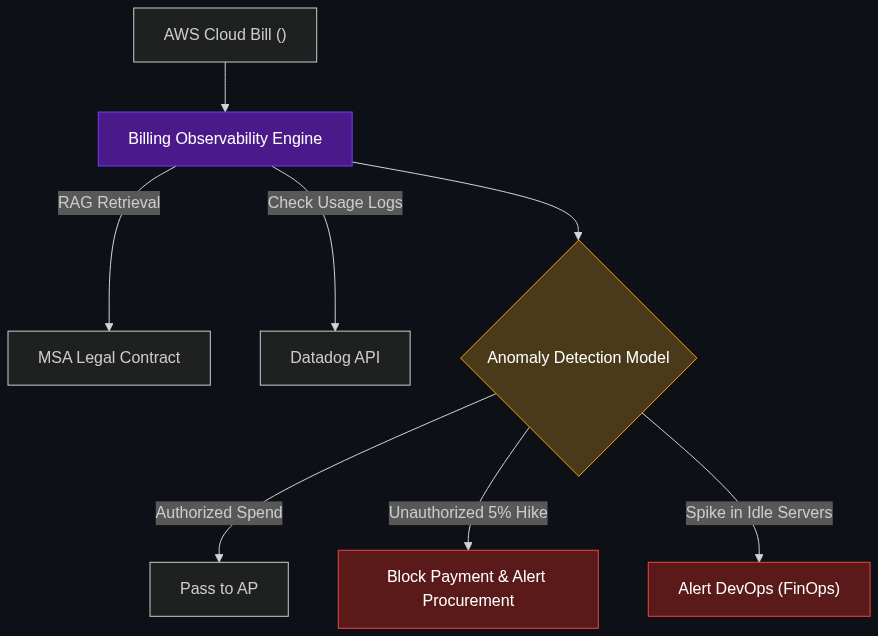

# 🧾 Intelligent Billing / Billing Observability

> **AI that watches every single invoice for "anomalies"—like a sudden 5% price hike from a vendor that a human might miss.**

---

## Phase 1: Core Foundations & Pre-requisites

### Prerequisites
- **Digital Employee / CoBot** — AI handling AP tasks (see [02_Digital_Employee.md](02_Digital_Employee.md)).
- **Anomaly Detection** — ML models that find weird patterns in data.

### Definition
In large enterprises, thousands of invoices flow in every week from cloud providers (AWS/Azure), SaaS vendors, and suppliers. Human AP clerks check to see if the math adds up, but they cannot remember the exact price-per-unit from a 100-page contract signed three years ago.

**Intelligent Billing (or Billing Observability)** acts as an AI auditor that sits on the data pipeline. It ingests every invoice, cross-references it with the historical contract, and uses anomaly detection to flag hidden price hikes, accidental double-billing, or "usage spikes" (like an AWS database accidentally left running that suddenly costs $10,000).

### The Problem It Solves

| Traditional AP Department | Billing Observability |
|---------------------------|-----------------------|
| Vendor quietly raises unit price by 4%. | AI instantly flags the 4% deviation from the contract. |
| Cloud bill spikes by $50,000 at the end of the month. | AI alerts engineering on Day 2 of the spike. |
| Pays duplicate invoices if the vendor changes the invoice number. | AI recognizes the semantic contents are identical and blocks payment. |

### 🧩 Mini-Quiz

> **Q1:** If my AWS bill is exactly $5,000 every month, and this month it is $5,000, does the Intelligent Billing AI just ignore it?
> <details><summary>Answer</summary>Not necessarily. Advanced Billing Observability doesn't just look at the total; it looks at the <b>line items</b>. If the total is $5k, but the AI notices you are paying $2k for servers you haven't logged into in 6 months, it will flag those servers as "Zombie Infrastructure" and suggest you shut them down to save money.</details>

---

## Phase 2: Anatomy & Internal Mechanisms

### The Observability Pipeline



1. **Ingestion:** Vendor PDFs, API usage logs, and CSVs are ingested via OCR and structured data pipelines.
2. **Contract Grounding:** The AI searches the Legal database (via RAG) to find the original MSA (Master Services Agreement) for that specific vendor.
3. **Line-Item Analysis:** The AI checks every single row of the invoice. 
   - *Did they apply our negotiated 15% enterprise discount?*
   - *Did the price per API call increase?*
4. **Anomaly Flagging:** If an anomaly is detected, the AI generates an "Audit Alert" and routes it to the human procurement manager.

### 🃏 Flashcard

> **Front:** What is "FinOps" and how does it relate to Intelligent Billing?
> <details><summary>Flip</summary>FinOps (Financial Operations) is the cultural practice of bringing finance and engineering teams together to manage cloud costs. Intelligent Billing is the <b>tooling</b> for FinOps. It is the AI system that gives engineers real-time visibility into how their code changes are impacting the corporate AWS/Azure bill.</details>

---

## Phase 3: Advanced / Enterprise Patterns & Pitfalls

### Enterprise Use Cases

| Industry | Billing Observability Application |
|----------|-----------------------------------|
| **Software/Tech** | Cloud cost observability. An AI notices that a newly deployed microservice is making 10x more database queries than expected, triggering a billing anomaly alert *before* the end-of-month invoice arrives. |
| **Manufacturing** | Supply chain auditing. An AI notices that the supplier for raw steel has sneakily added a "freight surcharge" to the invoice that was explicitly forbidden in the original procurement contract. |

### Anti-Patterns

- ❌ **Alert Fatigue** → If the AI alerts the CFO every time an invoice fluctuates by $1, the CFO will ignore the alerts. Observability systems must have configurable threshold logic (e.g., "Only alert me if the variance is > 5% AND the total dollar amount is > $1,000").
- ❌ **End-of-Month Only** → Running the anomaly detection only when the PDF invoice arrives. For consumption-based pricing (like Snowflake or AWS), the AI must monitor the live usage APIs *daily* to stop cost overruns before they happen.

---

## Phase 4: Practical Implementation

### Anomaly Detection Logic (Conceptual Python)

*How an AI decides if a bill is suspicious.*

```python
def audit_invoice_line_item(vendor, item_name, billed_price, db_contracts):
    """
    Checks an invoice line item against the legally negotiated contract price.
    """
    # 1. RAG retrieval of the contract terms
    contracted_price = db_contracts.get_negotiated_price(vendor, item_name)
    
    # 2. Check for unauthorized price hikes
    if billed_price > contracted_price:
        variance_percent = ((billed_price - contracted_price) / contracted_price) * 100
        
        # 3. Alert Logic
        if variance_percent > 3.0: # Alert if hike is greater than 3%
            alert = f"""
            🚨 BILLING ANOMALY: {vendor}
            Item: {item_name}
            Contracted Price: ${contracted_price}
            Billed Price: ${billed_price} (+{variance_percent}%)
            ACTION: Halting payment. Routing to Procurement.
            """
            return alert
            
    return "Line item verified. Price matches contract."

# Execution
print(audit_invoice_line_item("CloudCorp", "Server_Instance_XL", 120.00, db))
```

---

## Phase 5: Interview Preparation

### Q1: "Our enterprise uses 50 different SaaS tools. Every year our software budget grows by 20%, but nobody knows why. How can AI help?"
<details><summary><b>STAR Answer</b></summary>

**Situation:** The company is suffering from SaaS sprawl and "shadow IT," resulting in runaway procurement costs and undetected vendor price hikes.

**Task:** Implement a system to audit, control, and optimize vendor spend.

**Action:** I would deploy an **Intelligent Billing / Observability** layer across the Accounts Payable pipeline. 
This AI system will ingest every incoming SaaS invoice and cross-reference it against two things: the original legal contract (to catch unauthorized price-per-seat hikes) and our internal Okta/SSO logs (to check actual usage). 
If the AI detects that we are being billed for 1,000 Salesforce seats, but only 400 employees have logged into Salesforce in the last 90 days, it automatically flags the invoice for "Zombie Seat Optimization."

**Result:** The system caught several vendors quietly removing enterprise discounts, and identified thousands of unused software licenses. This observability directly reduced the annual software budget by 15% in the first quarter.
</details>

---

## Phase 6: Summary Cheatsheet & Action Plan

### 📋 TL;DR

| Concept | Key Point |
|---------|-----------|
| **Intelligent Billing** | AI auditing invoices to catch price hikes and errors. |
| **FinOps** | The practice of monitoring and optimizing cloud computing costs. |
| **The Mechanism** | Cross-referencing the current invoice against the historical legal contract. |
| **The Value** | Immediate ROI by stopping accidental double-billing and unauthorized surcharges. |

### 🚀 Do These Now
1. **Look at Datadog or CloudZero:** These are massive enterprise companies dedicated to observability. Review their marketing on "Cloud Cost Management" to see how they sell AI anomaly detection to CFOs.
