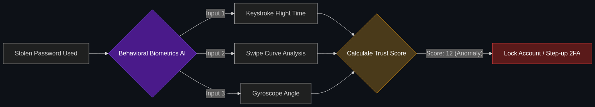

# 🤳 Behavioral Biometrics

> **AI that identifies you not by your password, but by how you type, the angle you hold your phone, and your typical swiping patterns. If a hacker gets your password, the AI knows it's not "you."**

---

## Phase 1: Core Foundations & Pre-requisites

### Prerequisites
- **Anomaly Detection** — ML models finding outliers.
- **Deepfakes / Voice Cloning** — Why traditional biometrics are failing (see [Module 4](../../03_Industrial_Keywords/04_Human_AI_Interaction_and_Ethics/02_Deepfakes_and_Watermarking.md)).

### Definition
Historically, security relied on **Authentication** (what you know: a password) or **Physical Biometrics** (what you are: a fingerprint/FaceID). Today, hackers steal passwords via phishing, and steal FaceID data via deepfakes.

**Behavioral Biometrics** is continuous, invisible AI security. It measures *how you act*. An AI model lives inside the banking app and tracks hundreds of micro-movements: the exact pressure of your thumb on the screen, the speed at which you type your username, and the gyroscopic angle at which you hold your phone. If a hacker steals your password and logs in from your phone, the AI instantly locks the account because the hacker's "typing cadence" doesn't match yours.

### The Problem It Solves

| Traditional Security | Behavioral Biometrics |
|----------------------|-----------------------|
| "Point-in-time" (Checks only at login). | "Continuous" (Checks every second you use the app). |
| Fails if the password is stolen. | Succeeds even if the password is stolen. |
| Adds friction (Requires 2FA texts). | Zero friction (Happens invisibly in the background). |

### 🧩 Mini-Quiz

> **Q1:** What happens to Behavioral Biometrics if I break my right hand and have to use the banking app with my left hand? Will it lock me out?
> <details><summary>Answer</summary>Yes, it will likely flag the session as an anomaly (a high risk score). However, instead of permanently locking the account, the system will dynamically introduce friction—asking you to verify your identity via a text message, an email code, or answering a security question before letting you transfer money.</details>

---

## Phase 2: Anatomy & Internal Mechanisms

### The Risk Score Engine



The AI assigns a "Trust Score" (0 to 100) that updates every millisecond.

1. **Keystroke Dynamics:** The time between pressing 'A' and 'B' (Flight time) and how long you hold the key down (Dwell time).
2. **Mouse/Swipe Dynamics:** Humans swipe in slight curves. Bots (malicious scripts) swipe in perfect, mathematically straight lines.
3. **Device Orientation:** The gyroscope shows the phone is perfectly flat on a table (Hackers often use phones flat on desks; everyday users hold them at a 45-degree angle).
4. **Hesitation:** Hackers trying to commit a scam often hesitate or move the mouse erratically on the "Confirm Transfer" screen because they are reading a script. 

### 🃏 Flashcard

> **Front:** How does Behavioral Biometrics stop "Authorized Push Payment (APP)" scams?
> <details><summary>Flip</summary>APP scams happen when a scammer calls a victim on the phone and tricks them into wiring money (e.g., "This is the IRS, pay us or go to jail"). The AI detects the victim's erratic mouse movements, typing hesitation, and the fact that the phone is actively on a call, realizing the user is being coerced, and halts the transfer.</details>

---

## Phase 3: Advanced / Enterprise Patterns & Pitfalls

### Enterprise Use Cases

| Industry | Biometric Application |
|----------|-----------------------|
| **Banking Apps** | Detecting if a phone has been stolen while unlocked. If the thief opens the Chase app, the AI detects the completely different hand-size and swipe velocity, locking the app before money is moved. |
| **Call Centers** | Voice Biometrics. The AI analyzes not just the pitch of the voice, but the breathing patterns, pauses, and vocabulary choices of the caller to verify their identity without asking for their mother's maiden name. |

### Anti-Patterns

- ❌ **Storing Raw Behavioral Data in the Cloud** → Sending a user's exact keystrokes to a central cloud server is a massive GDPR/privacy violation. Advanced biometric systems process the ML inference *locally* on the device (Edge AI) and only send the final "Risk Score" (e.g., `Score: 95`) to the bank's servers.
- ❌ **Binary Lockouts** → If the AI score drops to 80%, instantly freezing the user's bank account. This causes massive customer service nightmares. The correct pattern is "Step-up Authentication" (triggering an SMS code to verify).

---

## Phase 4: Practical Implementation

### Calculating Risk (Conceptual Python)

*How a bank dynamically shifts security based on the AI's Trust Score.*

```python
def process_wire_transfer(user_id, amount, behavioral_score):
    """
    Evaluates a transaction based on the real-time AI behavioral score.
    Score: 0 (Definitely a hacker) to 100 (Definitely the user).
    """
    print(f"Transaction Request: ${amount} | User Trust Score: {behavioral_score}/100")
    
    if behavioral_score >= 90:
        # High confidence. Zero friction.
        print("✅ Executing transfer seamlessly.")
        execute_transfer(amount)
        
    elif 70 <= behavioral_score < 90:
        # Moderate confidence (User might have a broken hand or a new phone).
        # Step-up authentication required.
        print("⚠️ Anomalous behavior detected. Triggering SMS 2FA.")
        trigger_2fa(user_id)
        
    else:
        # Low confidence. (Perfectly straight mouse lines, typing too fast).
        # Likely a bot or a stolen unlocked phone.
        print("🚨 CRITICAL ANOMALY: Blocking transfer. Freezing app.")
        lock_account(user_id)

# A bot running a script will have a score of 12 due to inhuman swipe speeds
process_wire_transfer("user_88", 5000, behavioral_score=12)
```

---

## Phase 5: Interview Preparation

### Q1: "Hackers are buying our customers' stolen passwords on the dark web and logging in to drain accounts. 2FA texts aren't working because the hackers are SIM-swapping our users. How do we stop this?"
<details><summary><b>STAR Answer</b></summary>

**Situation:** Traditional security perimeters (Passwords and SMS 2FA) are completely compromised by sophisticated social engineering and SIM-swapping attacks.

**Task:** Implement an invisible security layer that cannot be stolen or spoofed.

**Action:** I would integrate a **Behavioral Biometrics** SDK into our mobile and web applications. 
Instead of relying on *what the user knows* (a password that can be stolen), the AI model measures *how the user behaves* (keystroke dynamics, device angle, scroll velocity). 
When the hacker logs in with the stolen password and stolen 2FA code, the AI will immediately recognize that the typing speed and mouse movements do not match the historical biometric profile of the real customer. 

**Result:** The AI drops the session "Trust Score" to zero and silently locks the account before the hacker can execute a wire transfer, successfully defeating the breach even after the password was compromised.
</details>

---

## Phase 6: Summary Cheatsheet & Action Plan

### 📋 TL;DR

| Concept | Key Point |
|---------|-----------|
| **Behavioral Biometrics** | Identifying users by *how* they act (typing, swiping). |
| **The Shift** | From "Point-in-time" logins to "Continuous" invisible monitoring. |
| **The Metric** | The Trust Score (or Risk Score). |
| **Step-up Authentication** | Asking for a 2FA code only if the AI gets suspicious. |

### 🚀 Do These Now
1. **Look up "BioCatch":** BioCatch is the industry leader in behavioral biometrics for banking. Read their case studies on how they identify scammers by measuring "mouse hesitation" on the transfer screen.
