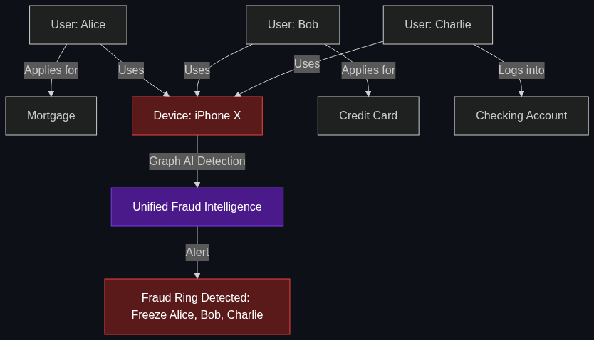

# 🌐 Unified Fraud Intelligence

> **Moving away from "siloed" data. This is an AI system that looks at your credit card, your bank login, and your insurance claims all at once to spot complex cross-platform fraud.**

---

## Phase 1: Core Foundations & Pre-requisites

### Prerequisites
- **Graph Databases** — Mapping relationships between data points.
- **Fan-out Queries** — Searching multiple systems (see [Module 4](../../04_Industry_terminology_AI/05_High_Level_Engineering_Concepts/02_Fan_out_Queries.md)).

### Definition
In traditional banking, departments are "siloed." The Credit Card team doesn't talk to the Mortgage team, who doesn't talk to the Mobile App Login team. Hackers exploit this by testing stolen identities in one silo, and if blocked, moving to another.

**Unified Fraud Intelligence** breaks down these silos. It uses AI (specifically Graph Neural Networks) to monitor the entire enterprise simultaneously. It links disparate events—like a changed phone number on a mortgage application, followed 2 hours later by a $5,000 credit card purchase in a different country—recognizing them as a coordinated "Account Takeover" attack rather than two isolated, normal events.

### The Problem It Solves

| Siloed Fraud Detection | Unified Fraud Intelligence |
|------------------------|----------------------------|
| Only sees that a $5,000 credit card charge occurred. (Seems normal for a rich client). | Sees the charge *and* that the user's password was reset 10 minutes ago via an unknown IP address. |
| Hackers attack the weakest department. | A threat detected in one department instantly shields all other departments. |
| High false-positive rate (declining legitimate cards). | Low false-positive rate (high contextual understanding). |

### 🧩 Mini-Quiz

> **Q1:** If an AI catches a fraudster trying to open a fake checking account, what should the Unified system do next?
> <details><summary>Answer</summary>It should instantly query the Graph Database to see what other products the fraudster touches. If the fraudster used the phone number <code>555-1234</code>, the Unified system searches all departments for that number and might discover the fraudster also has an active auto loan. It will then freeze the auto loan account immediately.</details>

---

## Phase 2: Anatomy & Internal Mechanisms

### The Knowledge Graph (GraphRAG for Fraud)



Unified Fraud relies heavily on **Graph Databases** (like Neo4j) rather than relational SQL databases. 

Instead of tables, data is stored as **Nodes** (Users, Devices, IP Addresses) and **Edges** (Relationships).
- Node 1: `User_Alice`
- Node 2: `Device_iPhone13`
- Node 3: `IP_192.168.1.1`

**The Fraud Ring Discovery:**
The AI notices that `User_Alice`, `User_Bob`, and `User_Charlie` are all completely separate customers with different names and SSNs. *However*, the Graph Database shows that all three users logged into the bank using the exact same `Device_iPhone13`. The AI instantly flags all three accounts as part of an organized fraud ring. A siloed system would never catch this.

### 🃏 Flashcard

> **Front:** What is "Synthetic Identity Fraud"?
> <details><summary>Flip</summary>When a hacker combines real data (a child's stolen SSN) with fake data (a fake name and address) to create a "Frankenstein" identity. They open credit cards and pay the bills for years to build a good credit score, then max out the cards and vanish. Unified Fraud Intelligence catches this by noticing the Graph node for the SSN doesn't logically link to the node for the stated age.</details>

---

## Phase 3: Advanced / Enterprise Patterns & Pitfalls

### Enterprise Use Cases

| Industry | Unified Application |
|----------|---------------------|
| **Insurance** | Linking auto claims and home claims. The AI notices a customer filed a claim for a stolen laptop under their Home Insurance, and 3 months later filed a claim for the *exact same laptop serial number* under their Auto Insurance (claiming it was stolen from their car). |
| **Retail Banking** | Cross-channel monitoring. An AI notices a user failed their ATM pin 3 times (physical channel), and 5 minutes later, a login attempt occurred from a Russian IP address (digital channel). It freezes all cards. |

### Anti-Patterns

- ❌ **Batch Processing** → Running the fraud check at midnight by pulling CSV files from the different departments. Fraudsters steal money in milliseconds. Unified Intelligence must operate on real-time streaming data architectures (like Apache Kafka).
- ❌ **Data Swamps** → Dumping all enterprise data into a massive data lake without structuring the relationships. Without a clean Semantic Layer or Graph architecture, the AI will just drown in noise and output false positives.

---

## Phase 4: Practical Implementation

### Graph-Based Threat Detection (Conceptual)

*How an AI traverses a graph to find a fraud ring.*

```python
def analyze_fraud_graph(transaction_request):
    """
    Evaluates a transaction by looking at the user's extended network.
    """
    user_id = transaction_request.user_id
    device_id = transaction_request.device_id
    
    # 1. Query the Graph Database: "Find all users who have ever used this device."
    connected_users = graph_db.execute(
        f"MATCH (u:User)-[:USED]->(d:Device {{id: '{device_id}'}}) RETURN u"
    )
    
    # 2. Unified Logic
    if len(connected_users) > 3:
        print(f"🚨 FRAUD RING DETECTED: {len(connected_users)} different users are sharing Device {device_id}.")
        
        # 3. Fan-out Action: Freeze all connected accounts across all departments
        for user in connected_users:
            freeze_credit_card(user)
            freeze_mortgage_app(user)
            freeze_checking(user)
            
        return "Transaction Blocked. Network Frozen."
        
    return "Transaction Approved."
```

---

## Phase 5: Interview Preparation

### Q1: "We have an AI for credit card fraud, and a separate AI for mortgage fraud. Our executives want to know why we should spend $2M to combine them."
<details><summary><b>STAR Answer</b></summary>

**Situation:** The enterprise is running highly siloed, department-specific fraud models, creating blind spots that organized cybercriminals exploit.

**Task:** Justify the ROI of migrating to a Unified Fraud Intelligence architecture.

**Action:** I would explain that siloed models only catch "dumb" fraud (like someone buying 10 TVs at BestBuy). Sophisticated fraud rings operate across boundaries. For example, a fraudster might establish a fake auto-loan to build a credit profile, and use that profile 6 months later to drain a massive corporate credit card. 
By investing in a **Unified Knowledge Graph**, our AI can connect the dots across time and departments. If the Auto-Loan AI detects a fake address, it instantly informs the Credit Card AI to block the transaction. 

**Result:** This architecture shifts our posture from *reactive* (chasing stolen money) to *predictive* (blocking the credit card before it is ever used), saving tens of millions in write-offs and drastically reducing the false-positive rate for our legitimate customers.
</details>

---

## Phase 6: Summary Cheatsheet & Action Plan

### 📋 TL;DR

| Concept | Key Point |
|---------|-----------|
| **Unified Fraud Intelligence** | Analyzing data across all bank departments simultaneously. |
| **The Tech** | Graph Databases (Node/Edge relationship mapping). |
| **The Target** | Organized Fraud Rings and Synthetic Identities. |
| **The Benefit** | Catching complex, multi-stage attacks that siloed teams miss. |

### 🚀 Do These Now
1. **Learn Graph Databases:** Spend 15 minutes reading about `Neo4j` and how Graph Databases differ from standard SQL databases. Understanding how "relationships" are stored as first-class citizens is critical for modern AI data architecture.
