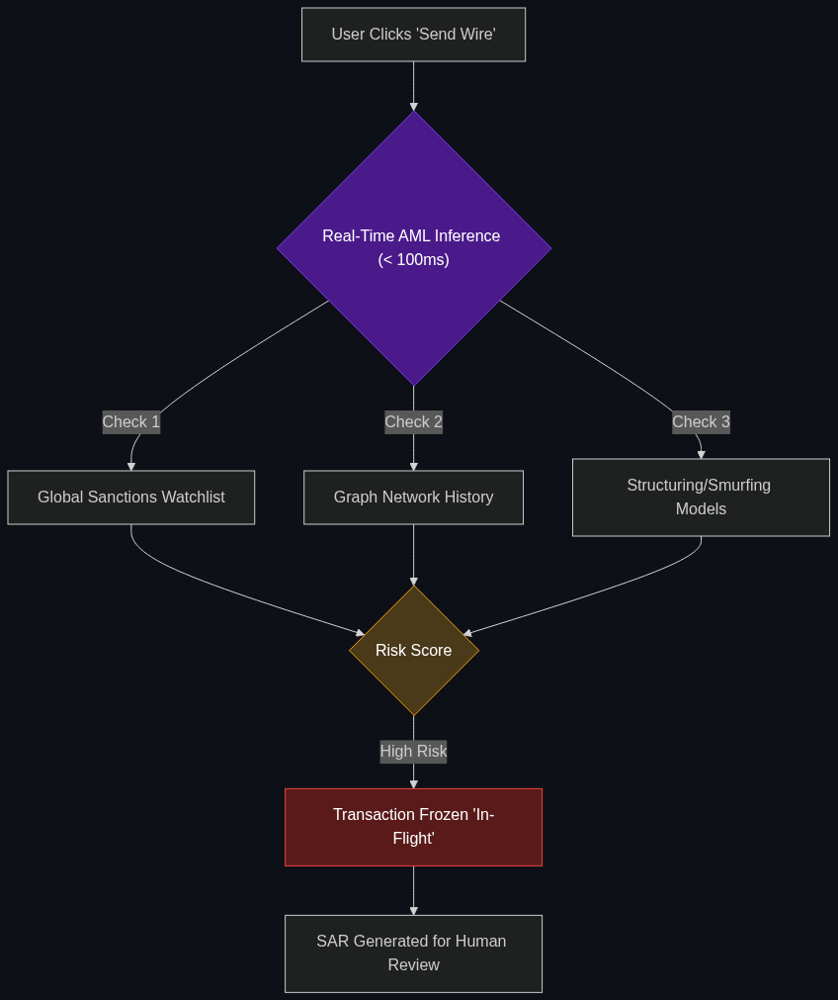

# 💸 Real-time AML 2.0 (Anti-Money Laundering)

> **Instead of flagging transactions after they happen, these AI models block suspicious money movements while they are still "in flight."**

---

## Phase 1: Core Foundations & Pre-requisites

### Prerequisites
- **Unified Fraud Intelligence** — Using Graph databases (see [02_Unified_Fraud_Intelligence.md](02_Unified_Fraud_Intelligence.md)).
- **Latency / Inference Compute** — The speed at which AI thinks.

### Definition
Money Laundering is the process of making illegally gained money (e.g., from drug cartels) appear legal by passing it through a complex web of bank accounts and shell companies. By law, banks must file SARs (Suspicious Activity Reports) to the government if they catch it.

Historically, **AML (Anti-Money Laundering)** was a batch process. Every Friday, an old algorithm would scan the week's database, flag suspicious accounts, and human investigators would spend 30 days researching the alerts. By then, the money was gone.

**AML 2.0** utilizes AI models operating with incredibly low latency. When a user clicks "Send Wire," the AI evaluates the transaction's risk against global sanctions lists, dark web data, and graph networks *within milliseconds*. If it detects laundering patterns (like "Smurfing"), it halts the transaction *before* the money leaves the bank.

### The Problem It Solves

| AML 1.0 (Rule-Based) | AML 2.0 (AI-Driven) |
|----------------------|---------------------|
| Checks transactions 24 hours *after* they happen. | Checks transactions *in-flight* (real-time). |
| Hardcoded rules: "Flag any deposit exactly $9,999." | Machine Learning: Learns dynamic, hidden patterns. |
| 95% False Positive rate (wastes investigator time). | Massively reduced False Positives via deep context. |

### 🧩 Mini-Quiz

> **Q1:** What is "Smurfing" and how does AML 2.0 catch it?
> <details><summary>Answer</summary>In the US, banks must automatically report any cash transaction over $10,000 to the IRS. "Smurfing" (or Structuring) is when a criminal breaks $50,000 into smaller $9,000 chunks and deposits them across 5 different bank branches on the same day to avoid the rule. Old systems miss this. AML 2.0 uses AI to look at the holistic <i>pattern</i> across all branches in real-time, instantly flagging the behavior as structured evasion.</details>

---

## Phase 2: Anatomy & Internal Mechanisms

### The Real-Time Inference Pipeline



To block money "in flight," the AI must execute its entire thought process in under **200 milliseconds** (otherwise the banking app feels broken to the user).

1. **Transaction Initiated:** User attempts a $50,000 SWIFT wire to an offshore account.
2. **Entity Resolution:** The AI instantly scans global watchlists (e.g., OFAC sanctions) to ensure the recipient name isn't an alias for a known terrorist.
3. **Graph Traversal:** The AI checks the Graph Database. *Does the sender have a connection to the recipient? Has this IP address sent money to this offshore account before?*
4. **Scoring:** The ML model outputs an AML Risk Score.
5. **Execution:** If Score > 85, the transaction is frozen in a "Pending" state, and an alert is routed to a human compliance officer for a legal review.

### 🃏 Flashcard

> **Front:** Why do traditional Rule-Based AML systems have a 95% False Positive rate?
> <details><summary>Flip</summary>Because the rules are dumb. A rule might say: "Flag any wire transfer to a high-risk country over $5,000." So, when a legitimate immigrant wires $6,000 to their family to buy a house, the system flags it as money laundering. AI (AML 2.0) looks at the <i>context</i> (the user's employment history, past transfers, and behavioral biometrics) to realize it's a legitimate family transfer, dropping the false positive.</details>

---

## Phase 3: Advanced / Enterprise Patterns & Pitfalls

### Enterprise Use Cases

| Industry | AML 2.0 Application |
|----------|---------------------|
| **Crypto Exchanges** | Criminals use "Tumblers" to mix dirty Bitcoin with clean Bitcoin to hide its origin. AML 2.0 models utilize blockchain tracing to score the "taint" level of a crypto wallet in real-time before allowing a user to cash out to USD. |
| **Correspondent Banking** | Massive banks processing cross-border payments for smaller banks. The AI scans millions of SWIFT messages a day, using NLP to read the "memo" fields for hidden code words associated with human trafficking or arms dealing. |

### Anti-Patterns

- ❌ **"Black Box" Denials** → Denying a wire transfer because the AI got a "bad feeling," but the AI cannot explain *why*. Under banking regulations, you cannot freeze a customer's money without cause. AML 2.0 models must be paired with **Explainable AI (XAI)** (see [Module 3](../03_Regulatory_and_Compliance/01_Explainable_AI.md)) to generate the legal report required by the government.
- ❌ **High-Latency Cloud Calls** → Sending the transaction data to a slow LLM API (like GPT-4) to make the AML decision. Taking 5 seconds to approve a credit card swipe will cause the checkout terminal to time out. AML models must be small, highly distilled, and run locally (Edge AI) for millisecond latency.

---

## Phase 4: Practical Implementation

### Latency-Bound ML Inference (Conceptual Python)

*How a transaction is scored and halted in real-time.*

```python
import time

def aml_in_flight_check(transaction):
    start_time = time.time()
    
    # 1. Fast checks (Under 10ms)
    if is_on_sanctions_list(transaction.recipient):
        return "BLOCKED: OFAC Sanctions"
        
    # 2. ML Graph Risk Scoring (Must execute under 100ms)
    risk_score = fast_ml_model.predict(
        sender_history=transaction.sender_data,
        network_graph=transaction.graph_data
    )
    
    execution_time = (time.time() - start_time) * 1000
    print(f"AML check completed in {execution_time} ms")
    
    # 3. Decision routing
    if risk_score > 90:
        return "FROZEN: Routing to Human Investigator (SAR Required)"
    return "APPROVED"

# A clean transaction executes in 45ms, invisible to the user.
```

---

## Phase 5: Interview Preparation

### Q1: "Regulators just fined us $50 million because our AML system failed to catch a cartel laundering money through shell companies. Our current system just checks if the transaction is over $10,000. How do we fix this?"
<details><summary><b>STAR Answer</b></summary>

**Situation:** The bank is suffering massive regulatory fines because legacy, rule-based AML systems are easily bypassed by sophisticated criminals using structuring and shell networks.

**Task:** Modernize the AML infrastructure to catch hidden network behaviors while remaining compliant.

**Action:** I would lead the migration to an **AML 2.0** architecture. 
First, we abandon static rules (like the $10,000 threshold). Criminals know those rules and actively code around them. 
Second, we deploy an AI model connected to a Graph Database. Instead of looking at a single transaction, the AI evaluates the entire *topology* of the money movement. If the AI sees 50 seemingly unrelated accounts all funneling $9,000 into a single LLC on the same day, it recognizes the "Smurfing" pattern.
Third, we move the inference from batch-processing to real-time. The AI will freeze the funds while they are "in flight."

**Result:** We transition from catching laundering 30 days too late to preventing it proactively. The Graph AI exposes the hidden shell-company networks, satisfying regulators and eliminating future fines.
</details>

---

## Phase 6: Summary Cheatsheet & Action Plan

### 📋 TL;DR

| Concept | Key Point |
|---------|-----------|
| **AML 2.0** | Anti-Money Laundering powered by AI. |
| **The Speed** | "In-flight" (real-time) blocking instead of "Post-event" reporting. |
| **The Advantage** | Massive reduction in false positives; catches hidden patterns. |
| **The Tech** | Low-latency ML models and Graph Networks. |

### 🚀 Do These Now
1. **Understand SARs:** Read up on what a "Suspicious Activity Report" (SAR) is. In FinCEN regulations, banks are legally required to file these. The entire goal of AML AI is to automate the generation of highly accurate SARs for human compliance officers.
