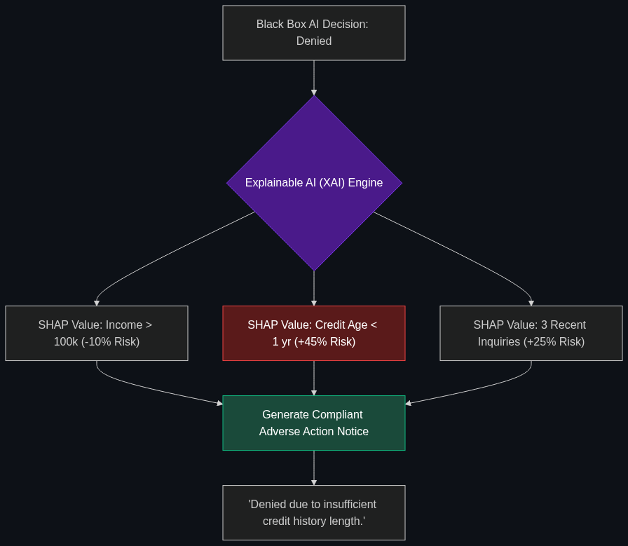

# 🗣️ Explainable AI (XAI) / Explainability

> **In finance, you can't just say "the computer said no." XAI is the tech that allows a bank to give a legal, human-readable reason why a loan was denied (crucial for Fair Lending laws).**

---

## Phase 1: Core Foundations & Pre-requisites

### Prerequisites
- **Chain of Accountability** — Tracing AI decisions (see [Module 4](../../04_Industry_terminology_AI/04_Safety_and_Chain_of_Command/01_Chain_of_Accountability.md)).
- **Neural Networks / Deep Learning** — Why AI is a "Black Box."

### Definition
When a human underwriter denies a mortgage, they must mail the applicant an "Adverse Action Notice" stating the exact reason (e.g., "Your Debt-to-Income ratio was too high").

Deep Learning models (like Neural Networks) are inherently "Black Boxes." They ingest 10,000 data points and output a single score (e.g., `Deny: 98%`), but they cannot mathematically explain *which* of those 10,000 data points caused the denial. 

**Explainable AI (XAI)** is a specialized subfield of machine learning dedicated to solving this. It refers to the algorithms and architectures designed to "crack open" the black box and extract the specific features (e.g., Income, Zip Code, Credit Age) that carried the heaviest weight in the AI's final decision.

### The Problem It Solves

| Black Box AI | Explainable AI (XAI) |
|--------------|----------------------|
| Highly accurate, but opaque. | Slightly less accurate, but transparent. |
| Output: "Loan Denied." | Output: "Loan Denied. Reason: Credit History Length (Weighted 45%)." |
| Illegal to use for credit decisions in the US/EU. | Fully compliant with Fair Lending laws (ECOA / GDPR). |

### 🧩 Mini-Quiz

> **Q1:** If an AI model is 99% accurate at catching fraud, but is a complete Black Box, can a bank use it?
> <details><summary>Answer</summary>For catching fraud? Yes. Banks don't owe fraudsters an explanation. For denying a legitimate customer a loan or a credit limit increase? No. Regulators prioritize <i>Explainability</i> over <i>Accuracy</i> when dealing with consumer rights. If you can't explain the decision, you can't deploy the model.</details>

---

## Phase 2: Anatomy & Internal Mechanisms

### SHAP Values (Shapley Additive Explanations)



How do data scientists make a Black Box explainable? They often use game theory, specifically **SHAP values**.

When an AI denies a loan, the XAI algorithm calculates the "SHAP Value" for every input feature. It asks: *"If I remove the user's Income from the prompt, how much does the AI's prediction change? What if I remove their Credit Score?"*

By running this thousands of times, the XAI generates a waterfall chart:
- **Base Denial Probability:** 20%
- **+ 40%** (Because Credit Score < 600)
- **+ 25%** (Because 3 recent hard inquiries)
- **- 10%** (Because Income > $100k)
- **Final Denial Probability:** 75%

This mathematical breakdown is translated into English for the regulators.

### 🃏 Flashcard

> **Front:** What is the difference between "Global Explainability" and "Local Explainability"?
> <details><summary>Flip</summary><b>Global:</b> Explaining how the model works <i>overall</i> (e.g., "Across all 1 million users, this model cares most about FICO scores").<br><b>Local:</b> Explaining how the model made a decision for <i>one specific person</i> (e.g., "For John Smith, the model denied him specifically because of a recent bankruptcy"). Banks need both for compliance.</details>

---

## Phase 3: Advanced / Enterprise Patterns & Pitfalls

### Enterprise Use Cases

| Industry | XAI Application |
|----------|-----------------|
| **Credit Underwriting** | Generating automated, legally compliant Adverse Action letters for rejected loan applicants, explicitly detailing the top 3 reasons for denial as required by the ECOA. |
| **Wealth Management** | An AI advising a portfolio manager to sell Apple stock. The XAI outputs a dashboard explaining: "Recommendation based on 1) Drop in consumer sentiment data, 2) Rising supply chain costs." |

### Anti-Patterns

- ❌ **"Post-Hoc Rationalization" by LLMs** → Using a Black Box model to make the decision, and then asking ChatGPT: *"Why do you think the Black Box made this decision?"* ChatGPT will just hallucinate a plausible-sounding reason. Explainability must be mathematically derived from the actual decision model (via SHAP/LIME), not hallucinated after the fact.
- ❌ **Using Deep Learning when a Decision Tree works** → If a bank just needs a simple loan-approval model, they shouldn't use a massive Neural Network. Decision Trees or Linear Regressions are *inherently* explainable. Only use Deep Learning if the complexity truly requires it.

---

## Phase 4: Practical Implementation

### Interpreting AI Decisions (Conceptual Python)

*How a data scientist extracts the "Why" from an AI model.*

```python
import shap

def explain_loan_decision(model, applicant_data):
    """
    Extracts the human-readable reasons from a Black Box model.
    """
    # 1. The Black Box makes the decision
    prediction = model.predict(applicant_data)
    
    # 2. The XAI tool calculates the SHAP values (The "Why")
    explainer = shap.TreeExplainer(model)
    shap_values = explainer.shap_values(applicant_data)
    
    # 3. Translate math to English for the compliance report
    top_negative_factors = extract_top_factors(shap_values)
    
    report = f"""
    DECISION: {'Denied' if prediction == 0 else 'Approved'}
    
    REGULATORY EXPLANATION:
    The applicant was denied primarily due to:
    1. {top_negative_factors[0].name} (Impact: {top_negative_factors[0].weight}%)
    2. {top_negative_factors[1].name} (Impact: {top_negative_factors[1].weight}%)
    """
    
    return report
```

---

## Phase 5: Interview Preparation

### Q1: "We built a Deep Learning model that is 15% better at predicting loan defaults than our old system. But Legal won't let us use it because they say it's a 'Black Box'. How do we deploy it?"
<details><summary><b>STAR Answer</b></summary>

**Situation:** A highly accurate predictive model is blocked from deployment due to regulatory and compliance concerns regarding Fair Lending and explainability.

**Task:** Engineer a solution that retains the model's accuracy while satisfying legal requirements for transparency.

**Action:** I would implement an **Explainable AI (XAI)** wrapper around the Deep Learning model using SHAP (Shapley Additive Explanations). 
While the underlying neural network remains a black box, the SHAP algorithm will algorithmically perturb the inputs for every single loan application to calculate the exact weight of each feature contributing to the final score. 
I would then build a pipeline that translates these mathematical weights into compliant "Adverse Action" text (e.g., "Denied due to Insufficient Credit History"). 

**Result:** Legal approved the deployment. We achieved the 15% boost in default prediction accuracy while maintaining full regulatory compliance by ensuring every single applicant receives a mathematically accurate, human-readable explanation for their decision.
</details>

---

## Phase 6: Summary Cheatsheet & Action Plan

### 📋 TL;DR

| Concept | Key Point |
|---------|-----------|
| **XAI (Explainable AI)** | Cracking open the Black Box to explain *why* an AI did something. |
| **The Regulation** | ECOA (US) and GDPR (Europe) make XAI legally mandatory for consumer decisions. |
| **The Math** | SHAP values (Game theory used to weigh features). |
| **The Output** | Human-readable reasons (e.g., "Denied because of Low Income"). |

### 🚀 Do These Now
1. **Understand Disparate Impact:** Look up "Disparate Impact in AI." If an AI is a black box, it might secretly figure out a user's race based on their zip code, and deny the loan. XAI exposes this bias so engineers can fix it before the bank gets sued.
