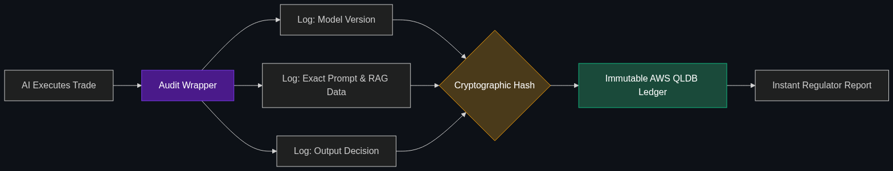

# 📋 AI Audit Readiness

> **Building AI systems that "self-document" every decision they make. When the regulators come knocking, the AI produces a perfect audit trail of why it sold a stock or approved a trade.**

---

## Phase 1: Core Foundations & Pre-requisites

### Prerequisites
- **Chain of Accountability** — Tracing agent thoughts (see [Module 4](../../04_Industry_terminology_AI/04_Safety_and_Chain_of_Command/01_Chain_of_Accountability.md)).
- **Model Governance** — Enterprise risk management.

### Definition
In finance, it is not enough for an AI to work perfectly; you must be able to *prove* it works perfectly to a government auditor (like the SEC or the OCC). 

**AI Audit Readiness** is the architectural practice of designing AI pipelines that are inherently self-documenting. Every time the model is trained, updated, or makes a high-stakes decision (like executing a million-dollar stock trade), the system automatically generates an immutable, timestamped legal artifact containing the model version, the exact data used, the prompt, and the output. When regulators ask for proof of compliance, the bank just hits "export."

### The Problem It Solves

| Post-Hoc Auditing (The Nightmare) | AI Audit Readiness (The Solution) |
|-----------------------------------|-----------------------------------|
| Regulator asks: "Why did the algorithm dump this stock 6 months ago?" | Regulator asks the same question. |
| Engineers spend 3 weeks digging through logs trying to recreate the exact server state from 6 months ago. | System instantly produces a signed PDF showing the exact API payload, model weights, and news articles the AI read. |
| High risk of fines if data is lost. | Zero friction; 100% legally defensible. |

### 🧩 Mini-Quiz

> **Q1:** If I save all the chat logs from my AI into an AWS S3 bucket, is my system "Audit Ready"?
> <details><summary>Answer</summary>No. Text logs can be edited by an engineer to hide mistakes. True Audit Readiness requires <b>Immutability</b>. The logs must be stored in a WORM (Write Once, Read Many) database or cryptographically signed ledger so the bank can legally prove the logs haven't been tampered with since the AI made the decision.</details>

---

## Phase 2: Anatomy & Internal Mechanisms

### The Model Factsheet



A core component of Audit Readiness is the automated generation of **Model Factsheets** (often called Model Cards). 

Whenever a Data Science team deploys a new AI model to production, the CI/CD pipeline automatically generates a document detailing:
1. **Intended Use:** "This model predicts credit default risk."
2. **Out-of-Scope Use:** "This model must NOT be used for auto-loans."
3. **Training Data Provenance:** "Trained on Database X, cut-off date 2025-01-01."
4. **Bias & Fairness Evals:** "Passed disparate impact testing across gender and race demographics."

Regulators (like the EU AI Act) are beginning to require these Factsheets by law before an AI can be turned on.

### 🃏 Flashcard

> **Front:** What is "Model Drift" and why do auditors care about it?
> <details><summary>Flip</summary>Model Drift happens when the real world changes, but the AI doesn't. (e.g., an AI trained before COVID-19 tries to predict housing prices during the pandemic and fails). Audit Ready systems must include continuous monitoring that alerts compliance officers the moment an AI's accuracy begins to drift away from its approved baseline.</details>

---

## Phase 3: Advanced / Enterprise Patterns & Pitfalls

### Enterprise Use Cases

| Industry | Audit Readiness Application |
|----------|-----------------------------|
| **Algorithmic Trading** | An AI executes 10,000 trades a second. The system captures the "Order Book" state (prices) at the exact microsecond the AI decided to trade, proving to the SEC the AI was not engaged in illegal market manipulation (Spoofing). |
| **Compliance (KYC)** | An AI approves a new customer's passport photo. The system cryptographically hashes the passport image and the AI's confidence score, proving the bank followed Know Your Customer (KYC) laws. |

### Anti-Patterns

- ❌ **Auditing only the Output** → Logging "The AI said Yes." If the AI hallucinates, the auditor needs to know *what data* the AI was looking at. You must log the Context (the input prompt and RAG documents) alongside the output.
- ❌ **Manual Factsheets** → Asking a data scientist to write a Word document explaining how their model works. They will forget to update it when they push a new code version. Factsheets must be generated dynamically by code.

---

## Phase 4: Practical Implementation

### Automated Audit Logging (Conceptual Python)

*How to wrap an AI decision in an immutable audit envelope.*

```python
import hashlib
from datetime import datetime

def auditable_ai_decision(prompt, retrieved_data, model_version):
    """
    Executes an AI task and generates a legally defensible audit record.
    """
    # 1. The Decision
    decision_output = call_llm(prompt, retrieved_data)
    
    # 2. The Audit Envelope
    audit_record = {
        "timestamp": datetime.utcnow().isoformat(),
        "model_version_hash": hashlib.sha256(model_version.encode()).hexdigest(),
        "context_data_used": retrieved_data,
        "ai_output": decision_output
    }
    
    # 3. Cryptographic Signature (Proving the record wasn't edited)
    audit_record["record_signature"] = sign_data(audit_record)
    
    # 4. Save to Immutable Ledger (e.g., AWS QLDB)
    write_to_ledger(audit_record)
    
    return decision_output
```

---

## Phase 5: Interview Preparation

### Q1: "We are deploying a generative AI to summarize complex client portfolios for our wealth managers. The Chief Compliance Officer is terrified the AI will hallucinate financial advice. How do we build this safely?"
<details><summary><b>STAR Answer</b></summary>

**Situation:** Deploying Generative AI in Wealth Management creates high regulatory risk regarding fiduciary duty and hallucinated financial advice.

**Task:** Design an architecture that guarantees AI Audit Readiness and prevents unapproved advice.

**Action:** 
1. **Grounding:** The AI is strictly barred from generating advice. It is only allowed to summarize verified portfolio data (RAG).
2. **Audit Pipeline:** I would implement a strict **AI Audit Readiness** architecture. Every summary generated by the AI is wrapped in a JSON payload containing the prompt, the specific portfolio data used, the LLM version, and the output.
3. **Immutability:** This payload is cryptographically hashed and written to a WORM database.

**Result:** If a client ever sues, claiming a wealth manager gave bad advice based on an AI hallucination, the Compliance Officer can pull the exact, tamper-proof record from the database to prove exactly what the AI outputted, completely shielding the firm from liability.
</details>

---

## Phase 6: Summary Cheatsheet & Action Plan

### 📋 TL;DR

| Concept | Key Point |
|---------|-----------|
| **AI Audit Readiness** | Systems that inherently self-document every AI action. |
| **The Goal** | Passing SEC/OCC regulatory audits instantly. |
| **Immutability** | Logs cannot be edited or deleted (tamper-proof). |
| **Model Factsheets** | Automated "nutrition labels" for AI models explaining their limits. |

### 🚀 Do These Now
1. **Google "EU AI Act Compliance":** The European Union has passed the strictest AI laws in the world. Read a summary of the Act. Notice how they classify models by "Risk Level" and legally mandate Model Factsheets and continuous auditing for "High Risk" systems (like banking and HR).
