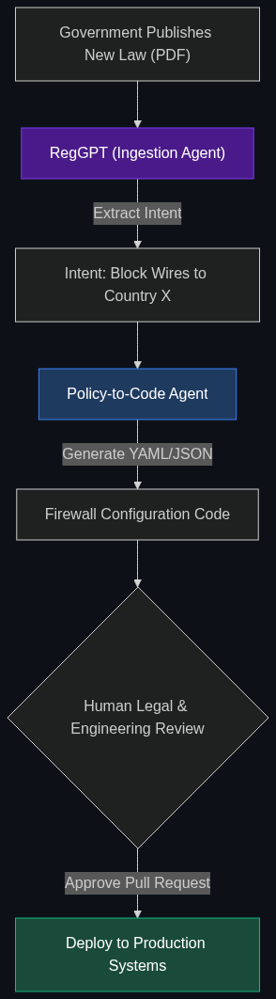

# ⚖️ RegGPT / Policy-to-Code

> **AI models trained specifically on massive volumes of financial regulations (like Dodd-Frank or Basel III) that can instantly tell a compliance officer if a new product is legal.**

---

## Phase 1: Core Foundations & Pre-requisites

### Prerequisites
- **RAG** — Retrieval-Augmented Generation (see [Module 2](../../02_Enterprise_AI/02_Data_and_Context_The_Knowing_Layer/01_RAG.md)).
- **Domain-Specific Models** — AI trained for a niche task.

### Definition
Regulatory frameworks (like Dodd-Frank, Basel III, or GDPR) are thousands of pages of dense, contradictory legal text. When a bank wants to launch a new product (e.g., a new crypto-trading feature), it can take teams of lawyers months to determine if it violates a regulation.

**RegGPT** (a colloquial term for Regulatory-focused AI) refers to specialized LLMs and RAG pipelines built exclusively to navigate legal compliance. 

**Policy-to-Code** is the advanced evolution of this: The AI reads a new 500-page regulation passed by Congress, understands the requirements, and automatically generates the Python code or firewall rules required to enforce that regulation across the bank's IT systems.

### The Problem It Solves

| Traditional Compliance | RegGPT & Policy-to-Code |
|------------------------|-------------------------|
| Lawyers read 500 pages of new tax law. | AI ingests the tax law in 5 seconds. |
| Lawyers tell engineers to update the software. | AI writes the software updates automatically. |
| Human error leads to massive compliance fines. | Instant, automated adaptation to new laws. |

### 🧩 Mini-Quiz

> **Q1:** If I ask ChatGPT-4 a complex legal question about banking regulations, isn't that just RegGPT?
> <details><summary>Answer</summary>No. ChatGPT is a general model. It might hallucinate a fake legal precedent. A true "RegGPT" enterprise system uses an orchestrator that is strictly grounded (via RAG) to a proprietary, continuously updated database of live legal statutes. It provides citations to exact paragraphs in the legal code, rather than just generating conversational advice.</details>

---

## Phase 2: Anatomy & Internal Mechanisms

### The Policy-to-Code Pipeline



1. **Ingestion:** The SEC publishes a new rule on margin trading (PDF format).
2. **Extraction (RegGPT):** The AI reads the PDF and extracts the semantic intent: *"Requirement: All margin trades over $50k require secondary manager approval."*
3. **Translation (Policy-to-Code):** The AI translates that English requirement into executable logic (e.g., a Python script or a JSON policy definition).
4. **Deployment:** The code is committed to a GitHub repository, reviewed by a human engineer, and deployed to the trading software. 

### 🃏 Flashcard

> **Front:** Why is the financial industry obsessed with "Regulatory Horizon Scanning"?
> <details><summary>Flip</summary>Because laws change every day across 200 countries. Horizon Scanning is the use of AI agents to constantly monitor global government websites, press releases, and legislative drafts. The AI flags any upcoming law that might impact the bank's operations, allowing them to prepare months in advance rather than reacting after the law passes.</details>

---

## Phase 3: Advanced / Enterprise Patterns & Pitfalls

### Enterprise Use Cases

| Industry | RegTech Application |
|----------|---------------------|
| **Global Expansion** | A fintech startup in the US wants to launch in Germany. They use a RegGPT RAG system loaded with the BaFin (German regulatory) codebook. The engineers query the AI: "What are the data localization requirements for our German database architecture?" |
| **Smart Contracts (DeFi)** | Decentralized Finance. Translating a complex traditional financial escrow agreement into executable Solidity code (Policy-to-Code) that lives on the blockchain. |

### Anti-Patterns

- ❌ **Replacing Lawyers** → The AI cannot assume legal liability. If RegGPT says a product is legal, and the SEC sues the bank, the bank cannot blame the AI. RegGPT is a *discovery tool* for lawyers, massively accelerating their research, but the human lawyer must still sign off.
- ❌ **Using Outdated Vector Databases** → If a law changes on Tuesday, and the AI's Vector DB isn't updated until Friday, the AI will provide illegal advice for three days. Regulatory RAG systems must have real-time ingestion pipelines.

---

## Phase 4: Practical Implementation

### Policy-to-Code Translation (Conceptual)

*How an AI turns legal text into a system rule.*

```python
# The Legal Text (Ingested from government PDF)
sec_rule_text = "Institutions must block any outbound wire transfer exceeding $10,000 to accounts domiciled in Country_X without manual compliance override."

def policy_to_code_agent(legal_text):
    """
    Translates English legal text into executable Python logic.
    """
    system_prompt = """
    You are a Policy-to-Code translation engine.
    Read the legal requirement and output a strict JSON configuration 
    that our firewall can execute.
    """
    
    # The AI generates the JSON configuration
    generated_policy = call_llm(system_prompt, legal_text)
    return generated_policy

# Output from the AI:
"""
{
  "rule_name": "SEC_Wire_Limit_Country_X",
  "action": "BLOCK_AND_FLAG",
  "conditions": {
    "transaction_type": "wire_transfer",
    "amount_greater_than": 10000,
    "destination_country": "Country_X"
  },
  "override_required": "compliance_officer_approval"
}
"""
```

---

## Phase 5: Interview Preparation

### Q1: "Every time a new data privacy law passes, our engineering team spends 3 months rewriting our database access rules. How can we use AI to solve this?"
<details><summary><b>STAR Answer</b></summary>

**Situation:** Manual translation of legal compliance requirements into software engineering tickets is slow, expensive, and error-prone.

**Task:** Automate the regulatory compliance lifecycle.

**Action:** I would implement a **Policy-to-Code** pipeline. 
First, we utilize a specialized Legal RAG system to monitor and ingest new regulatory text. 
When a new law is passed, an LLM agent extracts the specific data-handling requirements. A secondary coding agent then translates those English requirements into OPA (Open Policy Agent) declarative code or AWS IAM JSON policies. 
This code is automatically submitted as a Pull Request in GitHub.

**Result:** A human compliance officer and a lead engineer simply review the Pull Request. If accurate, they merge it. We reduce the compliance implementation cycle from 3 months down to 3 days, ensuring our software is always legally up to date.
</details>

---

## Phase 6: Summary Cheatsheet & Action Plan

### 📋 TL;DR

| Concept | Key Point |
|---------|-----------|
| **RegGPT** | AI trained specifically to understand dense financial laws. |
| **Policy-to-Code** | AI translating an English law directly into a software firewall rule. |
| **Horizon Scanning** | AI monitoring the globe for upcoming legal changes. |
| **The Rule** | The AI accelerates research, but the human lawyer assumes liability. |

### 🚀 Do These Now
1. **Look up "Harvey AI":** Harvey is one of the most famous and highly-valued Legal AI startups in the world. They build custom LLMs for massive law firms to do exactly this type of regulatory analysis. Read their thesis on how AI changes legal workflows.
