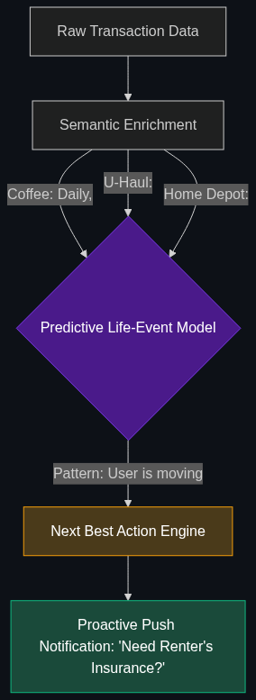

# 🔮 Anticipatory Banking

> **Using predictive AI to offer you a product before you know you need it. (e.g., "I noticed you’re paying $200/month for 5 streaming services; would you like me to cancel the ones you haven't used in 90 days?")**

---

## Phase 1: Core Foundations & Pre-requisites

### Prerequisites
- **Predictive ML** — Models that forecast future events.
- **Open Banking (APIs)** — How banks share transaction data.

### Definition
For decades, banking has been **Reactive**. You realize you want to buy a house, so you log into your bank's website and click "Apply for Mortgage."

**Anticipatory Banking** is **Proactive**. It uses AI to constantly analyze your transaction history, location data, and lifestyle patterns to predict your financial needs *before* you act on them. The AI realizes you just started paying for baby formula at Target. It instantly predicts you will soon need a larger car or a house, and proactively sends a push notification offering a pre-approved auto loan at a discounted rate.

### The Problem It Solves

| Reactive Banking | Anticipatory Banking |
|------------------|----------------------|
| Waits for the user to ask for a loan. | Offers the loan exactly when the user needs it. |
| Sends generic spam emails ("Apply for our Credit Card!"). | Sends hyper-relevant, personalized insights. |
| Bank is a place to store money. | Bank is an active financial advisor. |

### 🧩 Mini-Quiz

> **Q1:** If an AI realizes a customer is spending more than they earn every month, what should an Anticipatory Banking system do?
> <details><summary>Answer</summary>It should proactively intervene. Before the customer hits $0 and incurs massive overdraft fees, the AI sends a friendly alert: "Based on your current spending rate, your account will be empty by Thursday. Do you want me to temporarily transfer $500 from your savings account to cover upcoming bills?"</details>

---

## Phase 2: Anatomy & Internal Mechanisms

### The Predictive Life-Event Model



1. **Transaction Enrichment:** Raw bank data is messy (`POS DEBIT 04/12 SQ*STARBUCKS`). The AI cleans it into a semantic graph: `Category: Coffee, Frequency: Daily, Amount: $5`.
2. **Pattern Recognition (Life Events):** The ML model looks for specific clusters of transactions that indicate major life shifts.
   - *Example:* Sudden purchases at Home Depot + U-Haul = The user is moving.
3. **The "Next Best Action" (NBA):** The AI calculates the most helpful (and profitable) product to offer based on that life event. (e.g., "Offer Renter's Insurance").
4. **Agentic Execution:** If the user clicks "Yes," the AI agent autonomously executes the setup.

### 🃏 Flashcard

> **Front:** What is "Subscription Fatigue" and how does AI fix it?
> <details><summary>Flip</summary>Subscription Fatigue is when users forget they are paying for dozens of small monthly services (Netflix, Gym, Software). Anticipatory AI scans the transaction history, highlights recurring charges the user hasn't interacted with, and offers a 1-click button for an Agent to autonomously cancel the subscription on the user's behalf.</details>

---

## Phase 3: Advanced / Enterprise Patterns & Pitfalls

### Enterprise Use Cases

| Industry | Anticipatory Application |
|----------|--------------------------|
| **WealthTech** | The AI notices a $50k deposit from an unknown source (likely an inheritance or bonus). Instead of letting it sit in a checking account, the AI proactively texts the user suggesting they move it into a high-yield 5% CD to earn interest. |
| **Retail Banking** | "Safe to Spend." The AI analyzes upcoming recurring bills and tells the user: "You have $1,000 in your account, but you have a $600 rent payment due in 3 days. Your 'Safe to Spend' balance for the weekend is only $400." |

### Anti-Patterns

- ❌ **The "Creepy" Factor** → If a customer buys a pregnancy test, and the bank immediately emails them offering a college savings account. Anticipatory AI must be balanced with intense privacy constraints. Being *too* predictive destroys customer trust.
- ❌ **Aggressive Upselling** → If every AI notification is just trying to sell the user a high-interest loan. Anticipatory banking must focus on *customer value* (like saving them money on subscriptions) to earn the right to occasionally offer a loan.

---

## Phase 4: Practical Implementation

### The "Safe to Spend" Algorithm (Conceptual)

*How AI predicts future cash flow.*

```python
def calculate_safe_to_spend(current_balance, user_history):
    """
    Predicts upcoming liabilities so the user doesn't overdraft.
    """
    # 1. AI predicts bills that will hit before the next paycheck
    predicted_bills = predict_upcoming_recurring_charges(user_history)
    
    total_upcoming_liability = sum(bill.amount for bill in predicted_bills)
    
    # 2. Calculate the buffer
    safe_balance = current_balance - total_upcoming_liability
    
    if safe_balance < 100:
        return f"⚠️ Careful! You only have ${safe_balance} safe to spend before your rent hits on Friday."
    else:
        return f"✅ You have ${safe_balance} safe to spend this weekend."

# Output: "Careful! You only have $45 safe to spend..."
```

---

## Phase 5: Interview Preparation

### Q1: "Our bank's marketing emails only have a 1% open rate. Users think we are just spamming them. How can we use AI to fix our engagement?"
<details><summary><b>STAR Answer</b></summary>

**Situation:** Traditional, batch-and-blast marketing (sending the same credit card offer to 1 million people) is resulting in low conversion and customer annoyance.

**Task:** Transition from reactive spam to hyper-personalized, high-conversion engagement.

**Action:** I would implement an **Anticipatory Banking** strategy using a "Next Best Action" (NBA) ML model. 
Instead of sending generic emails, we ingest the customer's real-time transaction data. The AI looks for specific "Life Event" triggers. For example, if the AI detects the user just bought a plane ticket to Paris, it triggers an immediate, hyper-personalized push notification offering our "Zero Foreign Transaction Fee" travel credit card. 

**Result:** By offering the exact right product at the exact moment the user mathematically needs it, we transition from "spam" to "helpful financial advice." This hyper-personalization routinely increases conversion rates from 1% to over 15%.
</details>

---

## Phase 6: Summary Cheatsheet & Action Plan

### 📋 TL;DR

| Concept | Key Point |
|---------|-----------|
| **Anticipatory Banking** | AI predicting what the customer needs *before* they ask. |
| **The Shift** | From Reactive (waiting for the customer) to Proactive. |
| **Life-Event Modeling** | Finding transaction patterns that indicate a major life change (Moving, Having a baby). |
| **The Risk** | Being overly predictive and crossing the "creepy" line. |

### 🚀 Do These Now
1. **Look at Cleo or Monzo:** These modern Fintech apps are famous for their aggressive, highly-personalized AI interactions. They will literally "roast" you for spending too much money on fast food.
