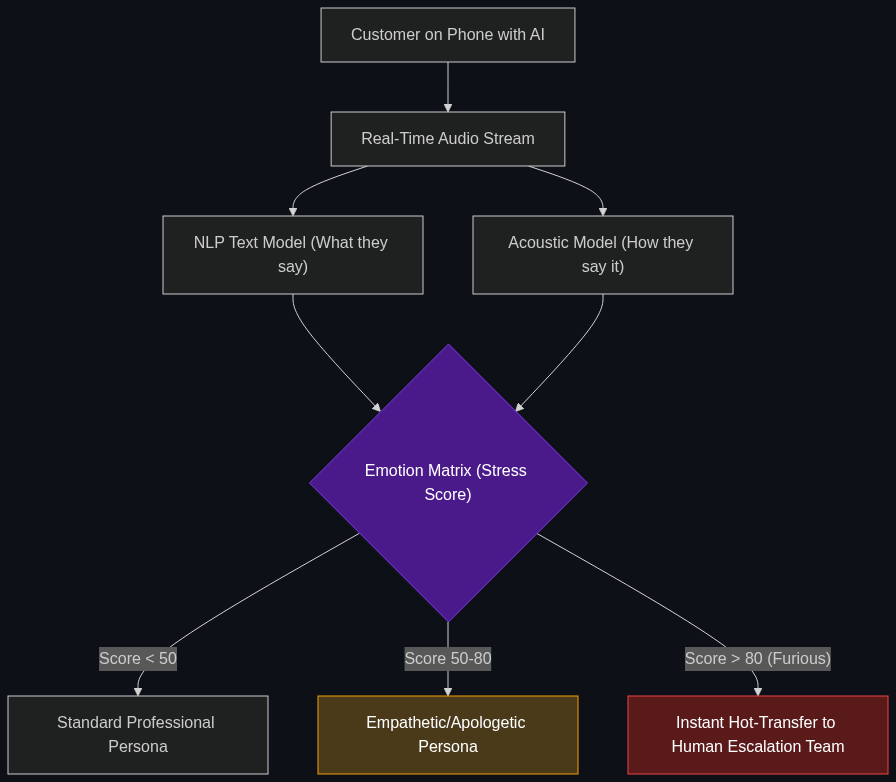

# 😡 Emotion-Aware Banking

> **AI in customer service apps that detects frustration or anxiety in your voice/typing and automatically "escalates" you to a human senior manager to prevent you from closing your account.**

---

## Phase 1: Core Foundations & Pre-requisites

### Prerequisites
- **Sentiment Analysis** — NLP models classifying text as positive, negative, or neutral.
- **Voice/Audio AI** — Transcribing and analyzing speech tone.

### Definition
Historically, customer service chatbots treated every user exactly the same, running through a rigid decision tree regardless of whether the customer was happy or furious.

**Emotion-Aware Banking** utilizes advanced Sentiment Analysis models that run in real-time during a customer interaction (either via text chat or phone call). The AI analyzes typing speed, the use of all-caps, curse words, or the pitch and volume of the caller's voice. If it detects high levels of stress or anger, it dynamically alters its own behavior—either adopting a highly empathetic, apologetic tone, or instantly bypassing the standard wait queue to route the customer to a specialized human retention expert.

### The Problem It Solves

| Standard Chatbot | Emotion-Aware AI |
|------------------|------------------|
| Customer: "WHERE IS MY MONEY?!" | Customer: "WHERE IS MY MONEY?!" |
| Bot: "Please select an option from the menu: 1. Balances..." | Bot: "I see you are upset. Bypassing the queue. Connecting you to a human manager immediately." |
| Infuriates the customer further (High Churn Risk). | De-escalates the situation (High Retention). |

### 🧩 Mini-Quiz

> **Q1:** If a customer is furious because they were charged a $35 overdraft fee, should the Emotion-Aware AI just refund the money to make them happy?
> <details><summary>Answer</summary>Only if authorized by strict corporate policy. While the AI can detect emotion, it must still obey the <b>Chain-of-Accountability</b> and business logic. It might be authorized to autonomously waive one fee per year to de-escalate an angry customer, but if the limit is reached, it must route to a human.</details>

---

## Phase 2: Anatomy & Internal Mechanisms

### Real-Time Sentiment Scoring



1. **The Input Stream:** The customer is on a phone call with an AI voice agent.
2. **Dual-Model Inference:** 
   - **Model 1 (NLP):** Reads the *text* transcript (e.g., "This is ridiculous").
   - **Model 2 (Acoustic):** Analyzes the *audio frequency* (e.g., raised volume, rapid speaking rate, voice tremors).
3. **The Empathy Matrix:** The system combines both models into a continuous stress score (0-100).
4. **Dynamic Routing:**
   - Score < 50: AI handles the call normally.
   - Score 50-80: AI shifts to an empathetic, highly apologetic persona.
   - Score > 80: AI initiates an instant "Hot Transfer" to the human Escalation Team.

### 🃏 Flashcard

> **Front:** How is Emotion-Aware AI used to protect vulnerable customers (like the elderly)?
> <details><summary>Flip</summary>Acoustic AI can detect cognitive hesitation, confusion, or signs of coercion (e.g., someone whispering instructions to the elderly person in the background). If the AI detects a senior citizen is anxious and confused while trying to wire $10,000 to a "tech support" company, it will freeze the transfer, suspecting an elder-abuse scam.</details>

---

## Phase 3: Advanced / Enterprise Patterns & Pitfalls

### Enterprise Use Cases

| Department | Emotion-Aware Application |
|------------|---------------------------|
| **Collections** | Debt collection calls are highly emotional. The AI detects if a customer is showing genuine distress/anxiety about job loss vs. anger/defiance. It dynamically offers a flexible payment plan to the distressed user, improving recovery rates without cruelty. |
| **Trading Platforms** | If a retail trader loses a massive amount of money and frantically begins typing aggressive trades into the app (Revenge Trading), the app detects the erratic behavior and introduces a "Cool Down" friction screen, asking them to confirm the trades via SMS. |

### Anti-Patterns

- ❌ **Tone-Deaf Cheerfulness** → Programming an AI to always say "I'm so happy to help you today!" If the user just stated their credit card was stolen and they are stranded at an airport, cheerful AI is incredibly offensive. Emotion-Aware AI must dynamically match the gravity of the situation.
- ❌ **Over-Indexing on Culture** → Acoustic models trained in New York might flag loud, fast speaking as "Anger," when it is actually just standard regional communication. Models must be localized to avoid false-positive escalations.

---

## Phase 4: Practical Implementation

### Real-Time Escalation Logic (Conceptual Python)

*How a routing engine shifts traffic based on sentiment.*

```python
def handle_support_message(user_message, current_session):
    # 1. Run the Sentiment NLP Model
    sentiment_score = analyze_sentiment(user_message) # Scale: -1.0 (Angry) to 1.0 (Happy)
    
    # 2. Update the session's cumulative stress level
    current_session.stress_level -= sentiment_score
    
    # 3. Dynamic Routing Logic
    if current_session.stress_level > 2.0:
        return trigger_human_escalation("Priority 1: Highly Distressed Customer")
        
    elif sentiment_score < -0.5:
        # Shift the AI Persona to be highly empathetic
        return generate_ai_response(
            prompt=user_message, 
            persona="empathetic_and_apologetic"
        )
        
    else:
        # Standard corporate tone
        return generate_ai_response(
            prompt=user_message, 
            persona="professional_and_concise"
        )
```

---

## Phase 5: Interview Preparation

### Q1: "Our current customer service bot handles 50% of our inquiries, but our customer satisfaction (CSAT) scores have plummeted because users feel trapped in 'Bot Hell.' How do we fix this?"
<details><summary><b>STAR Answer</b></summary>

**Situation:** The deployment of a rigid chatbot saved operational costs but caused a severe drop in customer satisfaction due to users feeling ignored when frustrated.

**Task:** Re-architect the bot to provide an empathetic experience without losing the cost savings of automation.

**Action:** I would overlay an **Emotion-Aware Sentiment Analysis** layer onto the existing bot infrastructure. 
As the user types, the NLP model continuously scores their text for keywords indicating frustration, repetition, or urgency. I would implement a hard-coded "Empathy Threshold." If the user's frustration score crosses this threshold, the bot immediately drops its script, apologizes, and seamlessly routes the chat history to a live human agent.

**Result:** The bot continues to handle the 50% of easy, happy queries automatically, maintaining our cost savings. However, the moment a user gets frustrated, they are instantly rescued, eliminating "Bot Hell" and restoring our CSAT scores.
</details>

---

## Phase 6: Summary Cheatsheet & Action Plan

### 📋 TL;DR

| Concept | Key Point |
|---------|-----------|
| **Emotion-Aware Banking** | AI that detects stress, anger, or confusion. |
| **The Tech** | NLP text analysis and Acoustic voice frequency analysis. |
| **Dynamic Routing** | Bypassing the normal queue to get angry users to a human instantly. |
| **The Goal** | De-escalation, customer retention, and scam prevention. |

### 🚀 Do These Now
1. **Think about Voice Assistants:** The next time you use Siri or Alexa, whisper to it. Notice how it whispers back. This is a very primitive form of acoustic emotion-awareness. Enterprise banking AI takes this to the next level by detecting stress and fear.
