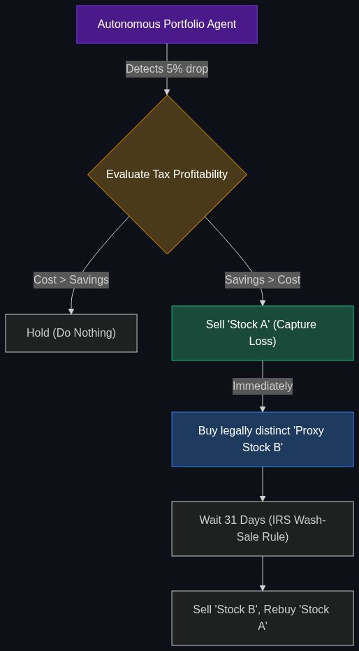

# 📉 Tax-Loss Harvesting Agents

> **AI that constantly watches your investment portfolio to sell "loser" stocks at the exact right moment to offset your taxes, a service once only available to the ultra-rich.**

---

## Phase 1: Core Foundations & Pre-requisites

### Prerequisites
- **AaaS** — Agent as a Service (see [Module 4](../../04_Industry_terminology_AI/02_The_Agentic_Enterprise/03_AaaS.md)).
- **Robo-Advisors** — Automated investment platforms.

### Definition
In investing, if you sell a stock for a $1,000 profit, you owe the government taxes on that gain. However, if you also sell a different stock for a $1,000 loss, the loss cancels out the gain, and you owe $0 in taxes. This strategy is called **Tax-Loss Harvesting**.

Historically, only the ultra-wealthy had human wealth managers constantly watching their portfolios to execute these complex trades. 

**Tax-Loss Harvesting Agents** democratize this. They are autonomous AI agents that monitor a retail investor's $5,000 Robinhood or Wealthfront portfolio 24/7. When a stock dips, the agent autonomously sells it to capture the tax loss, and instantly buys a similar (but legally distinct) stock so the user's overall portfolio doesn't change.

### The Problem It Solves

| Human Wealth Manager | Tax-Loss Agent |
|----------------------|----------------|
| Requires a $1,000,000 minimum portfolio to hire. | Available to anyone with a $500 portfolio. |
| Checks portfolios monthly or quarterly. | Scans the market every millisecond for micro-dips. |
| Very expensive fees (1% of AUM). | Included in the basic platform fee. |

### 🧩 Mini-Quiz

> **Q1:** If the AI sells my Apple stock for a loss to save me taxes, but Apple stock shoots up the next day, didn't the AI just lose me money?
> <details><summary>Answer</summary>No, because the Agent is programmed to perform a "Proxy Swap." When it sells Apple, it takes the cash and instantly buys an S&P 500 tech ETF (a similar investment). You capture the tax write-off, but your money remains invested in the tech sector so you don't miss the rebound.</details>

---

## Phase 2: Anatomy & Internal Mechanisms

### The Wash-Sale Rule Avoidance



The hardest part of this strategy is the IRS **"Wash-Sale Rule."** The law states that if you sell a stock for a loss, you cannot buy *the exact same stock* (or a "substantially identical" one) for 30 days, or the tax loss is invalidated.

The AI Agent manages this massive legal complexity autonomously:
1. **The Trigger:** The AI detects Stock A has dropped 5% and the user has unmet capital gains.
2. **The Sale:** The AI sells Stock A, capturing a $500 tax loss.
3. **The Swap:** The AI instantly buys Stock B. (The AI's knowledge graph ensures Stock B is highly correlated to Stock A's performance, but legally distinct enough to pass the IRS Wash-Sale audit).
4. **The Wait:** The AI sets a 31-day timer in its state management.
5. **The Reversion:** On day 31, the AI autonomously sells Stock B and buys back Stock A. 

### 🃏 Flashcard

> **Front:** What is "Direct Indexing"?
> <details><summary>Flip</summary>Instead of buying 1 share of an S&P 500 ETF, Direct Indexing uses an AI agent to buy fractional shares of all 500 individual companies in the index. Why? Because if the ETF drops, you only have 1 asset to tax-loss harvest. If the AI buys 500 individual stocks, even on a day the market goes up, 50 of those stocks likely went down. The AI can harvest micro-losses every single day, massively increasing tax savings.</details>

---

## Phase 3: Advanced / Enterprise Patterns & Pitfalls

### Enterprise Use Cases

| Platform | Harvesting Application |
|----------|------------------------|
| **Robo-Advisors (Wealthfront/Betterment)** | Offering Tax-Loss Harvesting as their core marketing feature. The AI agents run quietly in the background, and at the end of the year, the user gets a report saying: "Our AI saved you $3,000 in taxes this year." |
| **Crypto Platforms** | The Wash-Sale rule currently applies differently to crypto. AI agents aggressively harvest losses in Bitcoin during volatile micro-crashes, generating massive tax write-offs for retail crypto traders. |

### Anti-Patterns

- ❌ **Over-Trading** → If the AI trades 50 times a day to capture tiny $1 losses, the platform's transaction fees and the Bid/Ask spread will cost the user more than the tax savings. The agent must include a math function to ensure the tax yield is greater than the trading friction cost.
- ❌ **Violating the Wash-Sale Rule** → If the AI sells the Vanguard S&P 500 ETF and buys the Fidelity S&P 500 ETF, the IRS considers them "substantially identical" and the user will be audited. The agent must have strict legal parameters hardcoded into its Semantic Layer.

---

## Phase 4: Practical Implementation

### Harvesting Logic (Conceptual Python)

*How the Agentic workflow decides to execute a tax-swap.*

```python
def evaluate_tax_loss_harvest(portfolio_asset, user_tax_rate):
    """
    The AI agent scans an asset to see if a tax harvest is profitable.
    """
    current_loss = portfolio_asset.purchase_price - portfolio_asset.current_price
    
    if current_loss > 0:
        # Calculate the actual cash saved in taxes
        tax_savings = current_loss * user_tax_rate
        
        # Calculate the cost of executing the trade
        trading_fees = calculate_bid_ask_spread_cost()
        
        if tax_savings > (trading_fees * 2): # Must be highly profitable
            print(f"Executing Harvest. Selling {portfolio_asset.ticker}.")
            
            # Find a legally distinct proxy asset to hold for 30 days
            proxy_asset = find_irs_compliant_proxy(portfolio_asset)
            print(f"Buying {proxy_asset.ticker} to maintain market exposure.")
            
            execute_trade_swap(portfolio_asset, proxy_asset)
            return f"Harvested ${current_loss} in tax losses."
            
    return "Holding asset. No profitable harvest available."
```

---

## Phase 5: Interview Preparation

### Q1: "How does AI fundamentally change Wealth Management for the middle class?"
<details><summary><b>STAR Answer</b></summary>

**Situation:** Historically, advanced financial engineering (like tax optimization and direct indexing) was gated behind expensive human wealth managers who only accepted clients with high net worth.

**Task:** Explain how the democratization of Agentic AI disrupts this business model.

**Action:** AI changes this by replacing expensive human labor with high-speed **Autonomous Agents**. 
I would point to **Tax-Loss Harvesting Agents** as the prime example. A human manager cannot afford to watch a $5,000 portfolio every day to capture a $50 tax write-off. An AI agent, however, can monitor 1 million retail portfolios simultaneously, executing micro-trades and swapping proxy assets to avoid Wash-Sale rules with near-zero marginal cost.

**Result:** This allows FinTech companies to offer ultra-wealthy financial strategies to the middle class for a fraction of the cost, shifting wealth management from a luxury service to a scalable software product.
</details>

---

## Phase 6: Summary Cheatsheet & Action Plan

### 📋 TL;DR

| Concept | Key Point |
|---------|-----------|
| **Tax-Loss Harvesting** | Selling losing stocks to lower your tax bill. |
| **The Agentic Benefit** | AI does this autonomously, 24/7, for tiny portfolios. |
| **Wash-Sale Rule** | The IRS rule the AI must legally navigate around. |
| **Direct Indexing** | Buying 500 individual stocks instead of 1 ETF to give the AI more chances to find losers. |

### 🚀 Do These Now
1. **Look at Wealthfront:** Wealthfront is a pioneer in this space. Go to their website and read their page on "Tax-Loss Harvesting." Notice how they sell the *algorithm* as the core product, proving that AI is replacing human financial advisors.
