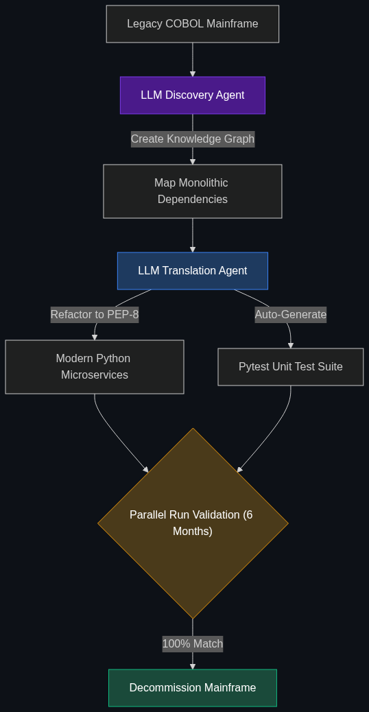

# 💾 Legacy Code Modernization

> **Using AI to translate 50-year-old banking code (COBOL) into modern languages (Java/Python). This is a multi-billion dollar trend as big banks try to "un-stick" themselves from old tech.**

---

## Phase 1: Core Foundations & Pre-requisites

### Prerequisites
- **LLM Coding Agents** — Using AI to write code (see [Module 1](../../01_Introduction_to_AI/04_Coding_with_AI/01_Copilots_vs_Agents.md)).
- **Technical Debt** — The cost of using old, bad code.

### Definition
When you swipe your debit card at a massive global bank, that transaction is almost certainly processed by a mainframe computer running **COBOL**—a programming language invented in 1959. 

The problem? The engineers who know how to write COBOL are literally retiring or passing away. The banks are terrified because their core infrastructure is unmaintainable. 

**Legacy Code Modernization** refers to the enterprise trend of deploying specialized coding LLMs to automatically read millions of lines of 50-year-old COBOL, figure out what it does, and rewrite it perfectly into modern Java or Python, allowing the bank to migrate off mainframe computers and into the AWS/Azure cloud.

### The Problem It Solves

| Traditional Migration | AI Legacy Modernization |
|-----------------------|-------------------------|
| Takes 5-10 years and costs billions. | Takes 1-2 years and costs millions. |
| Humans must reverse-engineer undocumented code. | LLM instantly explains what the undocumented code does. |
| High risk of breaking the banking system. | High automated test coverage generated by the AI. |

### 🧩 Mini-Quiz

> **Q1:** If an LLM can translate COBOL to Python, why do banks still need human engineers for this?
> <details><summary>Answer</summary>Because COBOL was designed for a <i>batch-processing mainframe</i> paradigm, while Python in the cloud uses a <i>microservices</i> paradigm. The AI is great at line-by-line translation, but human architects are required to redesign the overarching system architecture so the new code runs efficiently in the cloud.</details>

---

## Phase 2: Anatomy & Internal Mechanisms

### The Translation Pipeline



1. **Discovery (The Hard Part):** The AI Agent reads the legacy COBOL code and the "JCL" (Job Control Language). It creates a massive Knowledge Graph mapping out all the dependencies (e.g., "Script A relies on Database B").
2. **De-coupling:** The AI identifies "Spaghetti Code" and breaks the massive monolithic COBOL program into smaller, logical chunks.
3. **Translation:** The LLM translates the COBOL logic into Python/Java line-by-line.
4. **Test Generation:** The AI writes thousands of Python Unit Tests.
5. **Parallel Run:** The bank runs the old COBOL system and the new Python system side-by-side for 6 months. If the outputs match perfectly, they turn the COBOL system off.

### 🃏 Flashcard

> **Front:** What is "Mainframe-as-a-Service" (MaaS) and why do banks want to escape it?
> <details><summary>Flip</summary>Banks currently pay companies like IBM massive fees to rent space on their old Mainframe computers. By using AI to translate their COBOL into Java, banks can escape MaaS, move their code to standard AWS servers, and save hundreds of millions of dollars a year in hosting fees.</details>

---

## Phase 3: Advanced / Enterprise Patterns & Pitfalls

### Enterprise Use Cases

| Department | Modernization Application |
|----------|-----------------------|
| **Core Banking** | Moving the central "General Ledger" (the master record of all bank money) from a 1980s mainframe into a modern cloud-native architecture. |
| **Insurance** | Translating millions of lines of old actuarial math (risk calculations) from Fortran into modern Python so modern data scientists can actually use it. |

### Anti-Patterns

- ❌ **"Lift and Shift" Translation** → Just translating terrible COBOL directly into terrible Java. This creates "JavaBOL" (Java written in the style of COBOL), which is just as impossible to maintain. The AI must be prompted to *refactor* the code into modern object-oriented paradigms.
- ❌ **Ignoring Test Coverage** → If the AI translates the code but doesn't write the tests, the bank can never prove to the regulators that the new system is functionally identical to the old system.

---

## Phase 4: Practical Implementation

### Prompting for Legacy Translation (Conceptual)

*How an engineer instructs the AI to modernize the codebase.*

```python
system_prompt = """
You are a Senior Mainframe Modernization Architect.
I will provide you with a legacy COBOL script.

Your task is to:
1. EXPLAIN the business logic in plain English.
2. TRANSLATE the logic into modern, Object-Oriented Python.
3. REFACTOR the code to follow PEP-8 standards (Do NOT write JavaBOL).
4. GENERATE `pytest` unit tests to prove your Python output matches 
   the mathematical output of the original COBOL.
"""

legacy_cobol = """
       IDENTIFICATION DIVISION.
       PROGRAM-ID. INTEREST-CALC.
       DATA DIVISION.
       WORKING-STORAGE SECTION.
       01  BALANCE        PIC 9(5)V99.
       01  INTEREST-RATE  PIC V99 VALUE .05.
       01  FINAL-AMT      PIC 9(5)V99.
       PROCEDURE DIVISION.
           MULTIPLY BALANCE BY INTEREST-RATE GIVING FINAL-AMT.
"""

# The AI outputs a clean Python class and Pytest suite.
```

---

## Phase 5: Interview Preparation

### Q1: "Our bank has 20 million lines of undocumented COBOL running our mortgage system. IBM is raising our mainframe hosting fees by 30%. How can AI help us migrate to AWS?"
<details><summary><b>STAR Answer</b></summary>

**Situation:** The enterprise is trapped by technical debt and facing massive vendor lock-in fees because human engineers cannot safely migrate 20 million lines of undocumented legacy code.

**Task:** Accelerate a safe migration from Mainframe to Cloud.

**Action:** I would implement an AI-driven **Legacy Code Modernization** pipeline. 
First, we use an LLM Agent to ingest the 20 million lines and auto-generate the missing documentation, creating a map of the business logic. 
Second, we use a fine-tuned coding LLM (like GitHub Copilot Enterprise or specialized IBM watsonx models) to systematically translate the COBOL monolith into modern Java microservices. 
Third, we use the AI to auto-generate identical test suites for both systems.

**Result:** By automating the translation and test-generation, we reduce a 5-year, $100M human-led migration project into a 2-year AI-assisted project. Once deployed on AWS, the bank escapes the mainframe hosting fees, saving millions annually.
</details>

---

## Phase 6: Summary Cheatsheet & Action Plan

### 📋 TL;DR

| Concept | Key Point |
|---------|-----------|
| **Legacy Code Modernization** | Using AI to rewrite old code (COBOL) into new code (Python/Java). |
| **The Why** | Mainframes are expensive, and COBOL engineers are retiring. |
| **The Risk** | Creating "JavaBOL" (bad Java written like old COBOL). |
| **The Solution** | Forcing the AI to refactor and generate massive test suites. |

### 🚀 Do These Now
1. **Look up "IBM watsonx Code Assistant for Z":** IBM built a specific AI model *just* to translate COBOL to Java for their banking clients. Reading their marketing material is the best way to understand this multi-billion dollar enterprise problem.
