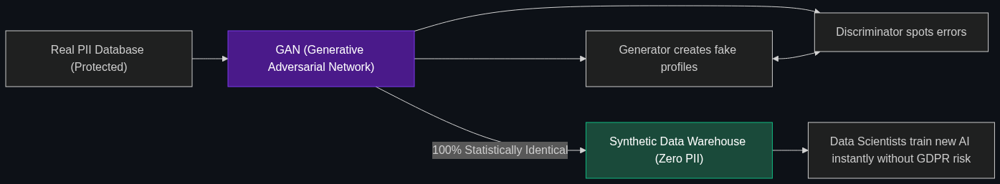

# 🧪 Synthetic Financial Data

> **Creating "fake" but statistically perfect financial records to train new AI models without ever risking real customer privacy or breaking GDPR laws.**

---

## Phase 1: Core Foundations & Pre-requisites

### Prerequisites
- **Data Privacy Laws** — GDPR (Europe) and CCPA (California).
- **Generative AI** — Models that create new data (see [Module 1](../../01_Introduction_to_AI/01_Foundations_of_Generative_AI/01_What_is_Generative_AI.md)).

### Definition
To train a powerful AI fraud model, a bank needs millions of rows of data (names, SSNs, credit card swipes, account balances). 
However, due to strict privacy laws (like GDPR), it is highly illegal to take real customer data from the secure production database and give it to a team of Data Scientists in the dev environment.

**Synthetic Financial Data** solves this. The bank uses a Generative AI model (often a GAN - Generative Adversarial Network) to study the real data and generate millions of completely fake, artificial customer records. 
These fake records have the *exact same statistical properties, correlations, and distributions* as the real data, but they belong to people who do not exist.

### The Problem It Solves

| Real Data Training | Synthetic Data Training |
|--------------------|-------------------------|
| Massive compliance risk (Data breaches). | Zero compliance risk (No real people exist). |
| Takes 6 months to get Legal approval to use. | Instant access for developers. |
| Biased (e.g., Not enough data on rare fraud types). | Can artificially "upsample" (generate more) rare fraud types. |

### 🧩 Mini-Quiz

> **Q1:** If I just take a real database and scramble the names and SSNs (Data Masking), isn't that the same as Synthetic Data?
> <details><summary>Answer</summary>No! Data Masking (or Anonymization) is highly dangerous. If an anonymized database contains a user with a $5.2M salary who lives in a specific small town, a hacker can easily figure out who that real person is. Synthetic data is generated entirely from scratch; the person with the $5.2M salary literally never existed, making it mathematically impossible to reverse-engineer.</details>

---

## Phase 2: Anatomy & Internal Mechanisms

### The GAN (Generative Adversarial Network)



Synthetic data is often created using a **GAN**, which consists of two AI models fighting each other:

1. **The Generator:** Creates a fake credit card transaction (e.g., "$50 at Starbucks for John Doe").
2. **The Discriminator:** Looks at the fake transaction and compares it to the real database. It says: *"Fake! Real humans named John Doe usually buy coffee at 8 AM, but you generated this at 3 AM."*
3. **The Loop:** The Generator learns from the feedback and tries again. 
4. **The Result:** After millions of rounds, the Generator produces fake data so statistically perfect that the Discriminator (and human data scientists) cannot tell it apart from real data.

### 🃏 Flashcard

> **Front:** How does Synthetic Data fix "Imbalanced Datasets"?
> <details><summary>Flip</summary>In a bank, 99.9% of transactions are legitimate, and only 0.1% are fraud. If you train an AI on this real data, it won't learn what fraud looks like because there isn't enough of it (Imbalanced). Engineers use Generative AI to create 100,000 synthetic examples of the rare fraud, giving the final AI model enough examples to learn from.</details>

---

## Phase 3: Advanced / Enterprise Patterns & Pitfalls

### Enterprise Use Cases

| Industry | Synthetic Data Application |
|----------|----------------------------|
| **Software Testing** | A bank wants to test a new mobile app feature but cannot use real user accounts. They generate 10,000 synthetic user accounts with synthetic transaction histories to stress-test the app before launch. |
| **Open Banking / Hackathons** | A bank wants to host a public Hackathon for external developers to build apps on their API. They expose a sandbox environment filled entirely with Synthetic Data, guaranteeing zero privacy risk while providing a realistic coding experience. |

### Anti-Patterns

- ❌ **Losing the "Tails"** → If the Generative AI only produces "average" synthetic users, it will fail to generate the weird, edge-case outliers (the "long tails") that exist in the real world. A model trained on this data will fail in production when it encounters a real-world edge case.
- ❌ **Privacy Leakage in the Generator** → If the GAN over-fits on the training data, it might accidentally perfectly memorize a real person's SSN and spit it out as "synthetic" data. This is a catastrophic failure.

---

## Phase 4: Practical Implementation

### Using Synthetic Data for Evals (Conceptual)

*How developers use fake data to safely test prompts.*

```python
def test_fraud_prompt_safely():
    """
    Testing an LLM prompt using 100% synthetic, GDPR-compliant data.
    """
    # 1. Fetch data from the Synthetic Data API (Not the Prod DB)
    synthetic_user = synthetic_data_generator.get_profile(type="high_risk")
    
    print(f"Testing with Synthetic User: {synthetic_user.fake_name}")
    print(f"Fake SSN: {synthetic_user.fake_ssn}")
    
    # 2. Test the Agentic Prompt
    prompt = f"Analyze this user for fraud: {synthetic_user.transaction_history}"
    
    response = llm_agent.run(prompt)
    return response

# Developers can run this test 10,000 times on their local laptops 
# without triggering a single cybersecurity compliance alert.
```

---

## Phase 5: Interview Preparation

### Q1: "Our Data Science team is completely blocked. It takes 6 months for the Legal and Compliance teams to approve access to customer data for model training. How can we speed this up?"
<details><summary><b>STAR Answer</b></summary>

**Situation:** Strict data privacy regulations (GDPR/CCPA) are creating massive bottlenecks, preventing engineers from training and deploying AI models quickly.

**Task:** Unblock the engineering team while maintaining 100% legal compliance.

**Action:** I would implement a **Synthetic Data Pipeline**. 
Instead of fighting Legal for access to the real production database, we deploy a Generative AI model within the secure production perimeter. This model studies the real customer data and generates a secondary, completely synthetic database. This synthetic database has the exact same mathematical distribution and correlations as the real data, but contains zero PII (Personally Identifiable Information) because the people do not exist. 

**Result:** Because the data is synthetic, it falls completely outside the scope of GDPR. The Data Science team is granted instant, unrestricted access to the synthetic database, cutting the model development lifecycle from 6 months down to 2 weeks while completely eliminating the risk of a privacy breach.
</details>

---

## Phase 6: Summary Cheatsheet & Action Plan

### 📋 TL;DR

| Concept | Key Point |
|---------|-----------|
| **Synthetic Financial Data** | AI-generated "fake" data that perfectly mimics real data. |
| **The Why** | Bypassing GDPR/Privacy laws to train AI models faster. |
| **The Tech** | GANs (Generative Adversarial Networks). |
| **Data Masking** | The old, dangerous way (Scrambling real data). Synthetic is the new, safe way. |

### 🚀 Do These Now
1. **Look up "Gretel AI" or "Tonic.ai":** These are leading enterprise startups dedicated entirely to generating synthetic data. Read their use cases to see how they sell "Fake Data" to massive Fortune 500 banks.
