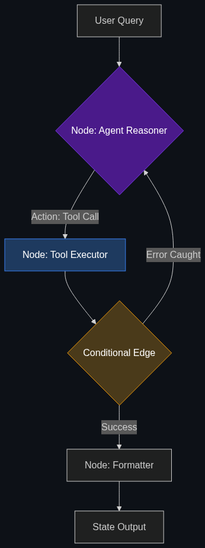

# 🔄 LangGraph & DCGs

> **LangGraph has become the industry standard over basic LangChain. It allows you to model workflows as "states" (e.g., Input → Validation → Tool Call → Human Review → Output).**

---

## Phase 1: Core Foundations & Pre-requisites

### Prerequisites
- **Agents** — AI making autonomous decisions (see [Module 1](../../01_Introduction_to_AI/04_Coding_with_AI/01_Copilots_vs_Agents.md)).
- **State Management** — Remembering what happened previously.

### Definition
In 2023, developers used frameworks like **LangChain** to build "Chains." A Chain is a Directed Acyclic Graph (DAG)—meaning the data flows in a straight line from A to B to C, and then stops. This is great for a simple Q&A bot.

However, in 2026 enterprise finance, workflows are incredibly complex and require loops (e.g., if the tool call fails, try again; if the data is incomplete, ask the user). This requires a **Directed Cyclic Graph (DCG)**.

**LangGraph** is the enterprise standard framework for building these DCGs. It treats an AI workflow not as a chain, but as a "State Machine." At each node in the graph, the AI can make a decision, update the global "state" (memory), and loop back to previous nodes if necessary.

### The Problem It Solves

| Linear Chains (LangChain) | State Machines (LangGraph) |
|---------------------------|----------------------------|
| Data flows in one direction (A $\rightarrow$ B $\rightarrow$ Output). | Data can loop (A $\rightarrow$ B $\rightarrow$ C $\rightarrow$ B $\rightarrow$ Output). |
| Cannot easily recover from a tool error. | Can catch an error, rethink, and retry the tool automatically. |
| Hard to insert a "Human-in-the-Loop" pause. | Native state persistence allows pausing the graph indefinitely for human approval. |

### 🧩 Mini-Quiz

> **Q1:** If my AI agent tries to query an SQL database and gets a syntax error, how does LangGraph handle it?
> <details><summary>Answer</summary>Because LangGraph supports cycles, it doesn't just crash. The error message is appended to the global State. The graph routes back to the LLM node, the LLM reads the error, realizes its syntax mistake, rewrites the SQL query, and routes back to the Tool execution node to try again.</details>

---

## Phase 2: Anatomy & Internal Mechanisms

### The Anatomy of a LangGraph Node



A LangGraph architecture consists of three core components:

1. **State:** A highly structured Python dictionary (or Pydantic model) that is passed between every node. (e.g., `{"query": "User balance", "sql_result": None, "errors": 0}`)
2. **Nodes:** Python functions that do the actual work. A node receives the State, modifies it, and returns the updated State.
   - Node 1: `Agent_Reasoner`
   - Node 2: `Tool_Executor`
3. **Conditional Edges:** The routing logic. Based on the current State, the edge decides which node to go to next.
   - *Logic:* `If tool_failed == True: Route back to Agent_Reasoner.`

### 🃏 Flashcard

> **Front:** What does it mean to say LangGraph enables "Time Travel"?
> <details><summary>Flip</summary>Because LangGraph saves the exact "State" of the graph at every single step to a database (like SQLite or Postgres), developers can "rewind" the execution. If an agent hallucinates at Step 4, an engineer can rewind the state to Step 3, fix the prompt, and resume the graph from that exact point without having to rerun Steps 1 and 2.</details>

---

## Phase 3: Advanced / Enterprise Patterns & Pitfalls

### Enterprise Use Cases

| Workflow | LangGraph Application |
|----------|-----------------------|
| **Loan Underwriting** | The graph routes an application through `Extract_Data` $\rightarrow$ `Run_Math` $\rightarrow$ `Evaluate_Policy`. If the policy is ambiguous, it hits a conditional edge routing to `Human_Approval_Queue`, saving the state to Postgres until a human clicks "Approve" 3 days later, at which point the graph wakes up and finishes. |
| **Self-Correcting Code** | An AI that writes code, runs it in a sandbox, catches the stack trace error, and loops back to rewrite the code up to 5 times before giving up. |

### Anti-Patterns

- ❌ **Infinite Loops** → A poorly designed cyclic graph where the AI gets stuck trying the exact same broken SQL query forever. You must hardcode safety mechanisms in the State (e.g., `if retry_count > 3: route to END`).
- ❌ **Massive Global States** → Stuffing 50 megabytes of PDF text into the LangGraph state object. This will cause memory crashes and cost thousands of dollars in token fees as the entire state is passed to the LLM at every step. Use pointers or summaries.

---

## Phase 4: Practical Implementation

### Building a Cyclic Graph (Conceptual Python)

*Defining the nodes and edges of a resilient financial agent.*

```python
from langgraph.graph import StateGraph, END
from typing import TypedDict

# 1. Define the Global State Schema
class AgentState(TypedDict):
    user_query: str
    tool_output: str
    retry_count: int

# 2. Define the Nodes
def agent_reasoner(state: AgentState):
    # The LLM decides what tool to use based on the query and any past errors
    print("Agent is thinking...")
    return {"tool_output": "Attempting API call..."}

def tool_executor(state: AgentState):
    print("Executing Tool...")
    # Simulate a failure
    return {"tool_output": "ERROR: Network Timeout", "retry_count": state["retry_count"] + 1}

# 3. Define the Conditional Edge (The Loop Logic)
def route_next_step(state: AgentState):
    if "ERROR" in state["tool_output"]:
        if state["retry_count"] >= 3:
            return END  # Break the loop if we've tried 3 times
        return "tool_executor"  # Try again
    return END # Success

# 4. Compile the Graph
workflow = StateGraph(AgentState)
workflow.add_node("agent", agent_reasoner)
workflow.add_node("tool", tool_executor)

workflow.set_entry_point("agent")
workflow.add_edge("agent", "tool")
workflow.add_conditional_edges("tool", route_next_step)

app = workflow.compile()
```

---

## Phase 5: Interview Preparation

### Q1: "Our current RAG chatbot occasionally fails to find data and just tells the user 'I don't know'. We want it to be more persistent and try different search terms if the first one fails. How do we build this?"
<details><summary><b>STAR Answer</b></summary>

**Situation:** A linear (DAG) agent architecture fails gracefully but gives up too easily, leading to a poor user experience.

**Task:** Re-architect the agent to support autonomous retries and self-correction.

**Action:** I would migrate the agent's architecture from standard LangChain to **LangGraph**. 
This allows us to introduce **Directed Cyclic Graphs (DCGs)**. I would create a new conditional routing edge called the `Grader Node`. 
After the `Retrieval Node` fetches documents from the database, the `Grader Node` evaluates them. If the documents are irrelevant to the user's question, the state is updated with a `Search_Failed` flag. The graph then dynamically loops *backward* to the `Query_Rewrite Node`, instructing the LLM to generate a new, different search term and try the database again.

**Result:** The agent becomes significantly more resilient. It autonomously loops and tries up to 3 different search strategies before giving up, vastly improving the successful retrieval rate without requiring human intervention.
</details>

---

## Phase 6: Summary Cheatsheet & Action Plan

### 📋 TL;DR

| Concept | Key Point |
|---------|-----------|
| **LangGraph** | The industry standard for building complex agentic workflows. |
| **DCG (Directed Cyclic Graph)** | Workflows that can loop backward (Self-correction). |
| **State Machine** | The architecture that allows pausing, resuming, and "Time Travel." |
| **The Safety Net** | Always include a max-retry limit to prevent infinite AI loops. |

### 🚀 Do These Now
1. **Read the LangGraph Docs:** Go to LangChain's official documentation for LangGraph. Look at their introductory diagram of a "StateGraph." Understanding how Nodes pass the State dictionary to each other is fundamental to 2026 AI engineering.
