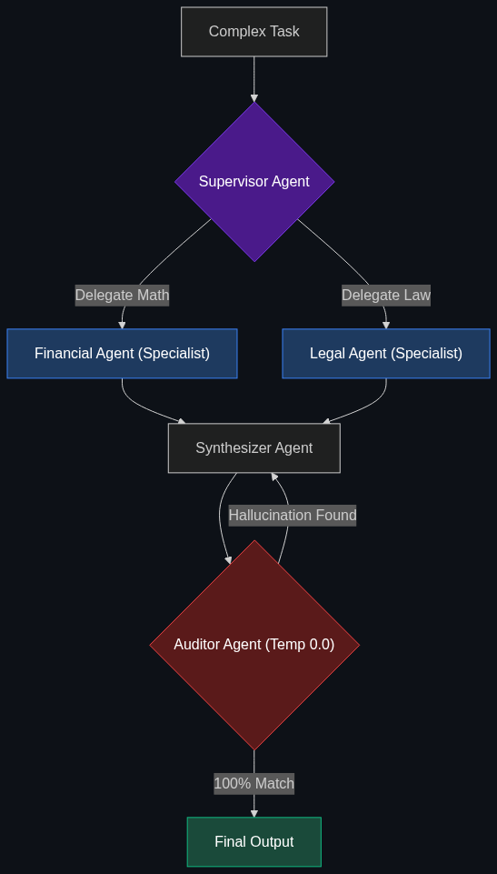

# 🐝 Multi-Agent Coordination

> **Instead of one "God Model," you build a swarm.**

---

## Phase 1: Core Foundations & Pre-requisites

### Prerequisites
- **Agentic Ops / Multi-Agent Orchestration** (see [Module 3](../../02_Enterprise_AI/03_Advanced_Orchestration/01_Multi_Agent_Orchestration.md)).
- **LangGraph** — For routing logic (see [01_LangGraph_and_DCGs.md](01_LangGraph_and_DCGs.md)).

### Definition
When companies first adopted AI, they tried to build a "God Model"—a single massive prompt instructing GPT-4 to act as a Risk Analyst, a Compliance Officer, and a Python Developer all at once. This failed because large, complex prompts confuse the LLM, causing it to hallucinate or skip instructions.

**Multi-Agent Coordination** (or Swarm Architecture) is the modern enterprise pattern. You break the massive task down and assign it to a team of highly specialized, narrowly focused agents that communicate with each other. 
In a financial firm, a **Supervisor Agent** receives a task and delegates it to a **Specialist Agent** (e.g., an agent strictly prompted to look for tax liabilities). Before the task is finalized, it is passed to an **Auditor Agent** (a low-temperature model) that double-checks the Specialist's work.

### The Problem It Solves

| Single "God Model" | Multi-Agent Swarm |
|--------------------|-------------------|
| Massive, confusing prompt (2,000+ words). | Narrow, precise prompts for each agent. |
| Easily distracted; forgets constraints. | Hyper-focused; adheres strictly to rules. |
| Single point of failure. | Resilient: Auditor agent catches mistakes. |

### 🧩 Mini-Quiz

> **Q1:** Does a Multi-Agent system require using different AI models from different companies?
> <details><summary>Answer</summary>Not necessarily. You can have a swarm of 5 agents all powered by the exact same underlying model (e.g., GPT-4o). What makes them different "agents" is their <b>System Prompt</b> and the specific <b>Tools</b> they are given access to.</details>

---

## Phase 2: Anatomy & Internal Mechanisms

### The Swarm Topology



A common enterprise topology is the **Hierarchical / Supervisor Pattern**:

1. **The Human Request:** "Analyze this startup for a venture capital investment."
2. **The Supervisor Agent:** Reads the request and creates a project plan. It delegates sub-tasks.
3. **The Specialists (Parallel Execution):**
   - **Financial Agent:** Given access to the `SQL_Database` tool. Calculates burn rate.
   - **Legal Agent:** Given access to the `Contract_RAG` tool. Scans the founder agreements.
4. **The Synthesizer:** Collects the reports from the Financial and Legal agents and writes the final summary.
5. **The Auditor:** A separate AI (often configured with `Temperature = 0.0` for maximum strictness) reads the final summary. If it detects a hallucination, it rejects the summary and sends it back to the Synthesizer for a rewrite.

### 🃏 Flashcard

> **Front:** Why is the "Auditor Agent" usually configured with `Temperature = 0.0`?
> <details><summary>Flip</summary>Temperature controls creativity. A high temperature (0.7) is great for generating ideas, but terrible for checking facts. An Auditor Agent must be highly deterministic and rigid. Its only job is to compare the generated report against the source data and yell "Error!" if they don't match. Zero creativity allowed.</details>

---

## Phase 3: Advanced / Enterprise Patterns & Pitfalls

### Enterprise Use Cases

| Industry | Swarm Application |
|----------|-------------------|
| **Software Engineering** | A Product Manager agent writes a ticket. A Coder agent writes the Python code. A QA agent runs the code, catches the syntax error, and sends it back to the Coder agent to fix it. |
| **Hedge Funds** | A Sentiment Agent reads Twitter. A Quantitative Agent reads the SEC filings. A Supervisor Agent combines both to make a final buy/sell recommendation. |

### Anti-Patterns

- ❌ **Endless Agent Chatting** → Putting two agents in a loop and telling them to "debate" an issue without a strict stopping condition. They will burn through thousands of dollars of API credits arguing in circles. The Supervisor must enforce a hard limit (e.g., maximum 3 iterations).
- ❌ **Over-Complication** → Building a 10-agent swarm to answer a simple FAQ question. Every agent hop adds latency (Time-To-First-Token). If the task is simple, use a single agent. Only use swarms for highly complex, multi-step enterprise workflows.

---

## Phase 4: Practical Implementation

### Defining the Swarm (Conceptual)

*How different system prompts define the agents.*

```python
# The overarching orchestration logic (LangGraph handles the routing)

# Agent 1: The Specialist
financial_agent_prompt = """
You are a highly specialized Financial Analyst Agent.
Your ONLY job is to extract revenue numbers from documents.
Do not comment on legal risks. Do not generate summaries.
Output strictly in JSON format.
"""

# Agent 2: The Auditor
auditor_agent_prompt = """
You are a strict, merciless Compliance Auditor.
You will be given a Financial Report and the original Source Document.
Your ONLY job is to verify that every number in the Report exactly matches the Source.
If a number is hallucinated, you must output 'REJECT' and specify the error.
"""

# The Execution Flow
report = call_llm(financial_agent_prompt, source_document)
audit_result = call_llm(auditor_agent_prompt, f"Source: {source_document}\nReport: {report}", temperature=0.0)

if "REJECT" in audit_result:
    print("Auditor caught a hallucination. Looping back to Financial Agent.")
```

---

## Phase 5: Interview Preparation

### Q1: "We built an AI to generate quarterly earnings reports. It does a decent job, but occasionally it hallucinates a metric or forgets to include the legal disclaimers. How do we make it reliable enough for production?"
<details><summary><b>STAR Answer</b></summary>

**Situation:** A single "God Model" is failing to balance the complex, multi-faceted requirements of generating a compliant financial report, leading to hallucinations and missing legal requirements.

**Task:** Architect a resilient system that guarantees structural and factual compliance.

**Action:** I would refactor the system from a single prompt into a **Multi-Agent Coordination** architecture. 
Instead of one model trying to write the report and remember the laws simultaneously, we create a swarm. 
The "Writer Agent" generates the initial draft. That draft is automatically passed to a secondary "Compliance Auditor Agent"—an LLM specifically prompted and fine-tuned to look *only* for missing legal disclaimers. It acts as an automated Red Team. 

**Result:** If the Writer forgets a disclaimer, the Auditor catches it instantly, rejects the draft, and forces the Writer to try again in an automated loop. The final report is only released to humans after the Auditor mathematically approves it, guaranteeing 100% compliance.
</details>

---

## Phase 6: Summary Cheatsheet & Action Plan

### 📋 TL;DR

| Concept | Key Point |
|---------|-----------|
| **Multi-Agent Swarm** | Breaking complex tasks into smaller pieces for specialized agents. |
| **Supervisor Agent** | The "Manager" that routes tasks to the right specialist. |
| **Auditor Agent** | A low-temperature model that double-checks the work to prevent hallucinations. |
| **The Rule** | Small, narrow prompts always outperform massive "God Model" prompts. |

### 🚀 Do These Now
1. **Look into CrewAI or Microsoft AutoGen:** These are two of the most popular frameworks specifically designed to make multiple AI agents talk to each other. Watch a quick demo of how a "Crew" of agents collaborates to write code.
