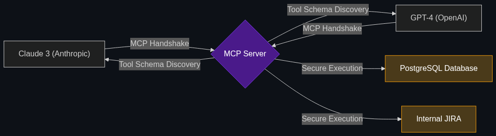

# 🔌 Model Context Protocol (MCP)

> **MCP acts as the "Universal Translator" for AI. It is an open standard that allows developers to easily connect any AI model to any enterprise database or internal tool without writing custom integration code for every single model.**

---

## Phase 1: Core Foundations & Pre-requisites

### Prerequisites
- **Tool Use / Function Calling** — Giving AI the ability to take action.
- **APIs** — How software communicates.

### Definition
In the early days of generative AI, if an enterprise wanted to connect GPT-4 to their internal PostgreSQL database, they had to write custom API middleware specifically designed for OpenAI's schema. If they wanted to switch to Anthropic's Claude 3 a month later, they had to throw that code away and rewrite the integration entirely for Anthropic's schema.

The **Model Context Protocol (MCP)**, introduced by Anthropic and rapidly adopted as an open industry standard, solves this nightmare. It is a universal, open-source protocol (like HTTP or USB) specifically designed for AI agents. 

You build an "MCP Server" around your database once. Now, *any* AI model (GPT-4, Claude, Gemini, Llama) that supports the MCP standard can instantly plug in, discover what tools are available (e.g., `get_account_balance`), and use them seamlessly.

### The Problem It Solves

| Pre-MCP (The Nightmare) | Post-MCP (The Standard) |
|-------------------------|-------------------------|
| Custom integration code required for every single AI vendor. | Write the integration once. Any AI model can connect. |
| Vendor Lock-in (Hard to switch from OpenAI to Google). | Plug-and-Play (Swap models instantly based on cost/performance). |
| Complex authorization handling. | Standardized authorization and tool discovery. |

### 🧩 Mini-Quiz

> **Q1:** If my bank builds an MCP Server for its Core Banking System, does the AI model automatically start executing trades?
> <details><summary>Answer</summary>No. The MCP server simply exposes the <i>capabilities</i> (the tools) and the <i>schemas</i> to the AI. The AI still has to reason about the user's prompt and send a valid request to the MCP server to execute the trade. Furthermore, the MCP server enforces strict authorization, ensuring the AI can only execute trades if the human user has the correct permissions.</details>

---

## Phase 2: Anatomy & Internal Mechanisms

### The MCP Architecture



1. **The MCP Host:** The application running the AI Agent (e.g., your LangGraph orchestrator or a desktop app like Claude for Desktop).
2. **The MCP Client:** The component inside the host that manages the protocol connection.
3. **The MCP Server:** A lightweight server you build that wraps around your real data source (e.g., a PostgreSQL database, a Slack workspace, or a Mainframe).
4. **The Exchange:**
   - **Discovery:** The AI asks the server, "What tools do you have?"
   - **Schema:** The server replies, "I have `transfer_funds`. It requires an `account_id` (string) and an `amount` (float)."
   - **Execution:** The AI sends a JSON payload matching that exact schema to execute the tool.

### 🃏 Flashcard

> **Front:** How is MCP similar to USB-C?
> <details><summary>Flip</summary>Before USB-C, every phone had a different proprietary charger (Nokia, Sony, Apple). You had to buy specific cables for specific devices. MCP is the "USB-C of AI." It provides a universal, standardized "connector" so that any AI model can plug into any database without requiring proprietary, custom-built API cables.</details>

---

## Phase 3: Advanced / Enterprise Patterns & Pitfalls

### Enterprise Use Cases

| Integration | MCP Application |
|-------------|-----------------|
| **Local Development** | An engineer connects their local IDE to a local MCP Server. The AI agent can instantly read the engineer's local filesystem, run Git commands, and query local databases to help debug code, without the enterprise having to expose their databases to the public internet. |
| **Enterprise Search** | A company builds an MCP server around their internal Confluence and Jira systems. Any compliant AI agent the company deploys can now instantly search across all corporate documents and tickets simultaneously. |

### Anti-Patterns

- ❌ **Building Custom "Tools" for every LLM SDK** → Writing `@tool` decorators specific to the LangChain framework, and then having to rewrite them when you switch to LlamaIndex. Instead, build an MCP Server. Both frameworks can connect to it seamlessly.
- ❌ **Exposing Destructive Tools Without Guardrails** → Creating an MCP Server that exposes `DROP TABLE users` to the AI. MCP standardizes the connection, but it does *not* magically make the AI safe. The enterprise must still build strict Semantic Layers and authorization checks within the MCP Server itself.

---

## Phase 4: Practical Implementation

### The MCP Handshake (Conceptual)

*How the AI discovers what it is allowed to do.*

```json
// 1. The AI (MCP Client) connects and asks: "What tools are available?"
// 2. The MCP Server responds with the strict Tool Schema:

{
  "tools": [
    {
      "name": "get_customer_risk_profile",
      "description": "Retrieves the AML and credit risk profile for a user.",
      "inputSchema": {
        "type": "object",
        "properties": {
          "user_id": {
            "type": "string",
            "description": "The 8-digit unique alphanumeric customer ID."
          }
        },
        "required": ["user_id"]
      }
    }
  ]
}

// 3. The AI understands the schema perfectly and can now generate 
// the exact JSON required to trigger the tool.
```

---

## Phase 5: Interview Preparation

### Q1: "We want to give our internal AI assistant access to our live financial reporting database. However, our CTO is worried that if we build this integration for OpenAI, we'll be locked into their ecosystem forever. How do we prevent vendor lock-in?"
<details><summary><b>STAR Answer</b></summary>

**Situation:** The enterprise wants to augment their AI with proprietary internal data, but fears the technical debt of vendor lock-in caused by writing proprietary API integrations for a single AI provider.

**Task:** Architect a universal, provider-agnostic data integration layer.

**Action:** I would implement the **Model Context Protocol (MCP)**. 
Instead of writing custom middleware that translates our financial database specifically for OpenAI's API schema, we wrap our database in an open-source MCP Server. 
The MCP Server acts as a universal translator. It exposes standard "Tools" (like `query_revenue_q3`) that any compliant AI model can understand. 

**Result:** By adopting the MCP standard, we achieve true "Plug-and-Play" architecture. Today, we can plug GPT-4 into the MCP server. Tomorrow, if Anthropic releases a cheaper, smarter model, we can hot-swap the AI agent to Claude 3 with zero changes to our underlying database integration code, completely eliminating vendor lock-in.
</details>

---

## Phase 6: Summary Cheatsheet & Action Plan

### 📋 TL;DR

| Concept | Key Point |
|---------|-----------|
| **MCP (Model Context Protocol)** | The open-source, universal standard for connecting AI to data. |
| **The "USB-C" of AI** | Write the integration once; any AI model can plug into it. |
| **MCP Server** | The wrapper around your database that exposes "Tools" to the AI. |
| **The Goal** | Eliminate vendor lock-in and standardize enterprise AI tool usage. |

### 🚀 Do These Now
1. **Visit ModelContextProtocol.io:** Anthropic open-sourced this standard. Go to their official site and look at the list of pre-built MCP servers (like the GitHub MCP server or the Slack MCP server) that developers can use right now.
