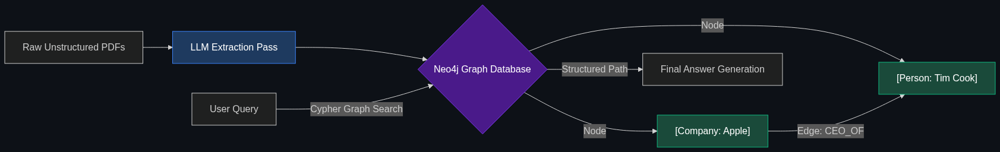

# 🕸️ GraphRAG & Neo4j

> **Knowledge Graphs (Neo4j): You map entities (e.g., Customer A is Director of Company B, which Received a transfer from Sanctioned Country C).**

---

## Phase 1: Core Foundations & Pre-requisites

### Prerequisites
- **RAG (Retrieval-Augmented Generation)** — Giving AI documents (see [Module 2](../../02_Enterprise_AI/02_Data_and_Context_The_Knowing_Layer/01_RAG.md)).
- **Unified Fraud Intelligence** — Finding fraud rings (see [Module 5](../../05_Fintech_AI/02_Fraud_and_Security/02_Unified_Fraud_Intelligence.md)).

### Definition
Standard **Vector RAG** is "fuzzy." It chops documents into tiny pieces, turns them into numbers (embeddings), and searches for chunks with similar meaning. This is great for finding an answer in a user manual. It is *terrible* for finding a specific transaction in a massive financial dataset.

**GraphRAG** solves this. Instead of chopping documents into raw text chunks, an LLM agent reads the documents and actively constructs a **Knowledge Graph**. It extracts specific "Entities" (People, Companies, IP Addresses) and maps out the exact "Relationships" between them (e.g., `Person A` -> `OWNS` -> `Company B`). 

These maps are stored in specialized graph databases like **Neo4j**. When the AI needs to answer a complex question, it retrieves the precise, structured graph data instead of fuzzy text chunks, leading to massively higher accuracy in enterprise environments.

### The Problem It Solves

| Standard Vector RAG | GraphRAG |
|---------------------|----------|
| Looks for text chunks with similar "meaning." | Traverses exact mathematical relationships. |
| Fails at global synthesis (e.g., "Summarize all connections across 1,000 documents"). | Excels at global synthesis and connecting disparate dots. |
| High hallucination risk for factual data. | Ultra-low hallucination risk (structured facts). |

### 🧩 Mini-Quiz

> **Q1:** If I want my AI to answer questions about a company's HR policy document ("How many vacation days do I get?"), should I build a complex Neo4j Knowledge Graph?
> <details><summary>Answer</summary>Probably not. For simple, factual lookups within a single, coherent document, standard Vector RAG is perfectly fine (and much cheaper to build). GraphRAG is designed for <b>complex, multi-document reasoning</b> where the AI has to connect a clue from Document A with a clue from Document Z.</details>

---

## Phase 2: Anatomy & Internal Mechanisms

### Building the Knowledge Graph



1. **Information Extraction (The LLM Pass):** The engineering team runs 10,000 PDF contracts through an LLM. The LLM is prompted to extract `Nodes` (Entities) and `Edges` (Relationships).
   - *Text:* "Elon bought Twitter for $44B."
   - *Nodes:* `[Elon Musk], [Twitter], [$44B]`
   - *Edges:* `[Elon Musk] -BOUGHT-> [Twitter] -FOR-> [$44B]`
2. **Graph Storage:** These Nodes and Edges are ingested into Neo4j (the industry standard database for graphs).
3. **Retrieval (The Graph Query):** When a user asks a question, the system uses Cypher (the SQL of graph databases) to pull the exact sub-graph relevant to the question and feeds *that structured map* into the final LLM prompt.

### 🃏 Flashcard

> **Front:** What is "Entity Resolution" in GraphRAG?
> <details><summary>Flip</summary>The hardest part of building a graph. If Document A says "Apple Inc." and Document B says "Apple Corporation", the AI might accidentally create two separate Nodes. Entity Resolution is the technical process of forcing the system to recognize that both names refer to the exact same Node, preventing the graph from becoming fragmented and useless.</details>

---

## Phase 3: Advanced / Enterprise Patterns & Pitfalls

### Enterprise Use Cases

| Industry | GraphRAG Application |
|----------|----------------------|
| **Venture Capital / M&A** | Asking an AI: "Which of our portfolio companies shares a supply chain dependency with a competitor?" Vector RAG fails this. GraphRAG easily traverses the `[Company]-USES_SUPPLIER->[Vendor]` edges to find the exact overlap. |
| **Cybersecurity** | Threat Hunting. Mapping the entire corporate network in Neo4j. If an employee's laptop is compromised, the GraphRAG agent instantly maps the "Blast Radius"—exactly which servers and databases that specific laptop has permission to touch. |

### Anti-Patterns

- ❌ **Graphing Everything** → Using GraphRAG for an entire Wikipedia dump. Extracting nodes/edges from millions of generic documents is incredibly slow and expensive (requiring massive LLM compute). GraphRAG should be reserved for high-value, structured or semi-structured corporate data.
- ❌ **Ignoring Ontologies** → Letting the LLM invent its own relationship names (e.g., creating one edge called `BOUGHT`, another called `PURCHASED`, and another called `ACQUIRED`). This breaks the graph. You must provide a strict "Ontology" (a predefined dictionary of allowed terms) to the LLM during the extraction phase.

---

## Phase 4: Practical Implementation

### Defining a Graph Schema (Conceptual JSON)

*How developers force the LLM to extract clean graph data.*

```json
// The Strict Ontology provided to the Extraction LLM
{
  "allowed_node_types": ["Person", "Company", "Bank_Account", "Location"],
  "allowed_edge_types": ["OWNS", "TRANSFERRED_MONEY_TO", "LOCATED_IN"],
  
  "extraction_example": {
    "text": "John Doe transferred $5k to Acme Corp.",
    "nodes": [
      {"id": "n1", "label": "Person", "name": "John Doe"},
      {"id": "n2", "label": "Company", "name": "Acme Corp"}
    ],
    "edges": [
      {"source": "n1", "target": "n2", "type": "TRANSFERRED_MONEY_TO", "weight": 5000}
    ]
  }
}
// The LLM outputs this structured JSON, which is directly injected into Neo4j.
```

---

## Phase 5: Interview Preparation

### Q1: "We built a standard Vector RAG system for our legal team. It's great at finding specific clauses, but when a lawyer asks 'Summarize all the connections between our CEO and Defendant X across these 500 emails,' the AI completely hallucinates or misses obvious links. Why?"
<details><summary><b>STAR Answer</b></summary>

**Situation:** Standard Vector Retrieval fails at complex, cross-document synthesis because it only retrieves isolated chunks of text based on keyword proximity, missing the broader relationships.

**Task:** Re-architect the knowledge retrieval layer to support complex, multi-entity reasoning.

**Action:** I would migrate the legal retrieval system from Vector RAG to **GraphRAG** using Neo4j. 
First, we run the 500 emails through an LLM to extract all the entities (People, Dates, Companies) and their relationships, building a comprehensive Knowledge Graph. 
When the lawyer asks about the connection between the CEO and Defendant X, the system queries the Graph Database to mathematically traverse the shortest path between the `[CEO]` node and the `[Defendant X]` node. 

**Result:** Instead of guessing based on random text chunks, the AI retrieves the exact structured path: `[CEO] -> Emailed -> [Secretary] -> Sent Payment To -> [Defendant X]`. It feeds this exact, verified chain into the final prompt, providing the lawyer with a 100% accurate, hallucination-free summary of the hidden relationship.
</details>

---

## Phase 6: Summary Cheatsheet & Action Plan

### 📋 TL;DR

| Concept | Key Point |
|---------|-----------|
| **GraphRAG** | Using Knowledge Graphs instead of Vector Databases to store data. |
| **Nodes & Edges** | The building blocks. (Nodes = Things. Edges = Relationships). |
| **Neo4j** | The industry-standard Graph Database software. |
| **The Advantage** | Perfect for finding complex connections across thousands of disparate documents. |

### 🚀 Do These Now
1. **Look up "Microsoft GraphRAG":** Microsoft Research recently open-sourced their official GraphRAG pipeline. Read their blog post introducing it—they specifically highlight how it solves the "Global Synthesis" problem that standard RAG fails at.
