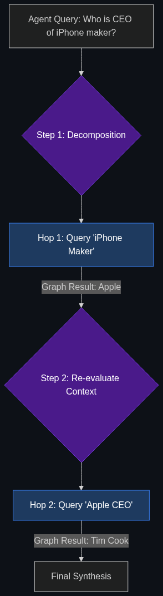

# 🦘 Multi-Hop Logic

> **While vector search finds "similar documents," GraphRAG allows the AI to traverse relationships to find complex fraud patterns that a simple keyword search would miss.**

---

## Phase 1: Core Foundations & Pre-requisites

### Prerequisites
- **GraphRAG & Neo4j** — Building the graph (see [01_GraphRAG_and_Neo4j.md](01_GraphRAG_and_Neo4j.md)).
- **Chain of Thought (CoT)** — Step-by-step AI reasoning.

### Definition
Imagine asking a librarian: *"Who wrote the book that won the Pulitzer Prize the year the Titanic sank?"* 
To answer this, you must "hop" across multiple facts:
1. When did the Titanic sink? (1912).
2. What book won the Pulitzer in 1912? (Wait, the Pulitzer didn't start until 1917, so this is a trick question).

**Multi-Hop Logic** is the ability of an AI to break down a complex question into smaller, sequential questions, where the answer to Step 1 is required to search for the answer to Step 2. 

In traditional RAG, the AI just smashes all those keywords into the database at once and fails. In advanced enterprise systems (powered by GraphRAG), the AI agent actively traverses (hops) across the Knowledge Graph nodes, gathering clues until it reaches the final answer.

### The Problem It Solves

| Single-Hop (Standard Search) | Multi-Hop Logic (Agentic Search) |
|------------------------------|----------------------------------|
| Tries to find the whole answer in one search query. | Breaks the query down into sequential steps. |
| Fails when data is split across 5 different documents. | "Hops" across the 5 documents, carrying clues along the way. |
| Result: "Information not found." | Result: "Accurate, synthesized conclusion." |

### 🧩 Mini-Quiz

> **Q1:** If an AI asks, "Who is the CEO of Apple?" is that a multi-hop query?
> <details><summary>Answer</summary>No. That is a <b>Single-Hop</b> query. The AI just searches the database for "CEO of Apple" and finds the answer (Tim Cook) immediately. A Multi-Hop query would be: "Who is the CEO of the company that manufactures the iPhone?" (Hop 1: Who makes the iPhone? -> Apple. Hop 2: Who is the CEO of Apple? -> Tim Cook).</details>

---

## Phase 2: Anatomy & Internal Mechanisms

### The Hop Traversal



How does an AI execute Multi-Hop Logic in a financial investigation?

**The Query:** *"Does the shell company 'Oceanic LLC' have any indirect ties to the sanctioned individual 'John Doe'?"*

1. **Hop 1:** The AI queries the Graph Database for the `[Oceanic LLC]` node. It finds an edge: `[Oceanic LLC] -REGISTERED_BY-> [Lawyer Smith]`.
2. **Hop 2:** The AI queries the `[Lawyer Smith]` node. It finds an edge: `[Lawyer Smith] -WORKS_FOR-> [Firm A]`.
3. **Hop 3:** The AI queries the `[Firm A]` node. It finds an edge: `[Firm A] -RETAINED_BY-> [John Doe]`.
4. **Synthesis:** The AI generates the final response: *"Yes. Oceanic LLC was registered by Lawyer Smith, who works for Firm A, which is currently on retainer for the sanctioned individual John Doe."*

### 🃏 Flashcard

> **Front:** What is the "Lost in the Middle" phenomenon?
> <details><summary>Flip</summary>When you feed an LLM a massive 100-page document, it remembers the beginning and the end perfectly, but completely ignores (or hallucinates) the information hidden in the middle pages. Multi-Hop GraphRAG solves this by only feeding the LLM the exact, precise "Hops" (facts) it needs, keeping the context window tiny and the accuracy perfect.</details>

---

## Phase 3: Advanced / Enterprise Patterns & Pitfalls

### Enterprise Use Cases

| Industry | Multi-Hop Application |
|----------|-----------------------|
| **Supply Chain Auditing** | Asking the AI: "If the Suez Canal is blocked, which of our top 5 products will face manufacturing delays?" The AI hops: [Suez Canal] -> [Shipping Route] -> [Cargo Ship] -> [Microchips] -> [Product Line]. |
| **KYC (Know Your Customer)** | Investigating the Ultimate Beneficial Owner (UBO) of a complex corporate structure. The AI hops through 6 layers of shell companies across 3 different tax havens to find the actual human who owns the bank account. |

### Anti-Patterns

- ❌ **Brute-Forcing Context Windows** → "Multi-hop is too hard to code. Let's just dump all 5,000 PDFs into Gemini 1.5 Pro's massive 2-million token context window and ask the question." This is incredibly slow, costs $20 per prompt, and is highly prone to hallucinations (Lost in the Middle). Multi-hop is mathematically precise and cheap.
- ❌ **Assuming the LLM knows how to Hop** → Standard models don't know how to query Graph databases. You must use a framework like LangGraph (an Orchestrator) to explicitly force the LLM into a `Plan -> Search -> Evaluate -> Search Again` loop.

---

## Phase 4: Practical Implementation

### The Multi-Hop Agent Loop (Conceptual)

*How an Agent decomposes a question and hops through data.*

```python
def multi_hop_investigator(complex_query):
    """
    An agentic loop that breaks down a question and hops through a database.
    """
    # 1. Decomposition (Agent decides the first step)
    current_clues = []
    next_question = extract_first_step(complex_query) 
    # e.g., "What company makes the iPhone?"
    
    while next_question:
        # 2. Execute the Search (Hop)
        answer = query_database(next_question)
        current_clues.append(answer) # Clue: "Apple makes the iPhone."
        
        # 3. Evaluation (Does the agent have enough info to answer the main query?)
        evaluation = evaluate_if_finished(complex_query, current_clues)
        
        if evaluation.is_finished:
            # 4. Final Synthesis
            return generate_final_answer(complex_query, current_clues)
        else:
            # Generate the next hop based on the new clue
            next_question = evaluation.next_logical_question 
            # e.g., "Who is the CEO of Apple?"
            
# The Agent loops and hops until it builds a complete logical chain.
```

---

## Phase 5: Interview Preparation

### Q1: "Our compliance analysts spend weeks mapping out corporate structures in Excel to find hidden relationships for Anti-Money Laundering checks. How can we automate this investigation process?"
<details><summary><b>STAR Answer</b></summary>

**Situation:** Manual compliance investigations require human analysts to synthesize complex, multi-layered data spread across dozens of legal documents, which is too slow to catch real-time money laundering.

**Task:** Automate deep, cross-document investigative research.

**Action:** I would build an AI investigator utilizing **Multi-Hop Logic** layered over a Neo4j Graph Database. 
Instead of trying to prompt the AI to find the answer all at once, we use an Agentic framework (like LangGraph). The Agent breaks the AML investigation down. First, it queries the graph for the initial company. It finds a shareholder. It then generates a *new* query to investigate that shareholder. It "hops" from node to node, actively traversing the corporate shell structure. 

**Result:** By combining Graph relationships with multi-hop agentic reasoning, the AI can unroll a 6-layer deep shell company structure in 3 seconds, instantly identifying if the Ultimate Beneficial Owner (UBO) is on a global sanctions list, a task that previously took human analysts three weeks.
</details>

---

## Phase 6: Summary Cheatsheet & Action Plan

### 📋 TL;DR

| Concept | Key Point |
|---------|-----------|
| **Multi-Hop Logic** | Breaking a complex question into sequential searches. |
| **The Methodology** | Finding Clue A, which tells you to search for Clue B. |
| **The Synergy** | Multi-Hop Logic is the "brain" that navigates the GraphRAG "map." |
| **The Alternative** | Dumping all documents into a massive prompt and praying (High failure rate). |

### 🚀 Do These Now
1. **Try it Yourself:** Go to ChatGPT and ask a multi-hop question: "Who was the president of the country where the author of '1984' was born, during the year that book was published?" Watch how the AI explicitly writes out its "Chain of Thought" (Hop 1: Where was Orwell born? India. Hop 2: When was 1984 published? 1949. Hop 3: Who was president of India in 1949?).
