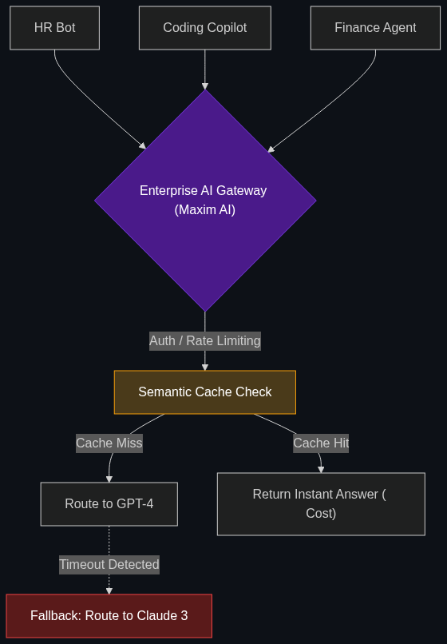

# 🚪 AI Gateways

> **All model calls go through a centralized gateway (like Maxim AI or Azure AI Content Safety) that intercepts traffic.**

---

## Phase 1: Core Foundations & Pre-requisites

### Prerequisites
- **API Management** — How enterprises route web traffic.
- **Agentic Ops** — Managing AI at scale (see [Module 4](../../04_Industry_terminology_AI/02_The_Agentic_Enterprise/01_Agentic_Ops.md)).

### Definition
When an enterprise builds 50 different AI applications (HR bots, Coding copilots, Financial forecasters), and they all send data directly to OpenAI or Anthropic, it creates chaos. The CISO (Chief Information Security Officer) cannot see what data is leaving the company, and the CFO cannot track which department is spending the most on API credits.

An **AI Gateway** is the enterprise architectural solution. It is a centralized proxy server. Instead of the HR bot calling OpenAI directly, the HR bot calls the internal AI Gateway. The Gateway logs the request, checks if the user is authorized, records the billing, and *then* forwards the request to OpenAI. 

It acts as the single choke-point for all AI traffic in the corporation.

### The Problem It Solves

| Point-to-Point (Chaos) | AI Gateway (Controlled) |
|------------------------|-------------------------|
| Developers hardcode API keys into their apps. | API keys are managed centrally in the Gateway. |
| No visibility into corporate AI spending. | Unified dashboard showing exact token spend per department. |
| If OpenAI goes down, the app crashes. | Gateway automatically routes the request to Google Gemini (Fall-back). |

### 🧩 Mini-Quiz

> **Q1:** If the AI Gateway goes down, what happens to the 50 enterprise AI apps?
> <details><summary>Answer</summary>They all crash. The AI Gateway is a Single Point of Failure (SPOF). Because of this, AI Gateways must be deployed using highly redundant, multi-region Kubernetes clusters to ensure 99.999% uptime. The centralization is worth the architectural risk.</details>

---

## Phase 2: Anatomy & Internal Mechanisms

### The Gateway Proxy Flow



1. **The Request:** App A sends a prompt: `"Summarize this resume."`
2. **The Gateway Intercept:** 
   - **Auth Check:** Does App A have permission to use the expensive GPT-4 model? (If no, reject).
   - **Rate Limiting:** Has App A exceeded its 1,000 requests/minute quota? (If yes, throttle).
   - **Caching:** Did someone else ask this exact question 5 minutes ago? (If yes, return the saved answer instantly, saving $0.05).
3. **The Forwarding:** The Gateway sends the prompt to the external AI provider.
4. **The Return:** The Gateway logs the exact token usage to the HR department's billing account and sends the answer back to App A.

### 🃏 Flashcard

> **Front:** What is "Model Fallback" in an AI Gateway?
> <details><summary>Flip</summary>Cloud AI providers (like OpenAI or Anthropic) occasionally experience outages. A Model Fallback is an automated rule in the Gateway. If the Gateway detects that GPT-4 is returning a 503 Timeout error, it seamlessly routes the user's prompt to an equivalent backup model (like Claude 3) in milliseconds, so the end-user never experiences the outage.</details>

---

## Phase 3: Advanced / Enterprise Patterns & Pitfalls

### Enterprise Use Cases

| Feature | Gateway Application |
|---------|---------------------|
| **Semantic Caching** | Standard web caches only work for *exact* matches. An AI Gateway uses a Vector Database. If User A asks "What is the capital of France?" and User B asks "Tell me France's capital", the Gateway recognizes the semantic similarity and serves the cached answer, saving massive API costs at scale. |
| **Data Residency** | European privacy laws require data to stay in Europe. The Gateway detects if a user is in Germany and dynamically routes their prompt to a Microsoft Azure AI server physically located in Frankfurt, ensuring legal compliance. |

### Anti-Patterns

- ❌ **Client-Side Guardrails** → Asking mobile app developers to build safety checks into the iPhone app. The developer will forget, or a hacker will bypass the app entirely via the API. Security must be enforced universally at the Gateway layer.
- ❌ **Ignoring Latency** → Adding 3 seconds of latency because the Gateway runs 50 complex Python scripts on every request. Gateways must be built in extremely fast languages (like Go or Rust) to ensure the proxying process takes less than 20 milliseconds.

---

## Phase 4: Practical Implementation

### Gateway Fallback Logic (Conceptual)

*How a gateway handles a cloud outage.*

```python
def route_to_ai_provider(prompt, preferred_model="gpt-4", backup_model="claude-3"):
    """
    Centralized routing logic handled by the AI Gateway.
    """
    try:
        print(f"Gateway: Attempting to reach {preferred_model}...")
        response = call_openai_api(prompt, timeout=2.0) # Strict 2 second timeout
        return response
        
    except APITimeoutError:
        print(f"Gateway: {preferred_model} is down! Executing Fallback...")
        
        # Seamlessly switch providers
        response = call_anthropic_api(prompt, model=backup_model)
        
        # Log the incident for DevOps
        log_incident(metric="provider_failover", primary=preferred_model)
        
        return response

# The developer who built the HR Bot never has to write this error-handling code.
# The Gateway handles it for them.
```

---

## Phase 5: Interview Preparation

### Q1: "We have 12 different product teams building AI features. Last month, our OpenAI bill spiked to $50,000, and we have no idea which team spent the money or what data they are sending. How do we regain control?"
<details><summary><b>STAR Answer</b></summary>

**Situation:** Decentralized, point-to-point AI integrations are causing "Shadow AI," resulting in uncontrolled costs and massive data security blindness.

**Task:** Centralize observability, billing, and security without slowing down the development teams.

**Action:** I would immediately revoke all direct OpenAI API keys from the individual product teams. I would stand up an **AI Gateway** (using a tool like Cloudflare AI Gateway or Kong). 
I would issue new, internal API keys to each team that point exclusively to our Gateway. The Gateway will intercept all traffic, allowing us to enforce per-department rate limits, log exactly which team is spending the most tokens, and implement Semantic Caching to drastically reduce duplicate queries.

**Result:** The development teams experience zero friction (they just change the URL endpoint in their code). Meanwhile, the CISO gains 100% visibility into all outbound AI traffic, and the CFO receives a clean dashboard breaking down the $50,000 bill by department, allowing us to accurately allocate costs.
</details>

---

## Phase 6: Summary Cheatsheet & Action Plan

### 📋 TL;DR

| Concept | Key Point |
|---------|-----------|
| **AI Gateway** | The single proxy server that handles all AI traffic for a company. |
| **Observability** | Tracking token usage and billing per department. |
| **Model Fallback** | Automatically switching to a backup AI if the main one crashes. |
| **Semantic Caching** | Saving money by caching similar questions. |

### 🚀 Do These Now
1. **Look up "Cloudflare AI Gateway":** Cloudflare is famous for web routing, and they now have a massive AI Gateway product. Read their landing page. Notice how they sell "Control, Cost Savings, and Analytics" rather than just "AI Magic."
