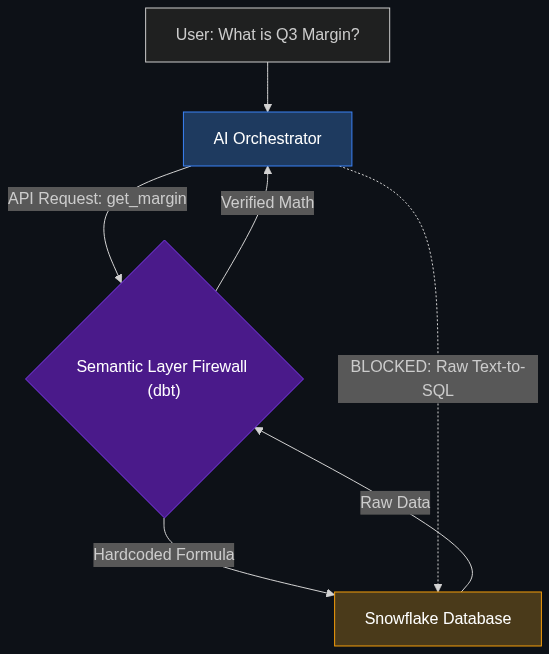

# 🧱 Semantic Layer Firewall

> **A "firewall" between the AI and your data. The AI asks for "Gross Margin," and the Semantic Layer ensures it uses the official company calculation instead of guessing from raw numbers.**

---

## Phase 1: Core Foundations & Pre-requisites

### Prerequisites
- **Text-to-SQL** — AI writing database queries.
- **Semantic Layer** — The business dictionary (see [Module 4](../../04_Industry_terminology_AI/02_The_Agentic_Enterprise/02_Semantic_Layer.md)).

### Definition
When companies try to build a "Chat-with-your-Database" bot, they usually use **Text-to-SQL**. The user asks a question, the AI writes an SQL query, executes it, and returns the answer. 

The problem? The AI doesn't know the company's specific business rules. If a user asks "What was our Profit last month?", the AI might write an SQL query that subtracts `expenses` from `revenue`. But in finance, "Profit" might legally require excluding taxes and depreciation (EBITDA). The AI confidently outputs the wrong number.

A **Semantic Layer Firewall** sits *between* the AI and the raw SQL database. It is a strict middle-tier (often built with tools like Cube or dbt). Instead of writing raw SQL, the AI is only allowed to request pre-defined, mathematically verified metrics from the Semantic Layer. The AI asks the Firewall for `get_metric("EBITDA")`, and the Firewall handles the complex, verified SQL math.

### The Problem It Solves

| Raw Text-to-SQL | Semantic Layer Firewall |
|-----------------|-------------------------|
| AI guesses the math formula. | AI uses the CFO-approved math formula. |
| If the database schema changes, the AI prompt breaks. | Semantic Layer maps the changes; AI is unaffected. |
| Multiple AIs might calculate "Revenue" differently. | Single Source of Truth for all AIs in the enterprise. |

### 🧩 Mini-Quiz

> **Q1:** If a CEO asks an AI, "How many active users do we have?", why is that a dangerous question for raw Text-to-SQL?
> <details><summary>Answer</summary>Because "Active User" is a business definition, not a database table. Does it mean "logged in within 30 days"? Or "made a purchase within 90 days"? An AI will just guess one. A Semantic Layer Firewall forces the AI to use the company's strictly defined `Active_User_30_Day` metric, preventing the CEO from getting a hallucinated metric.</details>

---

## Phase 2: Anatomy & Internal Mechanisms

### The Metric API Pattern



1. **The Vulnerability:** The user asks: "What is our Churn Rate?"
2. **The Guardrail:** The Agentic Orchestrator blocks the LLM from writing a raw `SELECT * FROM users` query.
3. **The API Call:** The LLM is forced to use the `Query_Semantic_Layer` tool. It requests the metric: `churn_rate`.
4. **The Firewall (Cube/dbt):** The Semantic Layer receives the request. It looks up the YAML file where the Data Engineering team has hardcoded the exact, legally verified SQL math for "Churn Rate".
5. **The Safe Execution:** The Semantic Layer runs the complex SQL against the Snowflake database, returns the exact number (`5.2%`) to the LLM, and the LLM formats it into a polite sentence.

### 🃏 Flashcard

> **Front:** What is a "Headless BI" (Business Intelligence) system?
> <details><summary>Flip</summary>Traditionally, the math for metrics (like Gross Margin) was locked inside dashboard tools like Tableau. If you wanted the number, you had to look at the dashboard. "Headless BI" is just another term for a Semantic Layer. It rips the math out of Tableau and turns it into an API, allowing AI Agents (and dashboards) to pull the exact same verified numbers.</details>

---

## Phase 3: Advanced / Enterprise Patterns & Pitfalls

### Enterprise Use Cases

| Department | Semantic Firewall Application |
|----------|-----------------------|
| **Financial Reporting** | Generating the Quarterly Earnings Report. The AI is strictly barred from doing math. It pulls the `Q3_Revenue` and `Operating_Expenses` metrics directly from the Semantic API, ensuring the AI-generated report exactly matches the SEC filings. |
| **Sales Operations** | Calculating commissions. The rules for "Qualified Lead" are incredibly complex and change quarterly. The AI queries the Semantic Layer for `Commission_Payout_User_A`, guaranteeing it doesn't accidentally overpay a salesperson due to a hallucinated calculation. |

### Anti-Patterns

- ❌ **Giving the AI a Calculator Tool to do the math** → Passing the AI the raw numbers and giving it a Python calculator. The AI might still calculate `(Revenue - Taxes) / Users` when it was supposed to calculate `(Revenue - Shipping) / Users`. The Semantic Layer must do the math, not the AI.
- ❌ **Prompting the Schema** → Trying to paste your entire 500-table database schema into the LLM's system prompt and begging it to figure out the joins. It will consume massive amounts of tokens and inevitably fail on complex joins.

---

## Phase 4: Practical Implementation

### Defining a Metric in the Semantic Layer (YAML)

*This code lives in the Semantic Firewall (e.g., Cube.js), not in the AI.*

```yaml
# The Data Engineering team hardcodes the CFO's definition of "Profit"
cubes:
  - name: financial_metrics
    sql: SELECT * FROM raw_finance_db.transactions
    
    # The AI is only allowed to ask for these specific names
    measures:
      - name: gross_profit
        type: number
        # THE VERIFIED MATH (The AI cannot change this)
        sql: "{revenue_column} - {cost_of_goods_sold_column}"
        description: "Official Gross Profit. Excludes operational expenses."

      - name: net_profit
        type: number
        sql: "{gross_profit} - {operational_expenses} - {taxes}"
        description: "Official Net Profit (Bottom Line)."
```

---

## Phase 5: Interview Preparation

### Q1: "We built a 'Chat-with-Data' tool for our executives. Last week, the CEO asked it for total sales, and it gave a number $5 million higher than what the CFO reported. They have lost all trust in the AI. How do we fix this?"
<details><summary><b>STAR Answer</b></summary>

**Situation:** The AI was executing raw Text-to-SQL, resulting in hallucinated business logic that damaged executive trust and created compliance risks.

**Task:** Architect a data retrieval pipeline that guarantees 100% mathematical accuracy and alignment with official financial reporting.

**Action:** I would immediately deprecate the raw Text-to-SQL capabilities of the agent. I would insert a **Semantic Layer Firewall** (using a tool like dbt or Cube) between the AI and the Snowflake data warehouse. 
The Data Engineering team will encode the CFO's exact, verified mathematical definitions for "Total Sales" into the Semantic Layer. The AI will be re-prompted to act only as a routing interface. When the CEO asks for sales, the AI makes an API call to the Semantic Layer requesting the "Total Sales" metric, and the Semantic Layer executes the verified SQL.

**Result:** The AI is mathematically neutered; it can no longer invent formulas. The CEO receives the exact same number from the AI as they do from the CFO's official Tableau dashboard, instantly restoring trust in the enterprise AI initiative.
</details>

---

## Phase 6: Summary Cheatsheet & Action Plan

### 📋 TL;DR

| Concept | Key Point |
|---------|-----------|
| **Semantic Layer Firewall** | The middle-tier that stops the AI from touching the raw database. |
| **The Vulnerability** | Text-to-SQL (AI guessing the math). |
| **The Solution** | Forcing the AI to use an API to request predefined, CFO-approved metrics. |
| **The Value** | A Single Source of Truth across the enterprise. |

### 🚀 Do These Now
1. **Look at Cube.dev:** Cube is one of the most popular Semantic Layers in the industry. Go to their website and look at their "AI / LLM Integration" page. They explicitly market themselves as the "Firewall" that prevents AI hallucinations.
