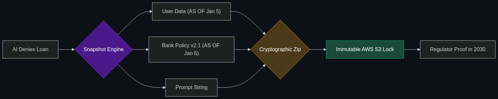

# 📸 Forensic Snapshots

> **Point-in-Time Context: The system saves a "snapshot" of the exact data the AI saw when it made a decision. If a loan is denied, you can prove it was based on Version 2.1 of the Risk Policy, not a hallucination.**

---

## Phase 1: Core Foundations & Pre-requisites

### Prerequisites
- **AI Audit Readiness** — Self-documenting AI (see [Module 5](../../05_Fintech_AI/03_Regulatory_and_Compliance/02_AI_Audit_Readiness.md)).
- **Database Versioning** — Tracking how data changes over time.

### Definition
When an AI model makes a critical financial decision (e.g., executing a \$10M trade or denying a mortgage), regulators do not just audit the AI's algorithm; they audit the *data* the AI was looking at. 

The problem is that enterprise databases change every millisecond. If an auditor asks, "Why did the AI deny this loan 6 months ago?", the engineers cannot just look at the database, because the user's credit score and the bank's risk policy have likely changed since then.

A **Forensic Snapshot** (or Point-in-Time Context) is an architectural requirement. At the exact millisecond the AI makes a decision, the system takes a "photograph" of every single piece of data the AI touched (e.g., the exact wording of the PDF policy, the exact API payload from Experian). This snapshot is cryptographically frozen and saved forever, allowing the bank to perfectly reconstruct the past.

### The Problem It Solves

| Standard Database Architecture | Forensic Snapshot Architecture |
|--------------------------------|--------------------------------|
| Data is constantly overwritten. | Data is immutable and versioned. |
| Impossible to prove what the AI "saw" 6 months ago. | Instantly recreates the exact state of the universe 6 months ago. |
| Automatic failure in a regulatory audit. | Mathematically provable compliance. |

### 🧩 Mini-Quiz

> **Q1:** If my company uses a Vector Database to store all our corporate policies for RAG, do we need Forensic Snapshots?
> <details><summary>Answer</summary>Yes, absolutely! If HR updates the "Employee Code of Conduct" in the Vector Database today, and an employee sues the company tomorrow over an AI-generated HR decision made last year, you must be able to prove exactly what the <i>old</i> version of the policy said on the day the AI read it.</details>

---

## Phase 2: Anatomy & Internal Mechanisms

### The Bitemporal Data Model



Advanced financial databases use **Bitemporal Modeling** to support forensic snapshots. Every single row of data has two timestamps:
1. **Valid Time:** When did this fact become true in the real world?
2. **Transaction Time:** When did the database record this fact?

**The Scenario:**
- Jan 1: The bank policy requires a 600 Credit Score.
- Jan 5: The AI denies John's loan (He has a 590). **[Snapshot Taken]**.
- Jan 10: The bank lowers the requirement to 550.
- Jan 15: John sues the bank, claiming he should have been approved.

When the judge asks for the data, the engineers run a `Point-in-Time Query`: `SELECT * FROM policies AS OF 'Jan 5'`. The database ignores the Jan 10 update and retrieves the exact Version 2.1 policy the AI used, proving the AI acted correctly at that specific moment in time.

### 🃏 Flashcard

> **Front:** What is an "Event Sourcing" architecture?
> <details><summary>Flip</summary>Instead of storing the <i>current state</i> of a bank account (e.g., Balance: $500), Event Sourcing stores every single <i>action</i> that ever happened (Deposit $200, Withdraw $50). By replaying all the events from the beginning of time up to a specific date, you can perfectly recreate the forensic snapshot of the account at any second in history.</details>

---

## Phase 3: Advanced / Enterprise Patterns & Pitfalls

### Enterprise Use Cases

| Industry | Snapshot Application |
|----------|----------------------|
| **Algorithmic Trading** | "Order Book Snapshots." The SEC requires firms to prove they aren't manipulating the market. The system captures the exact prices of all stocks on the exchange at the microsecond the AI placed its trade to prove it acted on legitimate market data. |
| **Credit Underwriting** | Freezing the applicant's credit report, the bank's YAML policy rules, and the LLM's system prompt into a single immutable ZIP file the moment the loan decision is finalized. |

### Anti-Patterns

- ❌ **Overwriting Data (The UPDATE Command)** → In a highly regulated AI environment, using the SQL `UPDATE` command is a massive anti-pattern. If you update a record, you destroy history. You must use `INSERT` to append a new version of the record (leaving the old one intact but marked as inactive).
- ❌ **Storing Snapshots on Mutable Servers** → Saving the forensic snapshots to a standard hard drive where a rogue engineer could delete or alter them to hide a mistake. Snapshots must be stored on WORM (Write Once, Read Many) drives like AWS S3 Object Lock.

---

## Phase 4: Practical Implementation

### Capturing the Point-in-Time Context (Conceptual)

*How to freeze the AI's reality.*

```python
import time
import hashlib

def capture_forensic_snapshot(user_id, loan_decision, llm_prompt, policy_version):
    """
    Creates an immutable record of the AI's exact context.
    """
    # 1. Gather the exact data the AI saw
    context = {
        "timestamp_ms": int(time.time() * 1000),
        "user_id": user_id,
        "credit_data_pulled": fetch_credit_score_AS_OF_NOW(user_id),
        "policy_version_used": policy_version,
        "llm_prompt_used": llm_prompt,
        "final_decision": loan_decision
    }
    
    # 2. Cryptographically hash the payload to prove it hasn't been altered
    payload_hash = hashlib.sha256(str(context).encode()).hexdigest()
    context["verification_hash"] = payload_hash
    
    # 3. Write to an Immutable WORM Ledger (e.g., AWS QLDB)
    aws_qldb.insert_record(context)
    
    print("✅ Forensic Snapshot secured for Audit Layer.")

# If an auditor questions the decision in 2030, this exact payload can be retrieved.
```

---

## Phase 5: Interview Preparation

### Q1: "We are being audited by the Federal Reserve regarding an AI model we deployed 2 years ago to calculate risk limits. They want to know exactly what data the model was fed for a specific customer on March 14th, 2024. Can we provide this?"
<details><summary><b>STAR Answer</b></summary>

**Situation:** Regulators require historical, point-in-time proof of the data inputs that drove an AI decision to ensure compliance with Fair Lending and risk management laws.

**Task:** Design a data architecture capable of instantly retrieving historical context that has since been overwritten in production.

**Action:** Because we anticipated this, I designed our AI infrastructure using **Forensic Snapshots** and **Bitemporal Data Modeling**. 
Whenever the AI makes a high-stakes calculation, we do not just save the output. We package the specific version of the model, the user's data payload from that exact millisecond, and the specific version of the corporate policy into a JSON object. This object is cryptographically hashed and stored in an immutable ledger (AWS QLDB). 

**Result:** I do not need to try and reverse-engineer the database backups from two years ago. I simply query the ledger for the transaction ID, and I can hand the Federal Reserve a cryptographically verified snapshot proving exactly what the AI "saw" on March 14th, 2024, passing the audit effortlessly.
</details>

---

## Phase 6: Summary Cheatsheet & Action Plan

### 📋 TL;DR

| Concept | Key Point |
|---------|-----------|
| **Forensic Snapshot** | Freezing the exact data an AI used to make a decision. |
| **Point-in-Time Query** | Asking a database what it looked like on a specific date. |
| **Bitemporal Modeling** | The database structure required to never delete history. |
| **The Rule** | Never use `UPDATE` or `DELETE` in financial AI databases; only `INSERT` new versions. |

### 🚀 Do These Now
1. **Look up "AWS QLDB" or "AWS S3 Object Lock":** These are the exact enterprise cloud technologies used to build these systems. Read how QLDB (Quantum Ledger Database) provides a cryptographically verifiable transaction log that even the root AWS administrator cannot delete.
