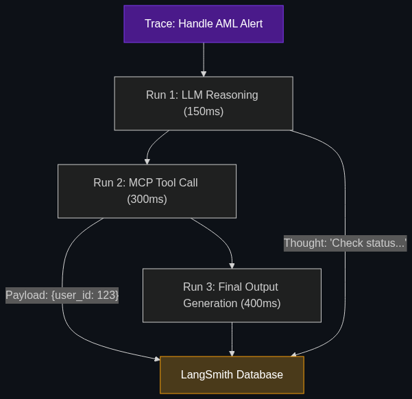

# 🕵️ Traceability Logs

> **Every "thought" or "reasoning step" the agent takes is saved as a JSON object.**

---

## Phase 1: Core Foundations & Pre-requisites

### Prerequisites
- **Chain of Accountability** — Why we track AI (see [Module 4](../../04_Industry_terminology_AI/04_Safety_and_Chain_of_Command/01_Chain_of_Accountability.md)).
- **LangGraph / DCGs** — How agents loop (see [Module 6](../01_The_Orchestration_Layer/01_LangGraph_and_DCGs.md)).

### Definition
When you talk to a standard chatbot (like ChatGPT web interface), the UI only shows you the final, polished response. It hides the messy internal process—the tools it tried and failed to use, the web searches it performed, and the internal logic it debated before answering.

In enterprise finance, hiding this process is unacceptable. **Traceability Logs** (often powered by tools like LangSmith) are the mandatory engineering layer that captures this invisible "thought process." 

Every single API call, every tool execution, every latency metric, and every internal "Chain of Thought" reasoning step the agent takes is captured, structured into a massive JSON object, and saved to a database. It is the ultimate "Black Box Flight Recorder" for an AI agent.

### The Problem It Solves

| Standard Chat UI | Traceability Logs (LangSmith) |
|------------------|-------------------------------|
| Shows the final answer. | Shows the 15 hidden steps it took to get the answer. |
| If the agent hallucinates, you don't know why. | You can read the exact internal reasoning step where the logic failed. |
| Impossible to debug at scale. | Easy to identify the exact prompt or tool causing the error. |

### 🧩 Mini-Quiz

> **Q1:** If my AI Agent uses an MCP tool to check a user's credit score, does the Traceability log just record "Tool Executed Successfully"?
> <details><summary>Answer</summary>No, that is insufficient. A proper Traceability Log records the <b>exact payload</b>. It must record: 1) The exact prompt the LLM generated to trigger the tool, 2) The exact JSON response the tool returned (e.g., <code>{"score": 720}</code>), and 3) The exact number of milliseconds the tool took to respond.</details>

---

## Phase 2: Anatomy & Internal Mechanisms

### The Anatomy of a Trace



A "Trace" represents one complete interaction (e.g., A user asking a question). Inside that Trace are "Runs" (the individual steps).

1. **Trace Start:** User asks: *"Why was my transfer blocked?"*
2. **Run 1 (LLM Call):** The Orchestrator decides it needs to use the `check_aml_status` tool. (Logs exactly how many tokens this decision took).
3. **Run 2 (Tool Execution):** The system calls the AML database. (Logs the HTTP request, the latency, and the JSON response).
4. **Run 3 (LLM Call - Chain of Thought):** The LLM internalizes the data: *"The database says the user is on a watchlist. I must inform them."* (This raw, unfiltered reasoning is logged).
5. **Trace End:** The final polished answer is sent to the user.

If the final answer is wrong, the engineer opens the Trace UI, expands all the Runs, and instantly sees that Run 2 returned corrupt database data.

### 🃏 Flashcard

> **Front:** How do Traceability Logs enable "Continuous Fine-Tuning"?
> <details><summary>Flip</summary>Traceability platforms (like LangSmith) allow human reviewers to look at thousands of logged traces and click a "Thumbs Up" or "Thumbs Down" on the agent's logic. Engineers can then filter for all the "Thumbs Up" traces and instantly export them as a training dataset to fine-tune a smaller, cheaper open-source model to act exactly like the expensive GPT-4 model.</details>

---

## Phase 3: Advanced / Enterprise Patterns & Pitfalls

### Enterprise Use Cases

| Department | Traceability Application |
|----------|-----------------------|
| **Agentic Ops / DevOps** | Setting up automated alerts. If the Traceability Log detects that the `Execute_Trade` tool is suddenly taking 5,000ms instead of 200ms, it triggers a PagerDuty alert to wake up an engineer before the trading system crashes. |
| **Legal Discovery** | If a customer sues, claiming the AI discriminated against them, the legal team exports the Traceability Log to prove the AI never accessed or reasoned about the customer's race or gender during its Chain of Thought. |

### Anti-Patterns

- ❌ **Logging PII to the Trace Database** → Saving raw Social Security Numbers into LangSmith. Traceability databases are often separate from the secure banking core. You must implement a "Data Scrubbing" step that redacts PII *before* the trace is sent to the logging server.
- ❌ **Sampling in High-Risk Workflows** → In standard web analytics, it is fine to only log 10% of traffic (Sampling) to save money. In financial AI, you cannot sample. If an agent executes 10,000 trades, you must have 10,000 traces. You must log 100% of execution.

---

## Phase 4: Practical Implementation

### Logging a Trace (Conceptual Python via LangSmith)

*Modern frameworks handle the heavy lifting via decorators.*

```python
from langsmith import traceable
from openai import Client

client = Client()

# The @traceable decorator automatically captures the inputs, outputs, 
# and latency of this function and sends it to the central dashboard.
@traceable(name="AML_Risk_Evaluation")
def evaluate_risk(customer_data):
    
    # 1. Internal Chain of Thought
    system_prompt = "Analyze this data for money laundering. Think step-by-step."
    
    # 2. LLM Execution
    response = client.chat.completions.create(
        model="gpt-4o",
        messages=[
            {"role": "system", "content": system_prompt},
            {"role": "user", "content": customer_data}
        ]
    )
    
    # LangSmith silently logs the exact prompt, the raw LLM output, 
    # the token usage (cost), and the millisecond latency.
    return response.choices[0].message.content
```

---

## Phase 5: Interview Preparation

### Q1: "We deployed an autonomous customer support agent. Every so often, it gives a completely unhinged, hallucinated answer. We try to recreate the error by typing the same prompt again, but it works perfectly the second time. How do we debug this?"
<details><summary><b>STAR Answer</b></summary>

**Situation:** The engineering team is facing the "Non-Determinism" problem of LLMs, making it impossible to reproduce and debug hallucinations in production using standard software testing.

**Task:** Implement an observability layer to capture the exact state of the failure as it happens in real-time.

**Action:** I would implement a strict **Traceability Logging** architecture using a tool like LangSmith or Phoenix. 
Instead of trying to recreate the error after the fact, the system acts as a flight recorder. Every single user interaction generates a comprehensive Trace. This Trace captures the exact prompt, the specific retrieval context from the Vector DB at that exact millisecond, every tool the agent attempted to use, and its internal Chain of Thought reasoning.

**Result:** The next time the agent hallucinates, the engineering team doesn't try to recreate it. They simply open the Traceability Dashboard, find the exact failed run, and expand the timeline. They instantly discover that the issue wasn't the LLM—it was a momentary API timeout on the CRM tool, causing the agent to panic and hallucinate a response. We fix the tool timeout, solving the issue permanently.
</details>

---

## Phase 6: Summary Cheatsheet & Action Plan

### 📋 TL;DR

| Concept | Key Point |
|---------|-----------|
| **Traceability Logs** | The "Flight Recorder" for an AI Agent. |
| **What it Captures** | Exact prompts, tool payloads, latencies, and Chain of Thought. |
| **The Value** | Debugging complex agent loops that are impossible to recreate. |
| **The Tools** | LangSmith, Arize Phoenix, Datadog LLM Observability. |

### 🚀 Do These Now
1. **Look at LangSmith:** This is the most popular tracing tool for LLMs. Go to the LangSmith website and look at a screenshot of a "Trace." Notice how it breaks down a single chat message into a massive tree of sub-tasks and API calls.
